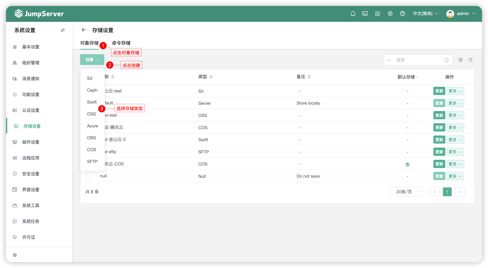
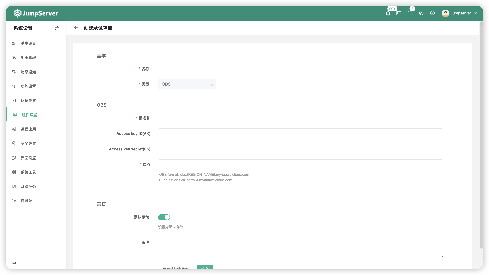
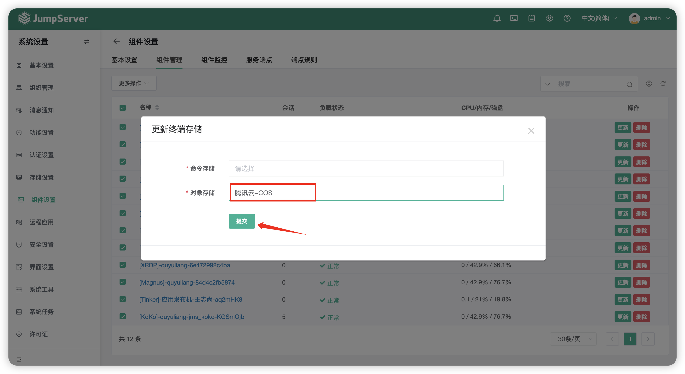
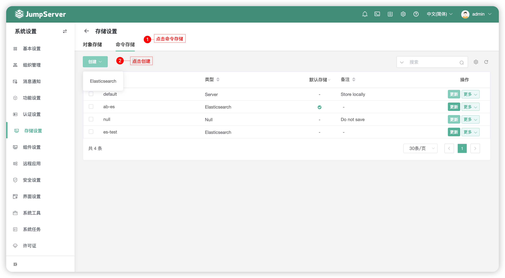
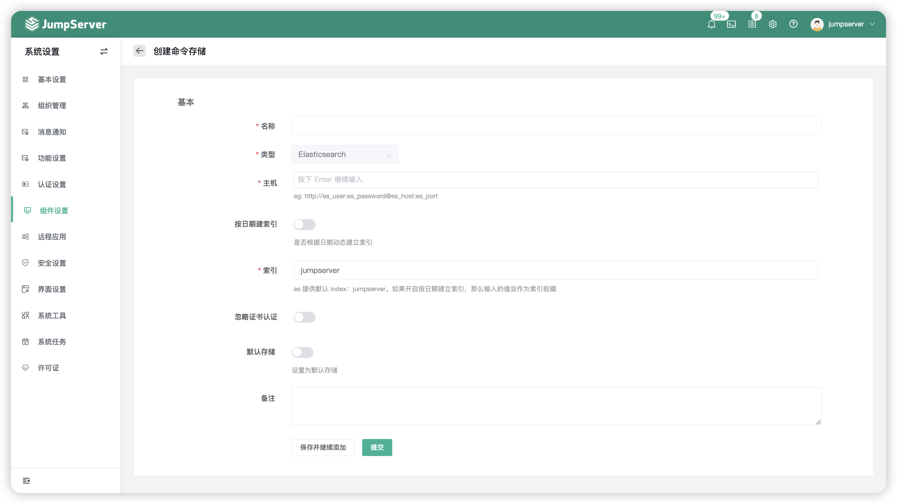
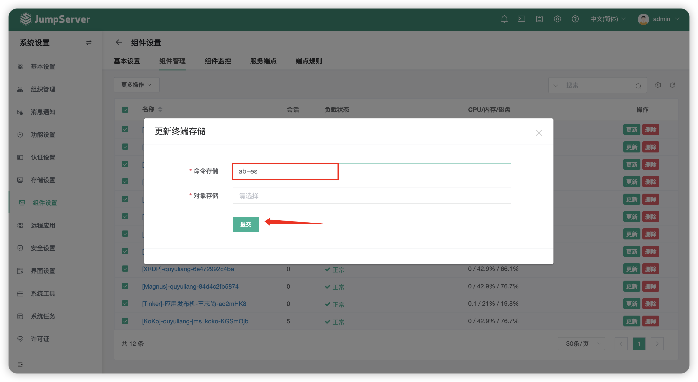

# 存储设置
## 1 对象存储
!!! tip ""
    - 录像存储页面可以对 JumpServer 连接资产的会话录像存储的位置进行自定义。
    - 目前支持的外部录像存储有亚马逊的 S3 云存储、Ceph、Swift、OSS、Azure、OBS、COS、SFTP。

!!! tip ""
    - 点击`创建`按钮，选择对应的存储类型，以 腾讯云COS 存储为例：
    - 以下图片中的认证信息均在腾讯云控制台页面获取，输入对应的字段后点击提交。
   

!!! tip ""
    - 创建完成后，即在组件管理中更新对象存储，将录像存储在 腾讯云COS 存储桶中。

!!! warning "注意"
    - JumpServer 录像存储对接外部存储后，定期清理页面中的会话日志保存时间对录像存储失效。

## 2 命令存储
!!! tip ""
    - 命令存储页面可以对 JumpServer 连接资产的会话命令记录存储的位置进行自定义。
    - 目前支持的外部命令存储有 Elasticsearch。

!!! tip ""
    - 点击`创建`按钮，创建一个新的命令存储，将 JumpServer 连接资产产生的会话存储到外部，减少数据库的存储用量。
    - 输入对应的字段点击提交，即创建成功，创建成功需要点击 Elasticsearch `名称` 后的 `更多` - `测试`，来进行验证测试。
    - JumpServer 支持使用 Elasticsearch 存储日志并支持根据日期建立索引，索引名为：JumpServer 中配置的索引名+命令记录产生的日期，方便用户根据日期进行查询与管理。

!!! tip ""
    - 创建完成后，即在组件管理中更新命令存储，将录像存储在 Elasticsearch 中。

!!! warning "注意"
    - JumpServer 命令存储对接外部存储后，定期清理页面中的会话日志保存时间对命令存储失效。
