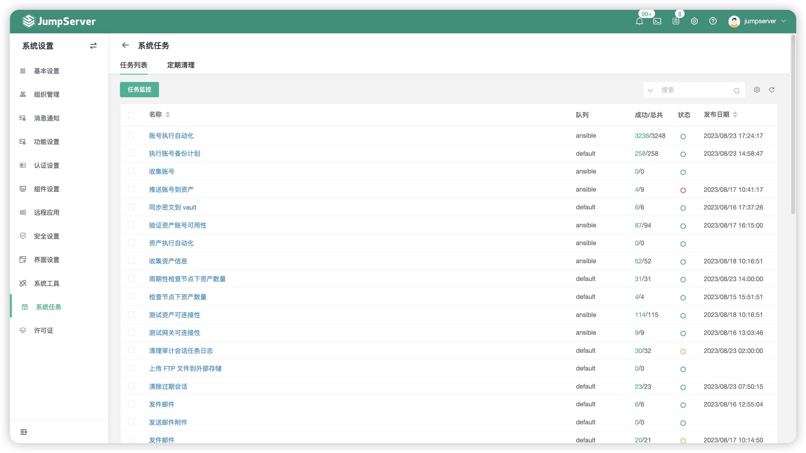
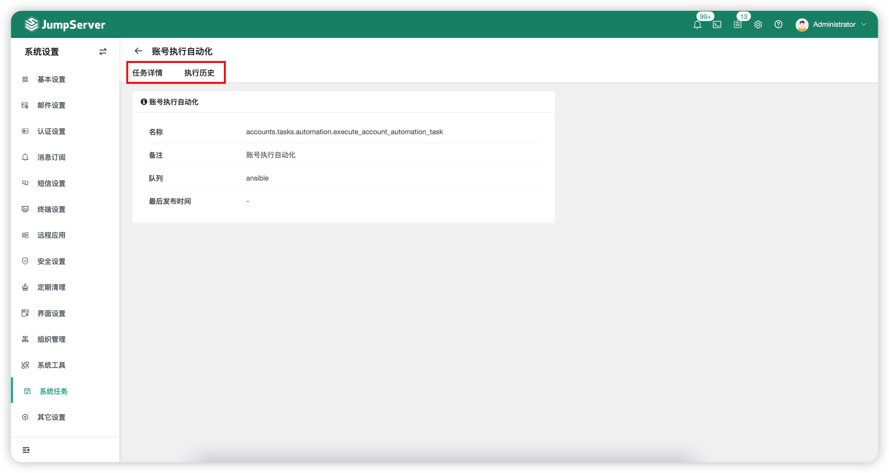
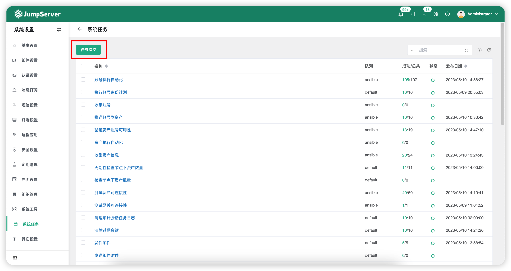

# 系统任务

## 1 任务列表
!!! tip ""
    - 点击页面上方的`任务列表`按钮，进入任务列表页面。
    - 该页面可查看所有自动化任务，其中包含账号备份计划，推送账号，检查资产连接性、邮件发送自动化任务等。
    - 点击自动化任务名称即可进入该自动化任务的详情页面，在该自动化任务的详情页面可查看任务详情信息，执行历史等信息。

### 1.2 任务详情
!!! tip ""
    - 点击自动化任务名称即可进入该自动化任务的详情页面，在该自动化任务的详情页面可查看任务详情信息，执行历史信息。

### 1.3 任务监控
!!! tip ""
    - 点击`任务列表`页面的`任务监控`按钮，进入任务监控页面。
    - 该页面主要查看 JumpSerevr 后端批量任务组件的相关状态。

!!! tip ""
    - 点击页面上部分的任务状态可查看成功任务的日志或失败任务的日志。

## 2 定期清理
!!! tip ""
    - 点击页面上方的`定期清理`按钮，即进入定期清理页面。
    - 该页面的配置主要控制本地保存的记录，当录像与日志存储到外部存储中，不受该页面配置影响。
    - 定期清理类型有：登录、任务、操作、上传下载日志和数据库记录，可以配置定时清理周期，为服务器存储减轻压力。

!!! tip ""
    - 详细参数说明：

    | 参数     | 说明                  |
    | ------- | --------------------- |
    | 登录日志 (天) | 登录日志主要记录记录 JumpServer 用户的登录信息，包括用户名、类型、Agent、登录 IP 地址、登录地点以及登录日期。 |
    | 任务日志 (天) | 任务日志主要记录一些批量命令等自动化的任务信息。 |
    | 操作日志 (天) | 操作日志主要记录用户对资产的操作动作、操作时间以及操作的资源类型和远端地址。 |
    | 上传下载 (天) | 上传下载主要记录用户进行 FTP 上传、下载时所留下的操作记录。 |
    | 会话日志 (天) | 会话日志主要记录通过 JumpServer 登录资产产生的会话日志包含录像与命令记录。 |
    | 活动记录 (天) | 资源活动记录日志保留时间。 |
    | 云同步记录 (天) | 云同步记录主要记录执行云同步任务的信息。 |