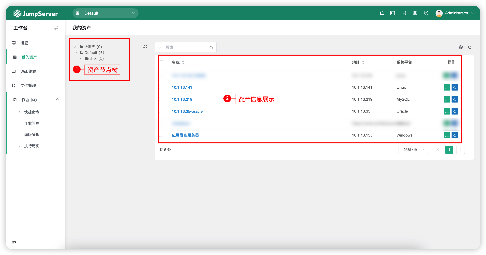
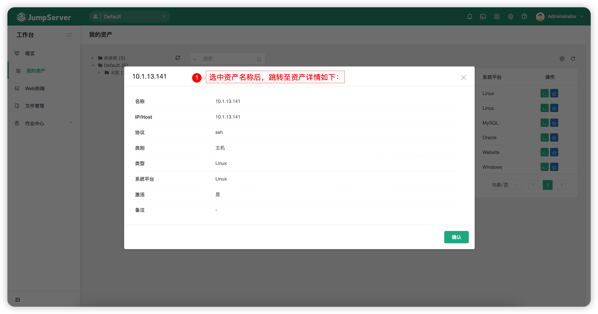
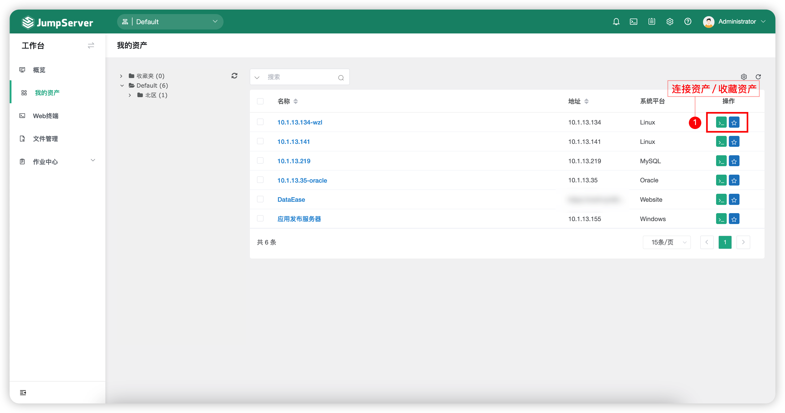

# 我的资产

## 1 功能简述
!!! tip ""
    - 我的资产页面主要包含的是已经授权给当前用户的资产信息。
    - 页面左侧为管理员用户授权给当前用户的资产所处的节点树，页面右侧为管理员用户授权给当前用户的所有资产。

!!! tip ""
    - 页面展示如下：

## 2 资产详情
!!! tip ""
    - 点击`资产名称`可以进入资产详情页面，查看资产详细信息。

## 3 快捷操作
!!! tip ""
    - 点击`资产`后方的第一个按钮，可以快速跳转到 Web 终端页面并连接对应资产。
    - 点击`资产`后方的第二个按钮，可以将当前资产添加到收藏夹之中，便于在 Web终 端中连接该资产。

