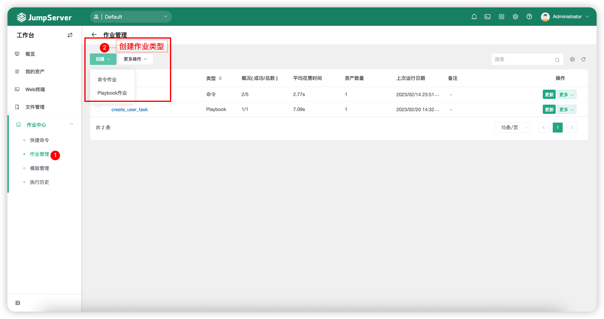
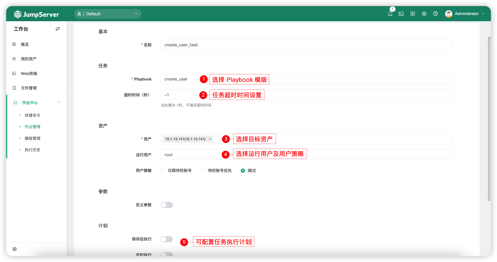
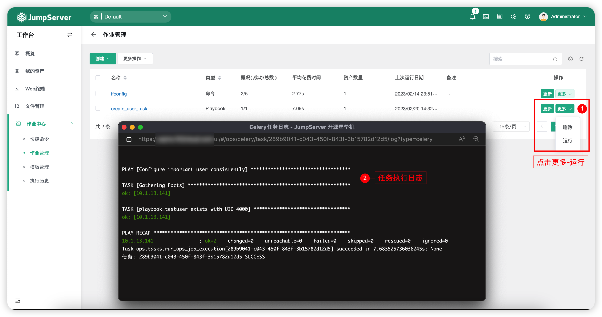

# 作业管理
## 1 功能简述
!!! tip ""
    - 作业管理功能主要是针对命令、Playbook 两种作业类型来创建作业任务，作业任务可以定期、手动执行。

!!! tip ""
    - 页面展示如下：

## 2 创建作业任务
!!! tip ""
    - 以 Playbook 类型作业任务示例。
    - 作业任务中的 Playbook 参数需要在左侧页面中的`模版管理`模块中创建好 Playbook 模版后进行选择。
    - 点击切换至`作业管理`页面中，创建 Playbook 作业任务，如下图：

## 3 作业任务运行
!!! tip ""
    - 点击作业任务名称末尾的`更多` - `运行`，进行作业任务的运行操作，如下图：

