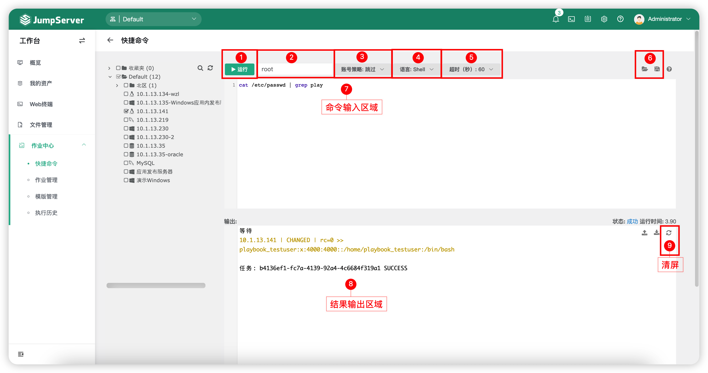

# 快捷命令
## 1 功能简述
!!! tip ""
    - 快捷命令页面主要包含的是用户对有权限的资产进行批量命令处理。

!!! tip ""
    - 页面展示如下：

!!! tip ""
    - 详细模块说明：

!!! tip ""

    | 序号  |   名称   |                                   说明                                                         |
    | :------ | :------- | :------------------------------------------------------------------------------------------------ |
    |    1    |   运行 | 运行命令按钮。 |
    |    2    |   运行用户  | 填写目标资产运行命令的用户。 |
    |    3    |   账号策略  | A.跳过。   B.优先特权账号。   C.仅特权账号。 |
    |    4    |   语言  | 目前支持的语言类型有:Shell、PowerShell、Python、 MySQL、PostgreSQL、SQL Server。 |
    |    5    |  超时（秒） | 执行命令超时时效，目前支持：10、30、60，单位为秒。 |
    |    6    |  打开命令   保存命令   | 打开`模版管理`模块的命令进行使用。   保存当前命令至`模版管理`模块。 |

