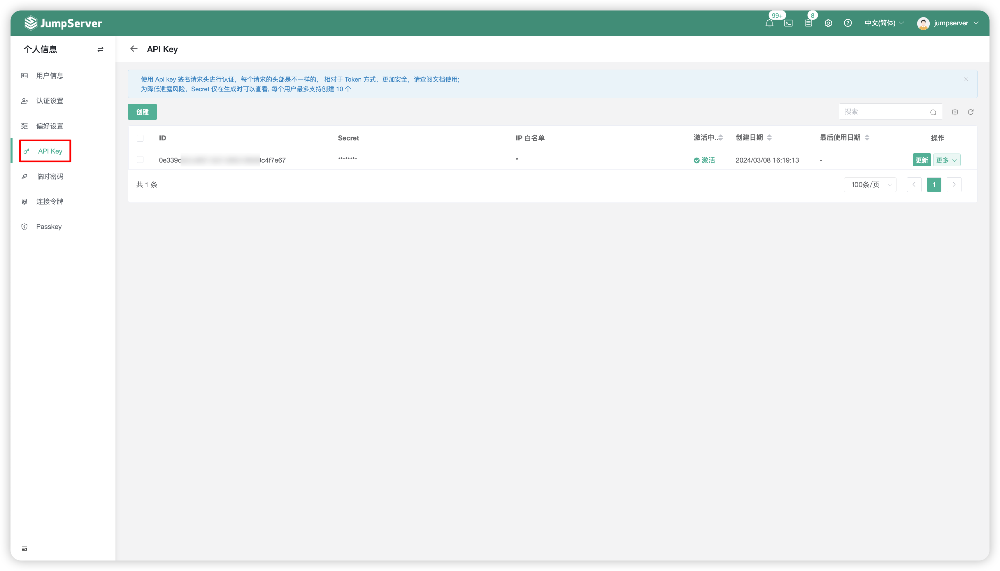
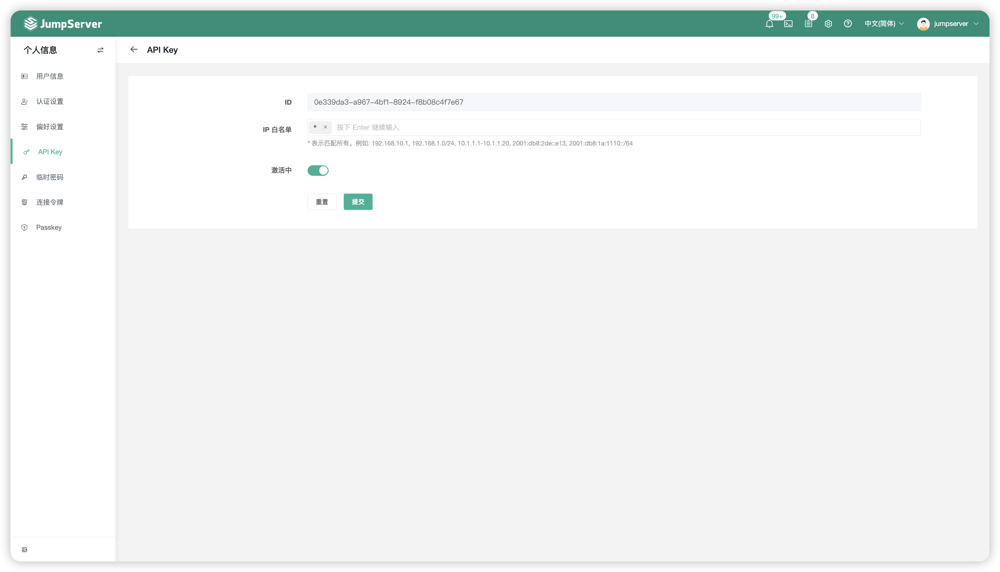

# API Key

## 1 功能简述
!!! tip ""
    - JumpServer 支持使用 API Key 签名请求头进行认证，每个请求的头部不一致，相对于永久 Token 的认证方式，API Key方式更加安全。
    - 点击 `API Key` 页面中的创建按钮，即可创建访问密钥，创建成功后会显示密钥的 Secret。

## 2 IP 白名单
!!! tip ""
    - 选中已创建的 API Key，点击更新，支持配置白名单策略对非法的IP请求进行安全拦截，可提升 JumpServer 系统的安全性。
