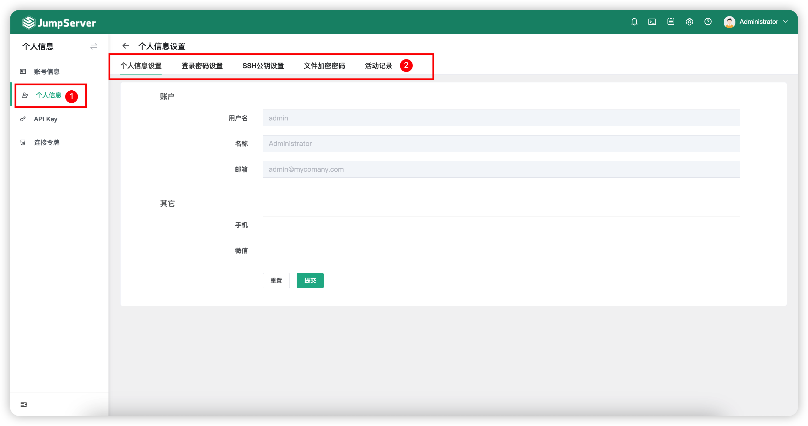

# 个人信息

## 1 功能简述
!!! tip ""
    - 管理员用户在个人信息页面可对本人账号信息进行相应的认证配置和消息订阅配置。

## 2 页面功能
!!! tip ""
    - 页面展示图如下：

!!! tip ""
    - 功能详细说明：
   
!!! tip "" 

    | 功能    |                说明                  |
    | -------| ------------------------------------ |
    | 个人信息设置 | 用户可再次页面设置手机、微信，开启短信 MFA 认证时，使用设置的手机号码接收短信。  |
    | 更新密码 | 用户可在此页面自行更新当前账户的密码。 |
    | SSH公钥设置 | 用户可在此页面自行设置SSH公钥并下载，在使用 SSH 终端登录时使用该公钥。 |
    | 文件加密密码 | 用户可在此页面设置文件的加密密码。 |
    | 活动记录 | 用户可在此页面查看自己的登录日志相关信息。 |