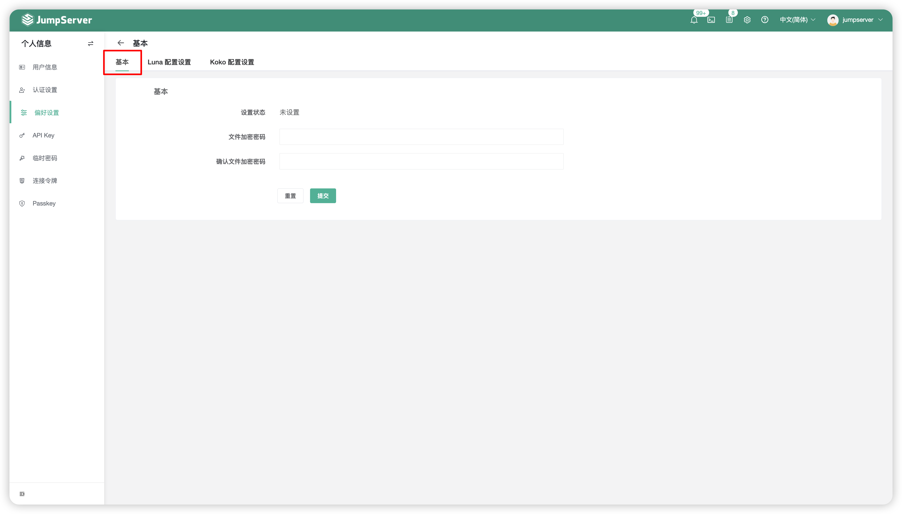
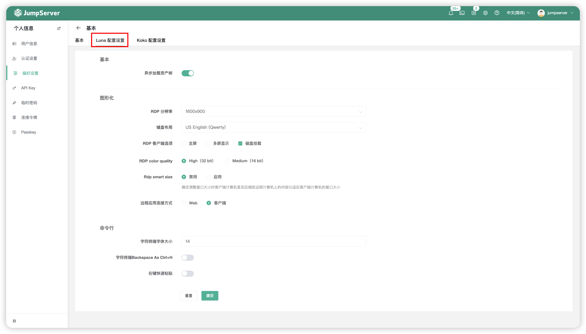
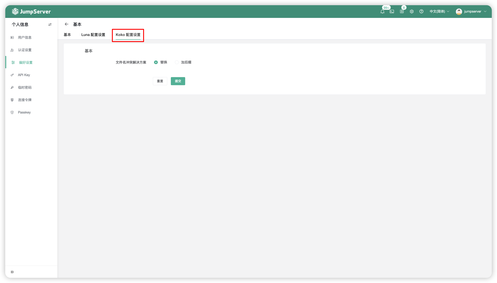

# 偏好设置

## 1 基本设置
!!! tip ""
    - 选中偏好设置`基本`按钮，可以对 JumpServer 页面导出文件的加密密码进行设置。

!!! tip ""
    - 功能详细说明：

    | 功能    |                说明                  |
    | -------| ------------------------------------ |
    | 文件加密密码 | 从 JumpServer 导出或者下载的文件中会存在敏感信息，此处设置文件的加密密码。此处的文件加密密码仅适用于账号密码批量导出的场景中。 |

## 2 Luna 配置设置
!!! tip ""
    - 选中偏好设置`Luna 配置设置`按钮，可以对 Luna 页面连接资产时的参数进行设置。

!!! tip ""
    - 功能详细说明：

    | 功能    |                说明                  |
    | -------| ------------------------------------ |
    | 异步加载资产树 | 支持资产连接页面异步加载资产树。 |
    | RDP 分辨率 | 支持修改 RDP 分辨率，默认为 Auto。 |
    | 键盘布局 | 支持选择连接 Windows 资产时使用的键盘布局。 |
    | RDP 客户端选项 | 在通过 RDP 客户端连接 Windows 资产时，是否开启全屏与磁盘挂载。 |
    | RDP 颜色质量 | 支持选择 RDP 远程会话的颜色深度。 |
    | RDP 智能大小 | 支持按照客户端主机的窗口大小，来自适应客户端主机与远程主机的画面内容。 |
    | 远程应用连接方式 | 支持选择远程应用的连接方式，Web 或者客户端方式。 |
    | 字符终端字体大小 | 支持设置终端字体的大小显示。 |
    | 字符终端 Backspace AS Ctrl+H | 支持在命令行中是否开启快捷键 Ctrl+H 作为删除键。 |
    | 右键快速粘贴 | 支持在命令行中开启右键快速粘贴。 |

## 3 Koko 配置设置
!!! tip ""
    - 选中偏好设置`Koko 配置设置`按钮，可以对 Koko 组件连接资产时的参数进行设置。

!!! tip ""
    - 功能详细说明：

    | 功能    |                说明                  |
    | -------| ------------------------------------ |
    | 文件名冲突解决方案 | 当通过 KOKO 组件进行文件上传时，支持对冲突的文件名进行替换或加后缀的操作。 |