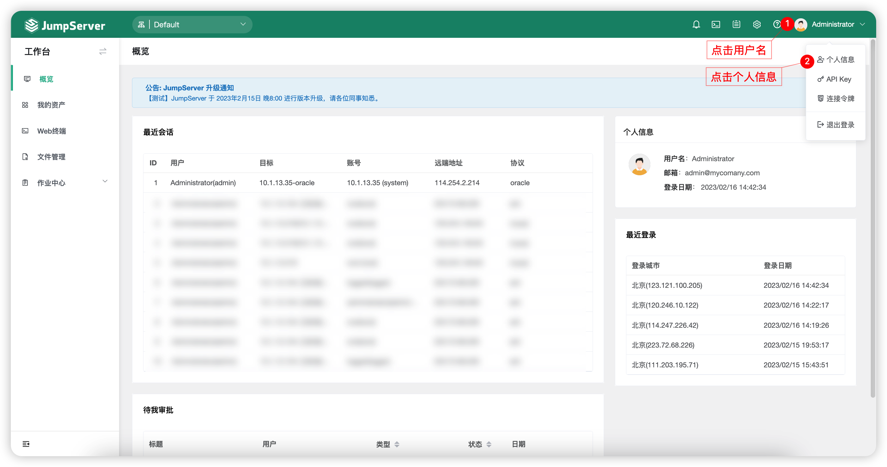
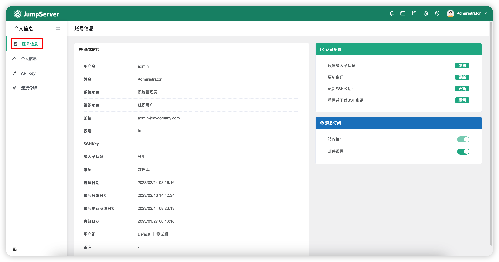
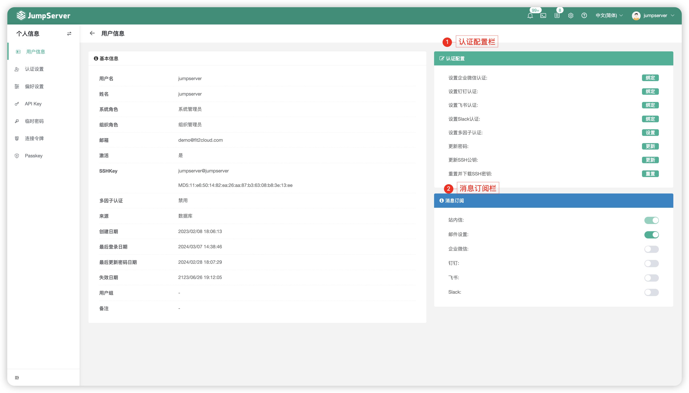

# 用户信息

## 1 功能简述
!!! tip ""
    - 页面可以查看用户的基本信息。
    - 该页面可以进行一些认证配置，例如多因子认证、密码、SSH 密钥登信息，同时可设置消息订阅，默认包含站内信和邮件设置，如果配置了企业微信或者钉钉，还可以在此处开启订阅。

## 2 页面功能
!!! tip ""
    - 点击切换至`用户信息`页面。
    - 点击可以进行认证配置和消息订阅操作。
