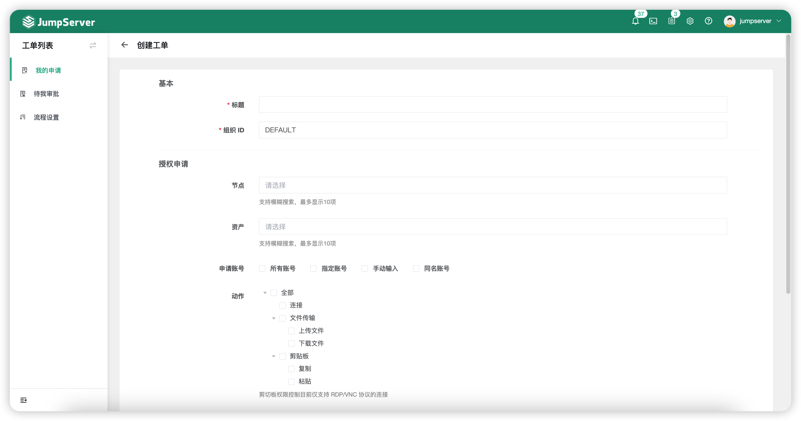
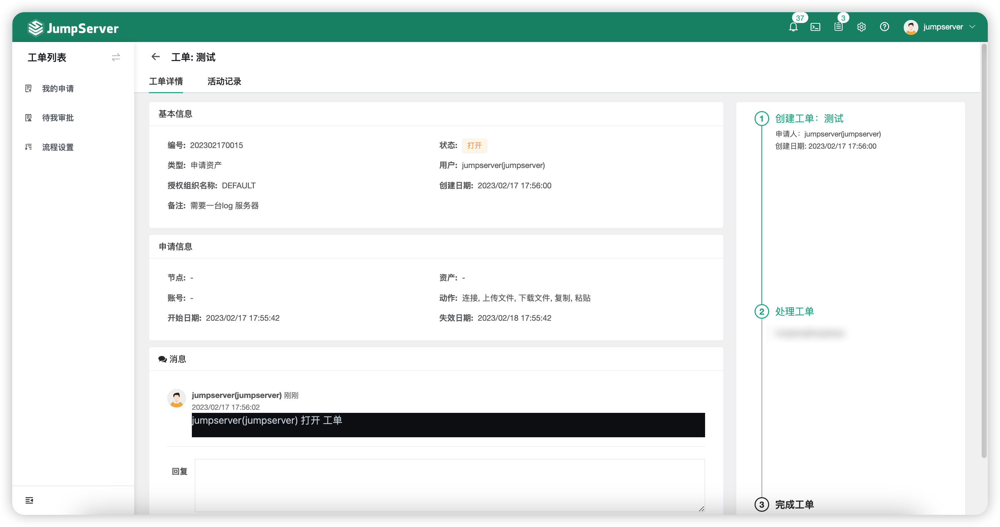
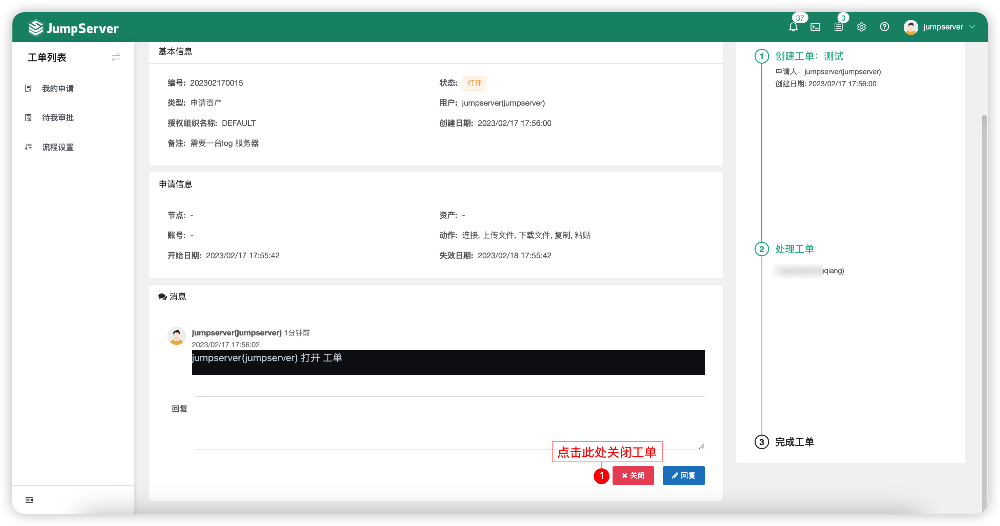

# 工单
!!! note "注：工单为 JumpServer 企业版功能。"

## 1 功能概述
!!! tip ""
    - 用户点击申请、申请授权工单信息，流程对应的审批人审批通过后，用户即可获得申请资产的权限或用户登录请求与命令过滤。

## 2 我的申请
!!! tip ""
    - 我的申请页面主要进行资产授权的申请、查看资产授权工单详情。

### 2.1 申请工单
!!! tip ""
    - 在我的申请页面点击`申请工单`按钮。
    - 选择`申请资产授权`按钮，进入资产授权申请页面如下所示：

!!! tip ""
    - 详细参数说明：

!!! tip ""

    | 参数     | 说明                  |
    | ------- | --------------------- |
    | 标题 | 该工单的标题。 |
    | 组织 ID | 该工单所申请的权限以及 JumpServer 用户所处的组织。 |
    | 节点 | JumpServer 用户申请的资产，节点指申请整个节点下所有资产的权限。 |
    | 资产 | JumpServer 用户申请的资产。 |
    | 申请账号 | JumpServer 用户申请的资产所使用的登录账号。 |
    | 动作 | JumpServer 用户申请拥有的动作权限。 |
    | 开始日期、失效日期 | 用户申请的权限使用的期限。 |

### 2.2 查看工单
!!! tip ""
    - 点击创建好的`工单标题`按钮，可进入工单详情页中。
    - 工单详情页中包含该工单的基本信息、申请信息以及审批人同时可以与审批人进行对话。

### 2.3 关闭工单
!!! tip ""
    - 申请人在审批人未审批前可自行关闭工单，关闭入口位于工单详情页下方。
