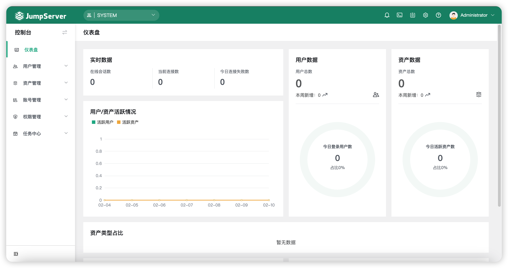

# 总体介绍

!!! tip ""
    JumpServer 是全球首款开源的堡垒机，使用 GNU GPL v2.0 开源协议，是符合 4A 规范的运维安全审计系统。  

    JumpServer 使用 Python / Django 为主进行开发，遵循 Web 2.0 规范，配备了业界领先的 Web Terminal 方案，交互界面美观、用户体验好。  

    JumpServer 采纳分布式架构，支持多机房跨区域部署，支持横向扩展，无资产数量及并发限制。  

    改变世界，从一点点开始。

## 页面展示

## 特色优势

!!! tip ""
    - 开源: 零门槛，线上快速获取和安装；
    - 分布式: 轻松支持大规模并发访问；
    - 无插件: 仅需浏览器，极致的 Web Terminal 使用体验；
    - 多云支持: 一套系统，同时管理不同云上面的资产；
    - 云端存储: 审计录像云端存储，永不丢失；
    - 多租户: 一套系统，多个子公司和部门同时使用；
    - 多应用支持: 数据库，Windows远程应用，Kubernetes。

## 功能列表

<table>
  <tr>
    <td rowspan="11">身份认证 Authentication</td>
    <td rowspan="7">登录认证</td>
    <td>资源统一登录与认证</td>
  </tr>
  <tr>
    <td>LDAP/AD 认证</td>
  </tr>
  <tr>
    <td>RADIUS 认证</td>
  </tr>
  <tr>
    <td>OpenID 认证（实现单点登录）</td>
  </tr>
  <tr>
    <td>CAS 认证 （实现单点登录）</td>
  </tr>
  <tr>
    <td>钉钉认证 （扫码登录）</td>
  </tr>
  <tr>
    <td>企业微信认证 （扫码登录）</td>
  </tr>
  <tr>
    <td rowspan="2">MFA认证</td>
    <td>MFA 二次认证（Google Authenticator）</td>
  </tr>
  <tr>
    <td>RADIUS 二次认证</td>
  </tr>
  <tr>
    <td>登录复核</td>
    <td>用户登录行为受管理员的监管与控制</td>
  </tr>
  <tr>
    <td>登录限制</td>
    <td>用户登录来源 IP 受管理员控制（支持黑/白名单）</td>
  </tr>
  <tr>
    <td rowspan="11">账号管理 Account</td>
    <td rowspan="2">集中账号</td>
    <td>管理用户管理</td>
  </tr>
  <tr>
    <td>系统用户管理</td>
  </tr>
  <tr>
    <td rowspan="4">统一密码</td>
    <td>资产密码托管</td>
  </tr>
  <tr>
    <td>自动生成密码</td>
  </tr>
  <tr>
    <td>自动推送密码</td>
  </tr>
  <tr>
    <td>密码过期设置</td>
  </tr>
  <tr>
    <td rowspan="2">批量改密</td>
    <td>定期批量改密</td>
  </tr>
  <tr>
    <td>多种密码策略</td>
  </tr>
  <tr>
    <td>多云纳管 </td>
    <td>对私有云、公有云资产自动统一纳管</td>
  </tr>
  <tr>
    <td>收集用户 </td>
    <td>自定义任务定期收集主机用户</td>
  </tr>
  <tr>
    <td>密码匣子 </td>
    <td>统一对资产主机的用户密码进行查看、更新、测试操作</td>
  </tr>
  <tr>
    <td rowspan="17">授权控制 Authorization</td>
    <td>多维授权</td>
    <td>对用户、用户组、资产、资产节点、应用以及系统用户进行授权</td>
  </tr>
  <tr>
    <td rowspan="4">资产授权</td>
    <td>资产以树状结构进行展示</td>
  </tr>
  <tr>
    <td>资产和节点均可灵活授权</td>
  </tr>
  <tr>
    <td>节点内资产自动继承授权</td>
  </tr>
  <tr>
    <td>子节点自动继承父节点授权</td>
  </tr>
  <tr>
    <td rowspan="2">应用授权</td>
    <td>实现更细粒度的应用级授权</td>
  </tr>
  <tr>
    <td>MySQL 数据库应用、RemoteApp 远程应用 </td>
  </tr>
  <tr>
    <td>动作授权</td>
    <td>实现对授权资产的文件上传、下载以及连接动作的控制</td>
  </tr>
  <tr>
    <td>时间授权</td>
    <td>实现对授权资源使用时间段的限制</td>
  </tr>
  <tr>
    <td>特权指令</td>
    <td>实现对特权指令的使用（支持黑白名单）</td>
  </tr>
  <tr>
    <td>命令过滤</td>
    <td>实现对授权系统用户所执行的命令进行控制</td>
  </tr>
  <tr>
    <td>文件传输</td>
    <td>SFTP 文件上传/下载</td>
  </tr>
  <tr>
    <td>文件管理</td>
    <td>实现 Web SFTP 文件管理</td>
  </tr>
  <tr>
    <td>工单管理</td>
    <td>支持对用户登录请求行为进行控制</td>
  </tr>
  <tr>
    <td rowspan="2">访问控制</td>
    <td>登录资产复核（通过 SSH/Telnet 协议登录资产）</td>
  </tr>
  <tr>
    <td>命令执行复核</td>
  </tr>
  <tr>
    <td>组织管理</td>
    <td>实现多租户管理与权限隔离</td>
  </tr>
  <tr>
    <td rowspan="8">安全审计 Audit</td>
    <td>操作审计</td>
    <td>用户操作行为审计</td>
  </tr>
  <tr>
    <td rowspan="3">会话审计</td>
    <td>在线会话内容监控</td>
  </tr>
  <tr>
    <td>在线会话内容审计</td>
  </tr>
  <tr>
    <td>历史会话内容审计</td>
  </tr>
  <tr>
    <td rowspan="2">录像审计</td>
    <td>支持对 Linux、Windows 等资产操作的录像进行回放审计</td>
  </tr>
  <tr>
    <td>支持对 RemoteApp、MySQL 等应用操作的录像进行回放审计</td>
  </tr>
  <tr>
    <td>指令审计</td>
    <td>支持对资产和应用等操作的命令进行审计</td>
  </tr>
  <tr>
    <td>文件传输</td>
    <td>可对文件的上传、下载记录进行审计</td>
  </tr>
  <tr>
    <td rowspan="20">数据库审计 Database</td>
    <td rowspan="2">连接方式</td>
    <td>命令方式</td>
  </tr>
  <tr>
    <td>Web UI方式</td>
  </tr>

  <tr>
    <td rowspan="4">支持的数据库</td>
    <td>MySQL</td>
  </tr>
  <tr>
    <td>Oracle</td>
  </tr>
  <tr>
    <td>MariaDB</td>
  </tr>
  <tr>
    <td>PostgreSQL</td>
  </tr>
  <tr>
    <td rowspan="6">功能亮点</td>
    <td>语法高亮</td>
  </tr>
  <tr>
    <td>SQL格式化</td>
  </tr>
  <tr>
    <td>支持快捷键</td>
  </tr>
  <tr>
    <td>支持选中执行</td>
  </tr>
  <tr>
    <td>SQL历史查询</td>
  </tr>
  <tr>
    <td>支持页面创建 DB, TABLE</td>
  </tr>
  <tr>
    <td rowspan="2">会话审计</td>
    <td>命令记录</td>
  </tr>
  <tr>
    <td>录像回放</td>
  </tr>
</table>

## 案例研究

!!! tip ""
    - [JumpServer 堡垒机护航顺丰科技超大规模资产安全运维](https://blog.fit2cloud.com/?p=1147)
    - [JumpServer 堡垒机让“大智慧”的混合 IT 运维更智慧](https://blog.fit2cloud.com/?p=882)
    - [携程 JumpServer 堡垒机部署与运营实战](https://blog.fit2cloud.com/?p=851)
    - [小红书的 JumpServer 堡垒机大规模资产跨版本迁移之路](https://blog.fit2cloud.com/?p=516)
    - [JumpServer 堡垒机助力中手游提升多云环境下安全运维能力](https://blog.fit2cloud.com/?p=732)
    - [中通快递：JumpServer 主机安全运维实践](https://blog.fit2cloud.com/?p=708)
    - [东方明珠：JumpServer 高效管控异构化、分布式云端资产](https://blog.fit2cloud.com/?p=687)
    - [江苏农信：JumpServer 堡垒机助力行业云安全运维](https://blog.fit2cloud.com/?p=666)

## 安全说明

!!! tip ""
    JumpServer是一款安全产品，请参考 [基本安全建议](https://docs.jumpserver.org/zh/master/install/install_security/) 部署安装.  
    如果你发现安全问题，可以直接联系我们：

    - ibuler@fit2cloud.com
    - support@fit2cloud.com
    - 400-052-0755

## 商业产品

!!! tip ""
    - [JumpServer 企业版](https://jumpserver.org/enterprise.html)
    - [JumpServer 一体机](https://jumpserver.org/hardware.html)
