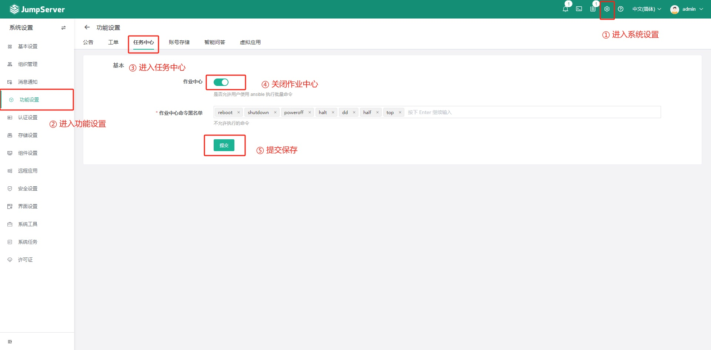
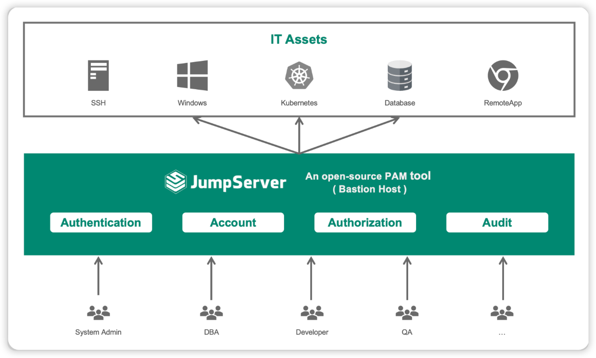

# 产品介绍

??? warning "重要通知 | JumpServer 漏洞通知及修复方案（JS-2024.07.18）"
    **2024年7月，有用户反馈发现 JumpServer 开源堡垒机存在安全漏洞，并向 JumpServer 开源项目组进行上报。**

    **漏洞信息：** 
      [JumpServer作业管理中Ansible Playbook存在可读取任意文件的漏洞，CVE编号为CVE-2024-40628 ](https://github.com/jumpserver/jumpserver/security/advisories/GHSA-rpf7-g4xh-84v9)
      [JumpServer作业管理中Ansible Playbook存在任意文件写入的远程执行漏洞，CVE编号为CVE-2024-40629。](https://github.com/jumpserver/jumpserver/security/advisories/GHSA-3wgp-q8m7-v33v)

    **以上漏洞影响版本为：**   JumpServer v3.0.0-v3.10.11版本

    **安全版本为：**   JumpServer版本>=v3.10.12版本 
      JumpServer版本>=v4.0.0版本
    

    **修复方案：**
     **永久修复方案：** 升级 JumpServer 软件至上述安全版本。
     **临时修复方案：** 关闭作业中心功能。关闭作业中心功能的具体步骤为：
         以管理员身份登录至JumpServer堡垒机。依次选择“系统设置”→“功能设置”→“任务中心”，在打开的页面中关闭作业中心功能。
          

    **特别鸣谢：**   感谢以下社区用户向JumpServer开源社区及时反馈上述漏洞。
      CVE-2024-40628：@oskar-zeinomahmalat-sonarsource
      CVE-2024-40629：@oskar-zeinomahmalat-sonarsource

## 1 JumpServer 是什么？
!!! tip ""
    JumpServer 是广受欢迎的开源堡垒机，是符合 4A 规范的专业运维安全审计系统。JumpServer 帮助企业以更安全的方式管控和登录所有类型的资产，实现事前授权、事中监察、事后审计，满足等保合规要求。

!!! tip ""
    JumpServer 堡垒机支持的资产类型包括：

    - SSH  (Linux / Unix / 网络设备 等)
    - Windows (Web 方式连接 / 原生 RDP 连接)
    - 数据库 (MySQL / MariaDB / Oracle / SQLServer / PostgreSQL / ClickHouse 等)
    - NoSQL (Redis / MongoDB 等)
    - GPT (ChatGPT 等)
    - 云服务 (Kubernetes / VMware vSphere 等)
    - Web 站点 (各类系统的 Web 管理后台)
    - 应用 (通过 Remote App 连接各类应用)

!!! tip "文档指引"
    - **JumpServer 介绍**    

         [**产品简介**](https://docs.jumpserver.org/zh/v3/) &emsp;&emsp;&emsp;&emsp;&emsp;  [**安装部署**](installation/setup_linux_standalone/requirements/) &emsp;&emsp;&emsp;&emsp;&emsp;  [**体验环境**](https://demo.jumpserver.org/ ) &emsp;&emsp;&emsp;&emsp;&emsp;  [**企业试用**](https://jinshuju.net/f/kyOYpi) &emsp;&emsp;&emsp;&emsp;&emsp;  [**社区论坛**](https://bbs.fit2cloud.com/c/js/5)

      - **功能指南**

           [**用户管理**](guide/admin/user/user_list/) &emsp;&emsp;&emsp;&emsp;&emsp;  [**资产管理**](guide/admin/asset/asset_list/) &emsp;&emsp;&emsp;&emsp;&emsp;  [**帐号管理**](guide/admin/account/account_list/) &emsp;&emsp;&emsp;&emsp;&emsp; [**权限管理**](guide/admin/permission/asset_permissions/)

           [**远程应用**](guide/system/remoteapp/) &emsp;&emsp;&emsp;&emsp;&emsp;  [**会话审计**](guide/audit/session_audit/session_record/)  &emsp;&emsp;&emsp;&emsp;&emsp;  [**日志审计**](guide/audit/log_audit/login_log/)

           [**文件管理**](guide/user/file_management/) &emsp;&emsp;&emsp;&emsp;&emsp;  [**作业中心**](guide/user/ops/quick_command/)   &emsp;&emsp;&emsp;&emsp;&emsp;  [**资产连接**](guide/user/web_terminal/) &emsp;&emsp;&emsp;&emsp;&emsp;  [**系统设置**](guide/system/basic/)

    - **企业应用（X-Pack）**

           [**资产登录复核**](guide/admin/permission/host_acls/)  &emsp;&emsp;&emsp; [**连接方式控制**](guide/admin/permission/connect_method_acls/)

           [**工单**](guide/admin/admin_tickets/) &emsp;&emsp;&emsp;&emsp;&emsp;&emsp;&emsp; [**云同步**](guide/admin/asset/asset_list/#33)  &emsp;&emsp;&emsp;&emsp;&emsp;&emsp;  [**角色列表**](guide/admin/user/role_list/)

           [**帐号收集**](guide/admin/account/account_gather/) &emsp;&emsp;&emsp;&emsp;&emsp; [**帐号改密**](guide/admin/account/account_change_secret/)  &emsp;&emsp;&emsp;&emsp;&emsp; [**帐号备份**](guide/admin/account/account_backup/) 

           [**短信设置**](guide/system/message/#2-x-pack)  &emsp;&emsp;&emsp;&emsp;&emsp; [**界面设置**](guide/system/index_logo/)  &emsp;&emsp;&emsp;&emsp;&emsp; [**组织管理**](guide/system/organization/)  &emsp;&emsp;&emsp;&emsp;&emsp; [**认证设置**](faq/faq/#4)

     - **进阶学习** 

           [**客户案例**](user_stories/) &emsp;&emsp;&emsp;&emsp;&emsp;  [**视频学习**](https://space.bilibili.com/510493147/channel/collectiondetail?sid=1394720) &emsp;&emsp;&emsp;&emsp;&emsp;  [**更多实践**](https://kb.fit2cloud.com/categories/jumpserver)&emsp;

## 2 产品特色
!!! tip ""
    JumpServer 的产品特色包括：

    - 开源：零门槛，线上快速获取和安装；
    - 分布式：轻松支持大规模并发访问；
    - 无插件：仅需浏览器，极致的 Web Terminal 使用体验；
    - 多云支持：一套系统，同时管理不同云上面的资产；
    - 云端存储：审计录像云端存储，永不丢失；
    - 多租户：一套系统，多个子公司和部门同时使用；
    - 多应用支持：数据库，Windows 远程应用，Kubernetes。

## 3 页面展示

## 4 功能列表
!!! tip ""
    - [JumpServer 堡垒机功能列表](https://www.jumpserver.org/features.html)

## 5 应用商店
!!! tip ""
    JumpServer 的远程应用功能，社区版默认支持 Chrome、DBeaver 应用，企业版支持更丰富的远程应用，可点击 [应用商店](https://apps.fit2cloud.com/jumpserver) 来获取更多远程应用。

## 6 安全说明
!!! tip ""
    JumpServer 是一款安全产品，请参考 [基本安全建议](faq/security.md) 部署安装。

    如果你发现安全问题，可以直接联系我们：

    - ibuler@fit2cloud.com
    - support@fit2cloud.com
    - 400-052-0755

## 7 商业产品
!!! tip ""
    - [JumpServer 企业版](https://jumpserver.org/enterprise.html){:target="_blank"}
    - [JumpServer 一体机](https://jumpserver.org/hardware.html){:target="_blank"}

## 8 了解更多
!!! tip ""
    - [如何向团队介绍 JumpServer？](https://www.jumpserver.org/documents/introduce-jumpserver_202310.pdf)
    - [新一代堡垒机建设指南](https://fit2cloud.com/whitepaper/jumpserver-whitepaper_202307.pdf){:target="_blank"}
    - [JumpServer 知识库](https://kb.fit2cloud.com/categories/jumpserver){:target="_blank"}
    - [FIT2CLOUD Bilibili 官方站](https://space.bilibili.com/510493147?spm_id_from=333.337.0.0){:target="_blank"}
    - [FIT2CLOUD 技术博客](https://blog.fit2cloud.com/){:target="_blank"}