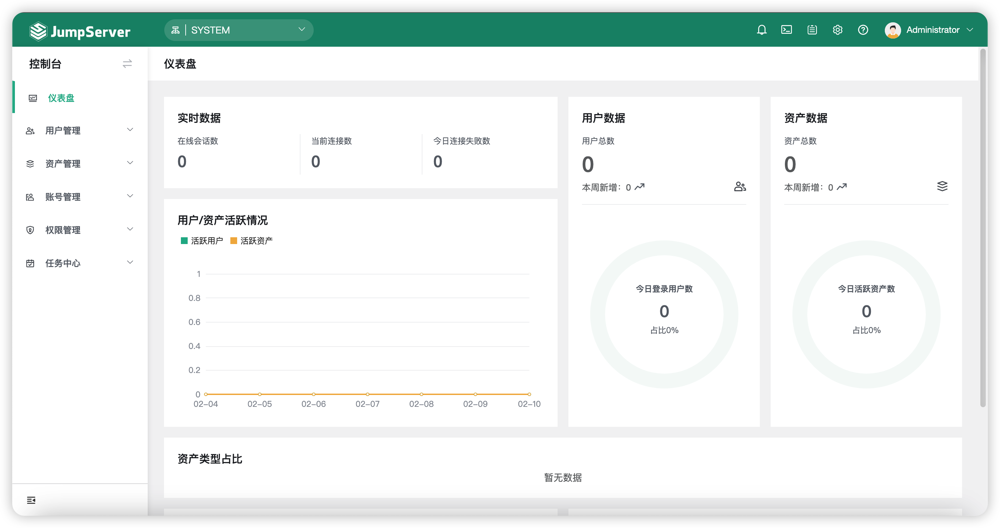

# 产品介绍

??? warning "[重要通知丨JumpServer 漏洞通知及修复方案（JS-2026.7.29）]"

    2026 年 7 月，JumpServer 开源项目组收到安全研究人员提交的漏洞报告。经验证，此次发现的漏洞包括：

    ■ **JumpServer Chen 组件依赖库 fastjson 漏洞（CVE-2026-16723）**。漏洞详情：[Security Advisory: Remote Code Execution in fastjson 1.2.68-1.2.83](https://github.com/alibaba/fastjson2/wiki/Security-Advisory:-Remote-Code-Execution-in-fastjson-1.2.68%E2%80%931.2.83)

    ■ **JumpServer Ansible Gateway SSH ProxyCommand 命令注入漏洞（CVE-2026-XXXXX）**。漏洞详情：[GHSA-q9wr-gv6g-5gm6](https://github.com/jumpserver/jumpserver/security/advisories/GHSA-q9wr-gv6g-5gm6)

    ■ **JumpServer Ansible 自动化模板渲染存在不安全 Lookup 插件调用漏洞（CVE-2026-XXXXX）**。漏洞详情：[GHSA-gr5x-5c4h-867g](https://github.com/jumpserver/jumpserver/security/advisories/GHSA-gr5x-5c4h-867g)

    ■ **JumpServer KoKo Web Terminal SFTP 路径遍历漏洞（CVE-2026-54336）**。漏洞详情：[GHSA-x6rg-36j6-76vr](https://github.com/jumpserver/jumpserver/security/advisories/GHSA-x6rg-36j6-76vr)

    ■ **JumpServer Applet Host 部署 Jinja 模板注入远程命令执行漏洞（CVE-2026-44845）**。漏洞详情：[GHSA-22h6-pcgh-9v7q](https://github.com/jumpserver/jumpserver/security/advisories/GHSA-22h6-pcgh-9v7q)

    ■ **JumpServer 组织邀请逻辑权限覆盖漏洞（CVE-2026-44846）**。漏洞详情：[GHSA-j836-99w5-523r](https://github.com/jumpserver/jumpserver/security/advisories/GHSA-j836-99w5-523r)

    **以上漏洞影响版本：**

     JumpServer V3 版本：&lt; v3.10.22 LTS 版本
     JumpServer V4 版本：&lt; v4.10.17 LTS 版本

    **安全版本：**

     JumpServer V3 版本：>= v3.10.22 LTS 版本
     JumpServer V4 版本：>= v4.10.17 LTS 版本

    
    如果暂时无法升级：

    **■** 建议限制 Ansible 自动化、SSH 网关、Applet Host 等高风险功能的管理权限，仅向可信管理员授予相关权限；

    **■** 审查已有 SSH 网关配置、自动化任务模板、Applet Host 配置以及组织角色变更记录，排查异常内容；

    **■** 限制具有用户邀请权限账号的使用范围。

!!! tip "[信创合规、开箱即用、全栈优化丨飞致云联合宏时数据发布 Zabbix 信创一体机！](https://fit2cloud.com/zabbix/index.html)"

## 1 JumpServer 是什么？
!!! tip ""
    JumpServer 是广受欢迎的开源堡垒机，是符合 4A 规范的专业运维安全审计系统。JumpServer 帮助企业以更安全的方式管控和登录所有类型的资产，实现事前授权、事中监察、事后审计，满足等保合规要求。

!!! tip ""
    JumpServer 堡垒机支持的资产类型包括：

    - SSH  (Linux / Unix / 网络设备 等)
    - Windows (Web 方式连接 / 原生 RDP 连接)
    - 数据库 (MySQL / MariaDB / Oracle / SQLServer / PostgreSQL / ClickHouse 等)
    - NoSQL (Redis / MongoDB 等)
    - GPT (ChatGPT 等)
    - 云服务 (Kubernetes / VMware vSphere 等)
    - Web 站点 (各类系统的 Web 管理后台)
    - 应用 (通过 Remote App 连接各类应用)

!!! tip "文档指引"

    [**产品官网**](https://jumpserver.org/) &emsp;&emsp;&emsp;&emsp;&emsp;  [**安装部署**](installation/setup_linux_standalone/requirements/) &emsp;&emsp;&emsp;&emsp;&emsp;  [**在线体验**](https://demo.jumpserver.org/ ) &emsp;&emsp;&emsp;&emsp;&emsp;  [**企业版试用**](https://jinshuju.net/f/kyOYpi) &emsp;&emsp;&emsp;&emsp;&emsp;  [**社区论坛**](https://bbs.fit2cloud.com/c/js/5) &emsp;&emsp;&emsp;&emsp;&emsp; [**视频教学**](https://www.bilibili.com/video/BV11AsDegEo8/) &emsp;&emsp;&emsp;&emsp;&emsp; [**技术白皮书**](https://whitepaper.jumpserver.org/)

## 2 产品特色
!!! tip ""
    JumpServer 的产品特色包括：

    - 开源：零门槛，线上快速获取和安装；
    - 分布式：轻松支持大规模并发访问；
    - 无插件：仅需浏览器，极致的 Web Terminal 使用体验；
    - 多云支持：一套系统，同时管理不同云上面的资产；
    - 云端存储：审计录像云端存储，永不丢失；
    - 多租户：一套系统，多个子公司和部门同时使用；
    - 多应用支持：数据库，Windows 远程应用，Kubernetes。

## 3 页面展示

## 4 应用商店
!!! tip ""
    JumpServer 的远程应用功能，社区版默认支持 Chrome、DBeaver 应用，企业版支持更丰富的远程应用，可点击 [应用商店](https://apps.fit2cloud.com/jumpserver) 来获取更多远程应用。

## 5 安全说明
!!! tip ""
    - JumpServer 是一款安全产品，请遵循 [基本安全建议](faq/security.md) 进行安装部署
    - 如果你发现安全问题，可以直接联系我们：support@fit2cloud.com

## 6 商业产品
!!! tip ""
    - [JumpServer 企业版](https://jumpserver.org/enterprise.html){:target="_blank"}
    - [JumpServer 一体机](https://jumpserver.org/hardware.html){:target="_blank"}

## 7 了解更多
!!! tip ""
    - [如何向团队介绍 JumpServer？](https://www.fit2cloud.com/jumpserver/documents/introduce-jumpserver_2026.pdf)
    - [JumpServer 技术白皮书](https://whitepaper.jumpserver.org/){:target="_blank"}
    - [JumpServer 知识库](https://kb.fit2cloud.com/categories/jumpserver){:target="_blank"}
    - [教学视频](https://space.bilibili.com/510493147?spm_id_from=333.337.0.0){:target="_blank"}
