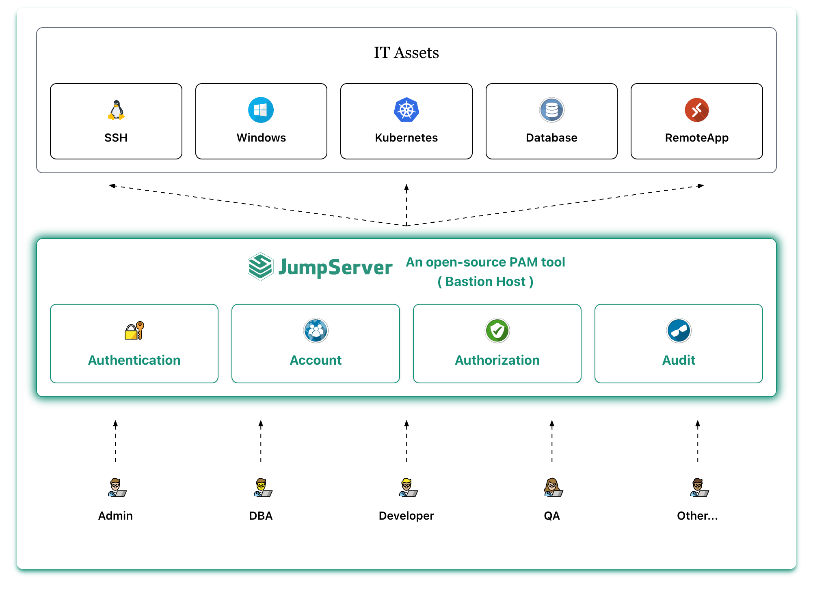

# 产品介绍

## 1 JumpServer 是什么？
!!! tip ""
    JumpServer 是广受欢迎的开源堡垒机，是符合 4A 规范的专业运维安全审计系统。JumpServer 帮助企业以更安全的方式管控和登录所有类型的资产，实现事前授权、事中监察、事后审计，满足等保合规要求。

!!! tip ""
    JumpServer 堡垒机支持的资产类型包括：

    - SSH  (Linux / Unix / 网络设备 等)
    - Windows (Web 方式连接 / 原生 RDP 连接)
    - 数据库 (MySQL / MariaDB / Oracle / SQLServer / PostgreSQL / ClickHouse 等)
    - NoSQL (Redis / MongoDB 等)
    - GPT (ChatGPT 等)
    - 云服务 (Kubernetes / VMware vSphere 等)
    - Web 站点 (各类系统的 Web 管理后台)
    - 应用 (通过 Remote App 连接各类应用)

!!! tip "文档指引"
    - **JumpServer 介绍**    

    [**产品简介**](https://jumpserver.org/) &emsp;&emsp;&emsp;&emsp;&emsp;  [**安装部署**](installation/setup_linux_standalone/requirements/) &emsp;&emsp;&emsp;&emsp;&emsp;  [**体验环境**](https://demo.jumpserver.org/ ) &emsp;&emsp;&emsp;&emsp;&emsp;  [**企业试用**](https://jinshuju.net/f/kyOYpi) &emsp;&emsp;&emsp;&emsp;&emsp;  [**社区论坛**](https://bbs.fit2cloud.com/c/js/5) &emsp;&emsp;&emsp;&emsp;&emsp; [**20分钟掌握 JumpServer 视频教学**](https://www.bilibili.com/video/BV11AsDegEo8/)

## 2 产品特色
!!! tip ""
    JumpServer 的产品特色包括：

    - 开源：零门槛，线上快速获取和安装；
    - 分布式：轻松支持大规模并发访问；
    - 无插件：仅需浏览器，极致的 Web Terminal 使用体验；
    - 多云支持：一套系统，同时管理不同云上面的资产；
    - 云端存储：审计录像云端存储，永不丢失；
    - 多租户：一套系统，多个子公司和部门同时使用；
    - 多应用支持：数据库，Windows 远程应用，Kubernetes。

## 3 页面展示

## 4 功能列表
!!! tip ""
    - [JumpServer 堡垒机功能列表](https://www.jumpserver.org/features.html)

## 5 应用商店
!!! tip ""
    JumpServer 的远程应用功能，社区版默认支持 Chrome、DBeaver 应用，企业版支持更丰富的远程应用，可点击 [应用商店](https://apps.fit2cloud.com/jumpserver) 来获取更多远程应用。

## 6 安全说明
!!! tip ""
    - JumpServer 是一款安全产品，请遵循 [基本安全建议](faq/security.md) 进行安装部署
    - 如果你发现安全问题，可以直接联系我们：support@fit2cloud.com

## 7 商业产品
!!! tip ""
    - [JumpServer 企业版](https://jumpserver.org/enterprise.html){:target="_blank"}
    - [JumpServer 一体机](https://jumpserver.org/hardware.html){:target="_blank"}

## 8 了解更多
!!! tip ""
    - [如何向团队介绍 JumpServer？](https://www.jumpserver.org/documents/introduce-jumpserver_202501.pdf)
    - [新一代堡垒机建设指南](https://fit2cloud.com/whitepaper/jumpserver-whitepaper_202307.pdf){:target="_blank"}
    - [JumpServer 知识库](https://kb.fit2cloud.com/categories/jumpserver){:target="_blank"}
    - [教学视频](https://space.bilibili.com/510493147?spm_id_from=333.337.0.0){:target="_blank"}
    - [技术博客](https://blog.fit2cloud.com/){:target="_blank"}
