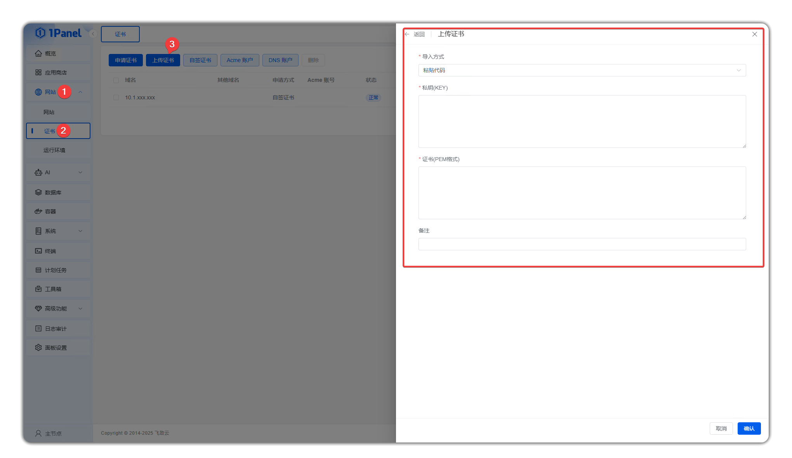
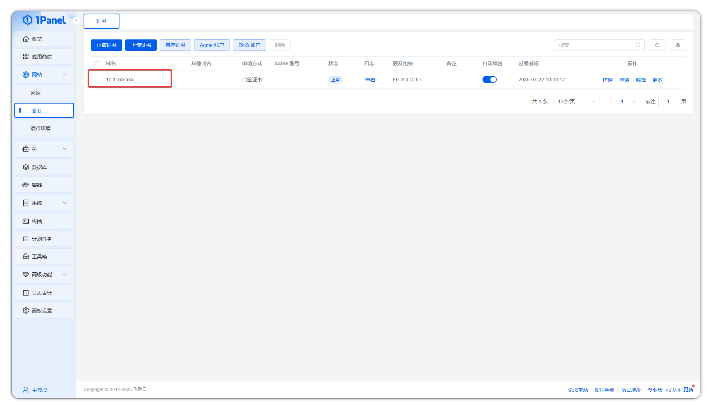
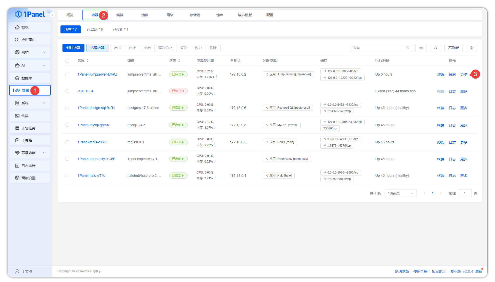
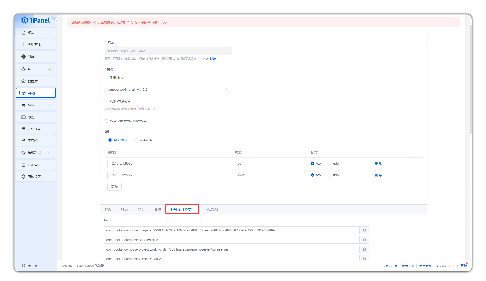
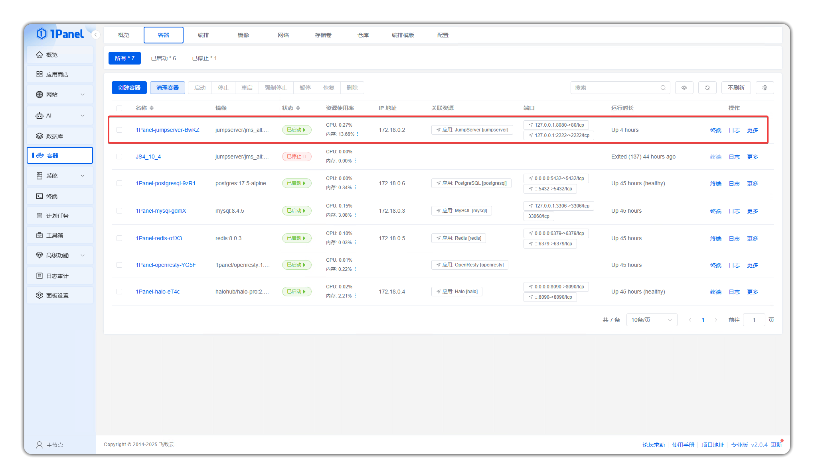
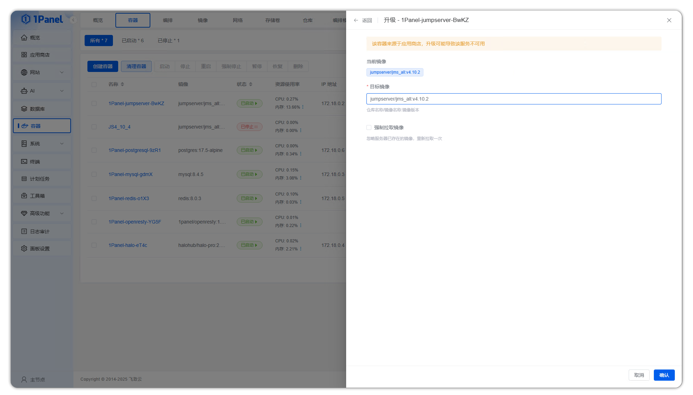

# Configure JumpServer on 1Panel

## 1 SSL/TLS Certificate Configuration
!!! warning "Note"
    - First, ensure that the openresty application is already installed and deployed in 1Panel.
!!! tip ""
    - Open 1Panel, in the left navigation bar click **Website** → **Certificates** → **Upload Certificate** button to access the **Upload Certificate** module. Users can configure the certificate's private key and certificate information through two methods: paste code or select file from server.

!!! tip ""
    You can also create certificates through applying for certificates or self-signed certificates.
    The system will automatically identify domain names, certificate issuer organization and other information based on the submitted private key and certificate files.

!!! tip ""
    - The following is based on OpenResty. In the left navigation bar, click **Website** → **Website** → **Create Website**, select **JumpServer** from installed applications, configure related domain information, and enable **HTTPS** at the bottom. Click **Confirm** button to complete website creation.

## 2 Modify Configuration File
!!! tip ""
    - Find **Containers** in the left menu, click **Containers** at the top to view specific containers. Find the image corresponding to **jms_all** and click **More** in the **Operation** column on the right, then click **Edit**.

!!! tip ""
    - On the edit page, scroll down to the bottom, select the **Labels & Environment Variables** section, and access the file configuration area.

!!! tip ""
    - Scroll down to the **Environment Variables** section. You can modify, add, and delete environment variable content. Click **Confirm** after modification to complete configuration file updates.

## 3 Upgrade Operation
!!! tip ""
    - First, in the 1panel Linux operations panel left navigation bar, click **Containers**. Then in the right top navigation bar, click **Containers** button to view all containers currently managed by the server.

!!! tip ""
    - Find the jms_all container (JumpServer service provider), in the right operation buttons, click **More** → **Upgrade**, select an appropriate new version image from the target image, and finally click **Confirm** button to complete JumpServer upgrade.

## 4 View Logs
!!! tip ""
    - Containers → Find the jumpserver container → Operation → View container logs.

## 5 Application Backup
### 5.1 Enter Application Management
!!! tip ""
    - Log in to the 1Panel console.
    - In the left menu, select **App Store** → **Installed**.
    - Find the JumpServer application, click the **Backup** button on the right.

### 5.2 Perform Backup Operation
!!! tip ""
    - On the backup page, find the **Backup** button.
    - You can enter compress or decompress passwords (if any) and description for the backup (if any).
    - Click confirm to automatically complete the backup operation.

### 5.3 Restore Backup Content
!!! tip ""
    - Click backup at the top right, select the backup file you need to restore.
    - Click **Restore** to return to the state when the backup was made.
