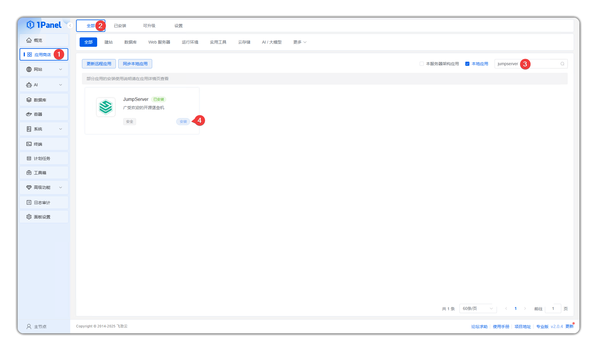
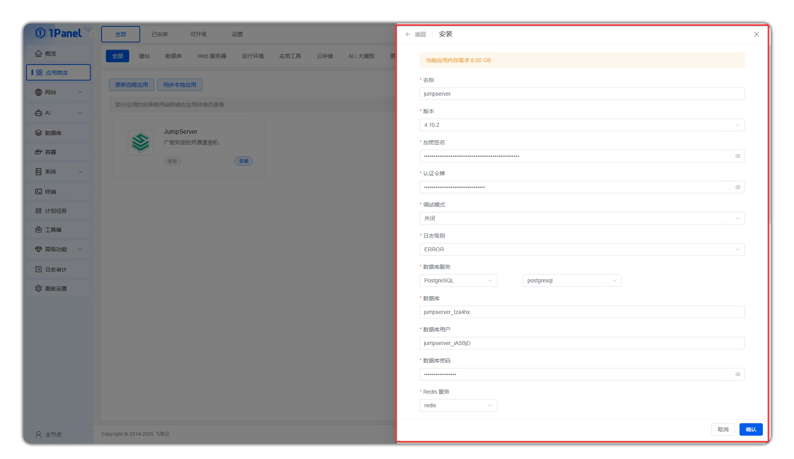
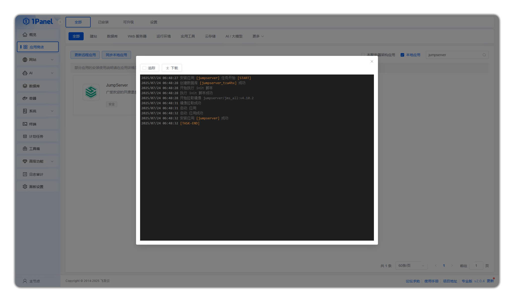

# Deploy JumpServer with 1Panel

## 1. Install 1Panel
!!! tip ""
    - For 1Panel installation, deployment and basic feature introduction, please refer to [1Panel Official Documentation](https://1panel.cn/docs/v2/installation/online_installation/).
    - After completing the 1Panel installation and deployment, open your browser and access 1Panel according to the provided URL.
    

## 2. Install Database and Redis Service
!!! warning ""
    - Before installing JumpServer, you need to install the required **PostgreSQL** (or **MySQL**) and **Redis** applications in 1Panel first.

## 3. Install JumpServer
!!! tip ""
    - Open the App Store menu, search for **JumpServer** in the search bar, and click **Install** after finding it.


!!! tip ""
    - Before installation, various installation version information and database selection information will be displayed. Enter the database password and other information, then click **Confirm** to start the installation.



!!! tip "Detailed parameter description:"

    | Parameter                | Description                                                         |
    | ------------------- | ------------------------------------------------------------ |
    | Name                | The name of the JumpServer application to be created.                                 |
    | Version                | The version of the JumpServer application to be created.                                 |
    | Encryption Signature            | JumpServer's SECRET_KEY. Keep default. Save this SECRET_KEY for migration environments. |
    | Authentication Token            | JumpServer's BOOTSTRAP_TOKEN. Keep default. Save this BOOTSTRAP_TOKEN for migration environments. |
    | Debug Mode            | Support enabling debug mode.                                           |
    | Log Level            | Log level. Support DEBUG, INFO, WARNING, ERROR, CRITICAL levels.                                           |
    | Database Service          | The PostgreSQL database application used by JumpServer. You can select from already installed PostgreSQL applications. 1Panel will automatically configure JumpServer to use this database. |
    | Database Name            | The database name used by JumpServer. 1Panel will automatically create this database in the selected database. |
    | Edit compose file   | Support customizing the compose file to start containers.                            |


!!! info "If the following log records appear, **TASK-END** indicates installation is complete."



## 4. Access JumpServer
!!! info "After successful installation, access JumpServer through your browser."
    ```sh
    http://your_server_ip:port
    ```
