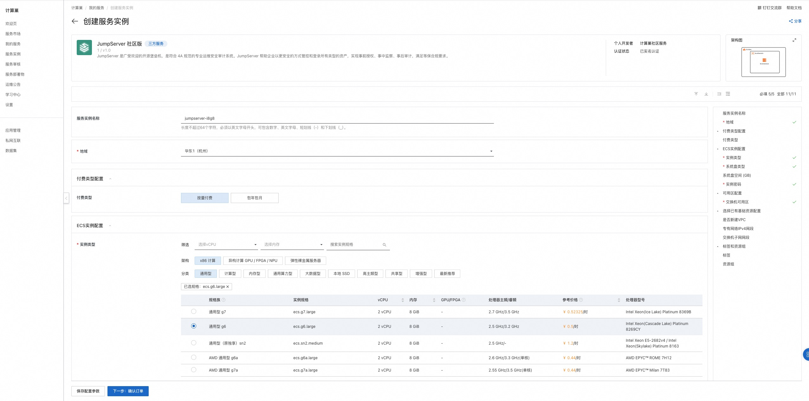
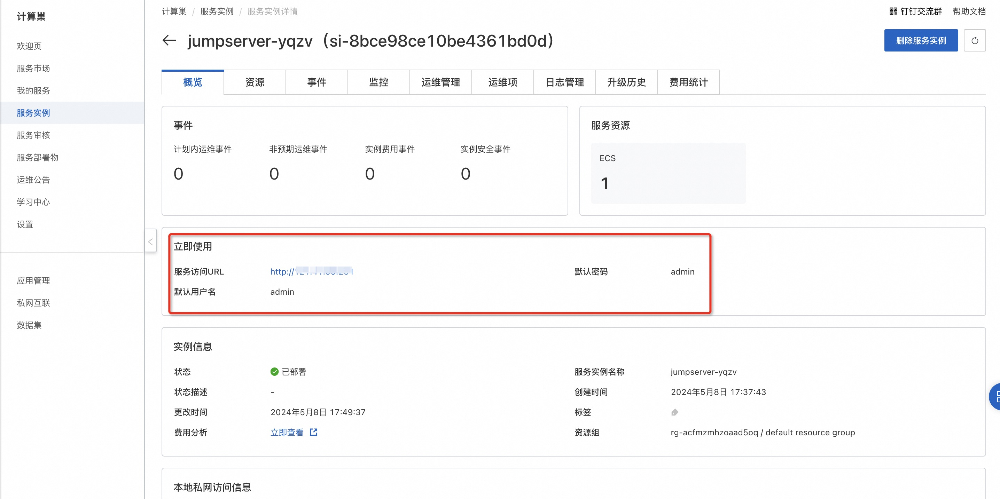
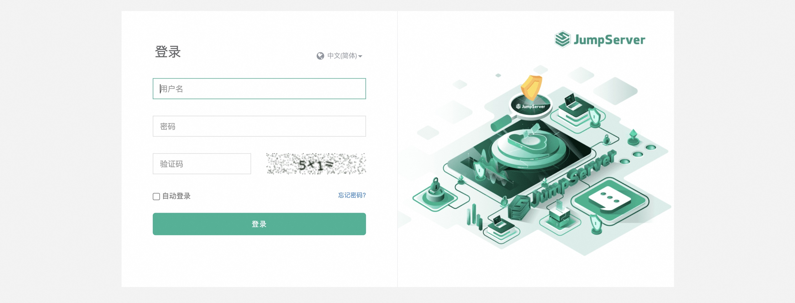

# 计算巢部署指南

!!! Abstract ""

    阿里云计算巢提供了软件与资源的一体化交付的完善基础能力，助力服务商、开发者的提升服务能力和降低运营成本。计算巢已经支持快速部署 JumpServer 社区版。

## 部署流程

!!! Abstract ""

    单击[部署链接](https://computenest.console.aliyun.com/service/instance/create/default?type=user&ServiceName=JumpServer%20%E7%A4%BE%E5%8C%BA%E7%89%88)，进入服务实例部署界面。

!!! Abstract ""

    根据界面提示配置参数，配置完成后确认订单并创建服务实例：

!!! Abstract ""

    服务实例创建成功后，进入服务实例详情页，在概览页获取服务访问地址：

!!! Abstract ""

    访问JumpServer服务：
   

