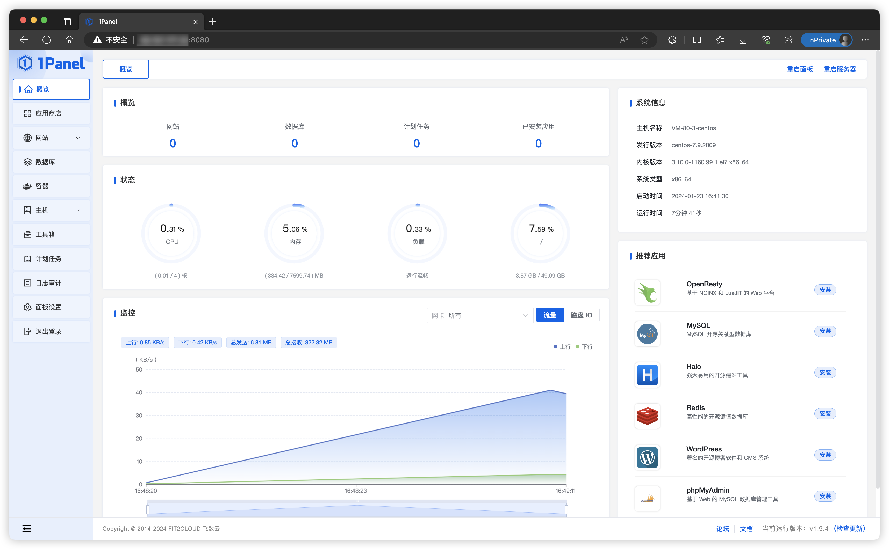
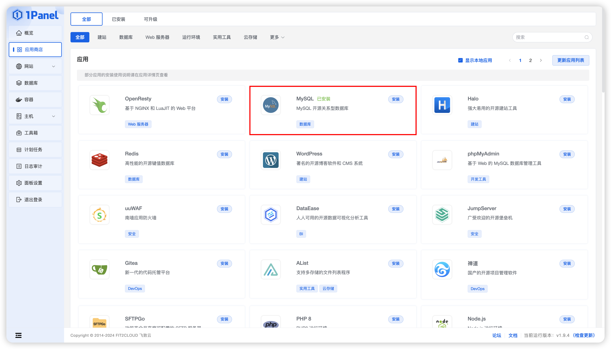
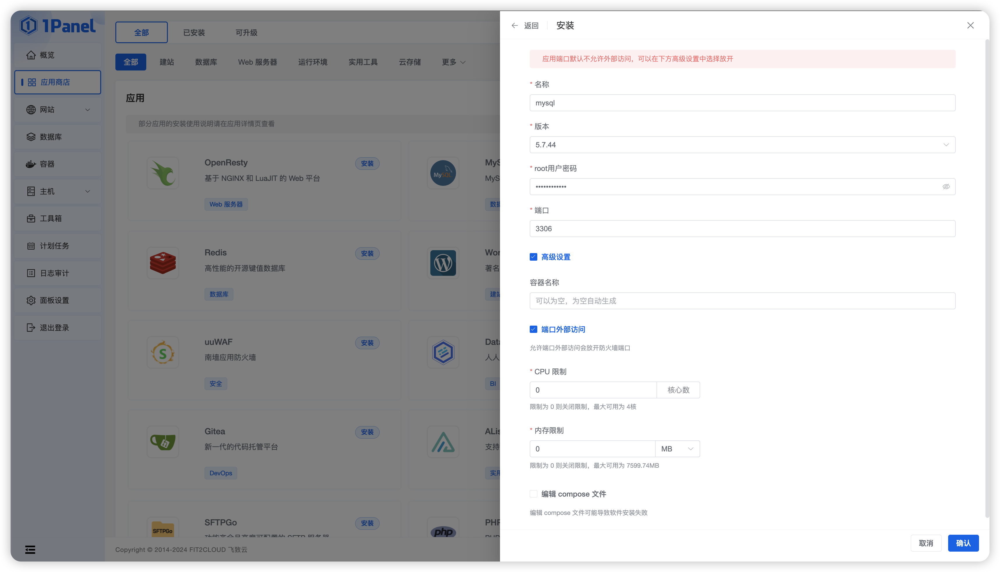
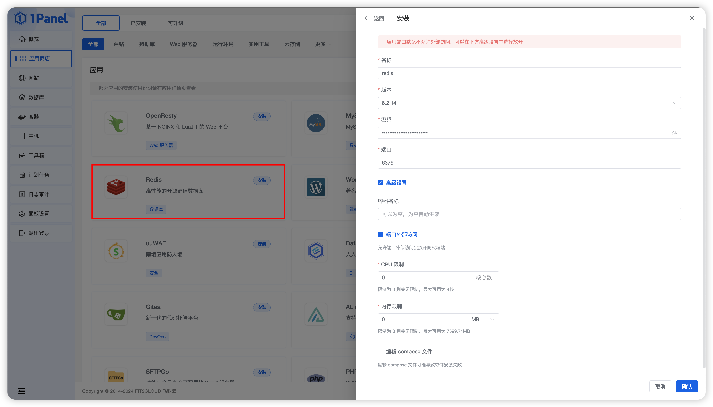
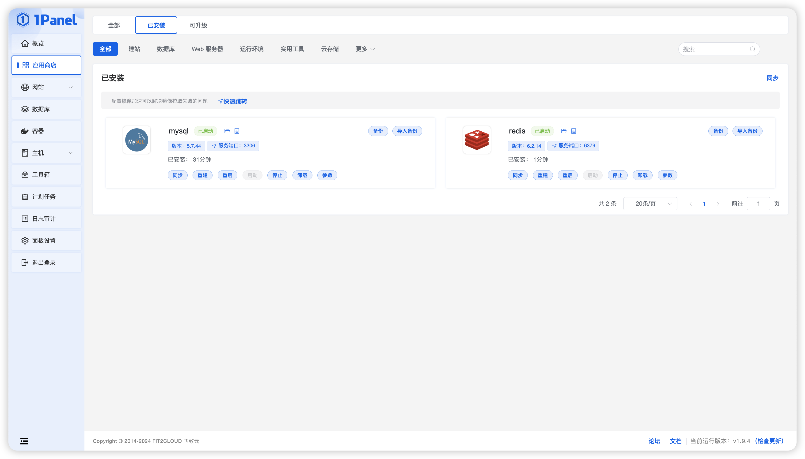
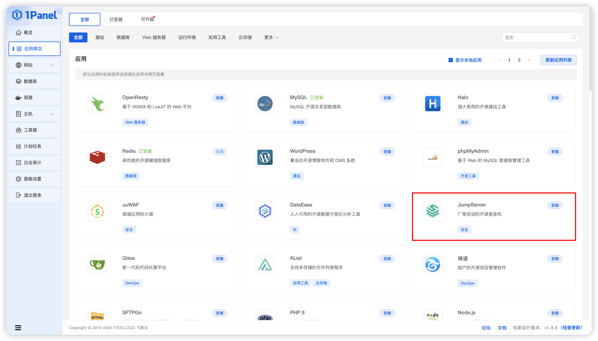
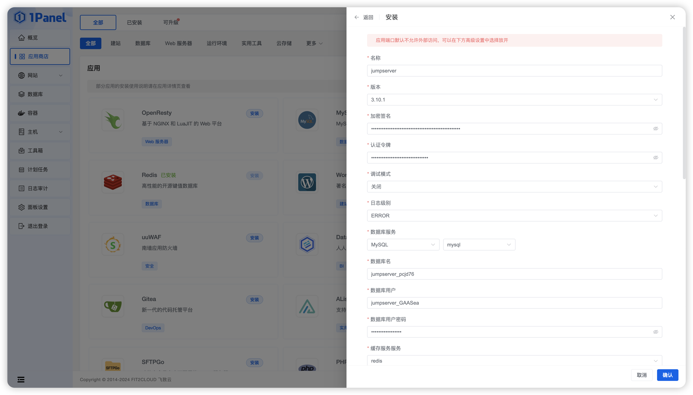
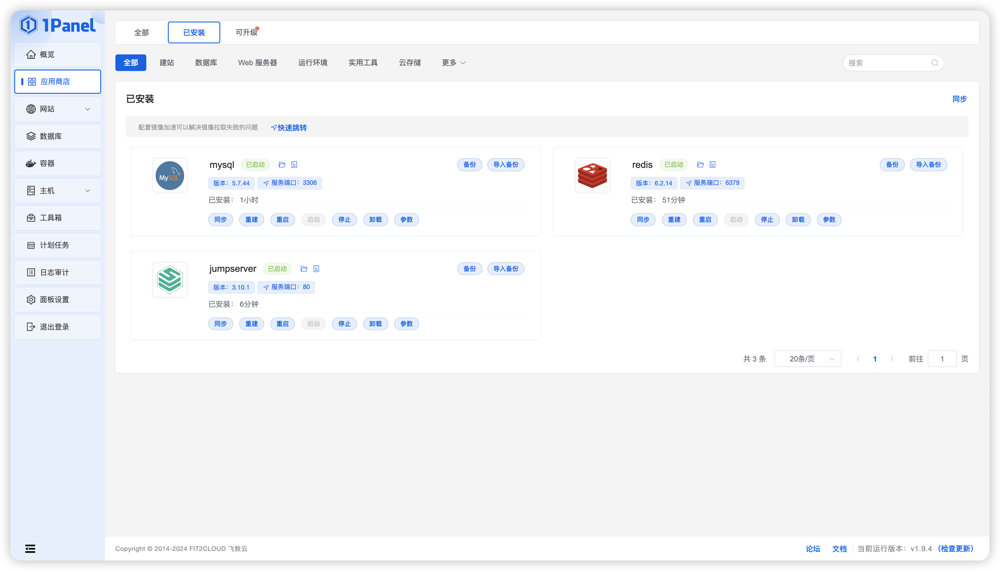
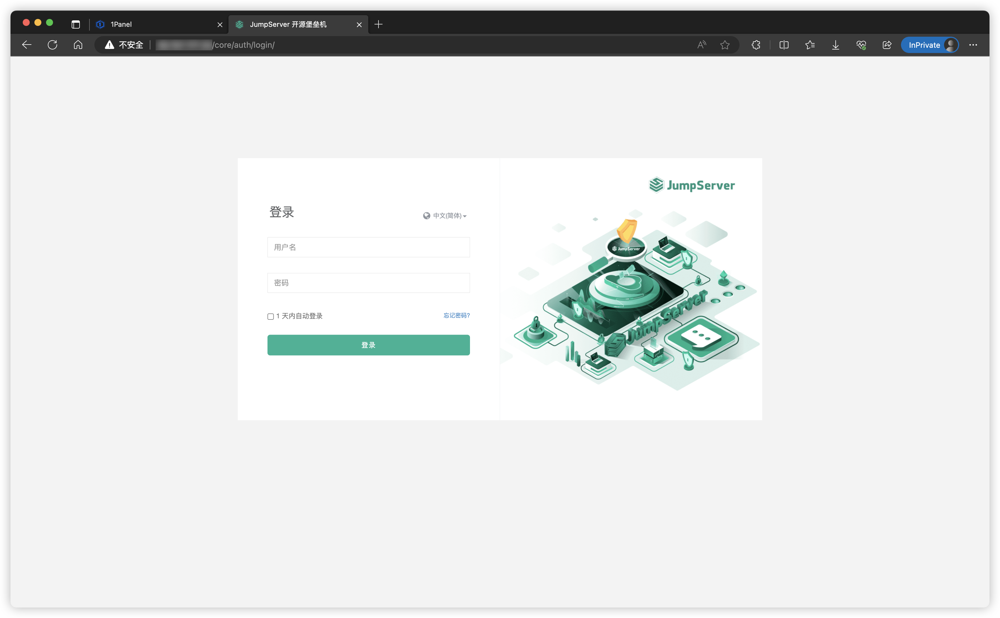

# 1Panel Installation

## 1. Install 1Panel
!!! tip ""
    - For installation, deployment, and basic features of 1Panel, please refer to the [1Panel Official Documentation](https://1panel.cn/docs/installation/online_installation/).
    - After completing the 1Panel installation, open your browser and navigate to the 1Panel URL as prompted, as shown below.



## 2. Install Database
!!! tip ""
    - Before installing JumpServer, you need to install the required software MySQL/PostgreSQL and Redis on 1Panel.

### 2.1 Install MySQL Database
!!! tip ""
    - Click the "App Store" module on the left side of the page, select MySQL, click "Install," and choose version 5.7.xx.





!!! tip ""
    - Detailed parameter explanation:

!!! tip ""

    | Parameter | Description |
    | ------- | ---------------------------- |
    | Name | Created MySQL application name. |
    | Version | Created MySQL application version. |
    | root User Password | root user password for installation of the MySQL application. |
    | Port | Service port of the MySQL application. |
    | Container Name | Container name of the MySQL application. |
    | External Port Access | Allow external port access and open firewall ports. |
    | CPU Limit | Number of CPU cores the MySQL application can use. |
    | Memory Limit | Amount of memory the MySQL application can use. |
    | Edit Compose File | Supports customized compose files to start the container. |

### 2.2 Install Redis Database
!!! tip ""
    - Click the "App Store" module on the left side of the page, select Redis, and click "Install."



!!! tip ""
    - Detailed parameter explanation:

!!! tip ""

    | Parameter | Description |
    | ------- | ---------------------------- |
    | Name | Created Redis application name. |
    | Version | Created Redis application version. |
    | Password | root user password for installation of the Redis application. |
    | Port | Service port of the Redis application. |
    | Container Name | Container name of the Redis application. |
    | External Port Access | Allow external port access and open firewall ports. |
    | CPU Limit | Number of CPU cores the Redis application can use. |
    | Memory Limit | Amount of memory the Redis application can use. |
    | Edit Compose File | Supports customized compose files to start the container. |

### 2.3 Database Status Check
!!! tip ""
    - Click the "App Store" module on the left side of the page, switch to the "Installed" app list, and check that the status of the MySQL and Redis services has changed to "Running."



## 3. Install JumpServer 

!!! tip ""
    - Click the "App Store" module on the left side of the page, select JumpServer, and click "Install."



!!! tip ""
    - Select the latest JumpServer version on the application details page, and perform relevant parameter settings.



!!! tip ""
    - Detailed parameter explanation:

!!! tip ""

    | Parameter | Description |
    | ------- | ---------------------------- |
    | Name | Created JumpServer application name. |
    | Version | Created JumpServer application version. |
    | Secret Key | JumpServer's SECRET_KEY. Keep the default. Save this key if you plan to migrate the environment. |
    | Bootstrap Token | JumpServer's BOOTSTRAP_TOKEN. Keep the default. Save this token if you plan to migrate the environment. |
    | Debug Mode | Supports enabling debug mode. |
    | Log Level | Log level, supports configuring DEBUG, INFO, WARNING, ERROR, CRITICAL. |
    | Database Service | The MySQL database application used by JumpServer. Supports selecting from the installed MySQL apps in the dropdown. 1Panel will automatically configure JumpServer to use this database. |
    | Database Name | The database name used by JumpServer. 1Panel will automatically create this database in the selected database server. |
    | Database User Password | The database user password used by JumpServer. 1Panel will automatically configure this password for the user created in the previous step. |
    | Cache Service | The Redis database application used by JumpServer. Supports selecting from the installed Redis apps in the dropdown. 1Panel will automatically configure JumpServer to use this database. |
    | Cache Service Password | Password for the Redis database used by JumpServer. 1Panel will automatically configure this password. |
    | Web Port | Access JumpServer frontend via HTTP protocol. |
    | SSH Port | Connect to JumpServer via SSH client using terminal tools such as Xshell, PuTTY, or MobaXterm. |
    | Magnus MySQL Port | Connect to MySQL database assets via DB client. |
    | Magnus MariaDB Port | Connect to MariaDB database assets via DB client. |
    | DOMAINS | Define trusted access IPs. Modify based on your situation. If using a public IP, please update this to the corresponding public IP. |
    | Container Name | JumpServer app container name. |
    | External Port Access | Allow external port access and open firewall ports. |
    | CPU Limit | Number of CPU cores the JumpServer application can use. |
    | Memory Limit | Amount of memory the JumpServer application can use. |
    | Edit Compose File | Supports customized compose files to start the container. |

!!! tip ""
    - Click the "App Store" module on the left side of the page, switch to the "Installed" app list, and check that the status of the JumpServer service has changed to "Running."



## 4. Access JumpServer 
!!! info "After successful installation, log in to JumpServer through a browser."
    ```sh
    Address: http://<1Panel_Server_IP>:<JumpServer_Service_Port>
    Username: admin
    Password: admin
    ```


