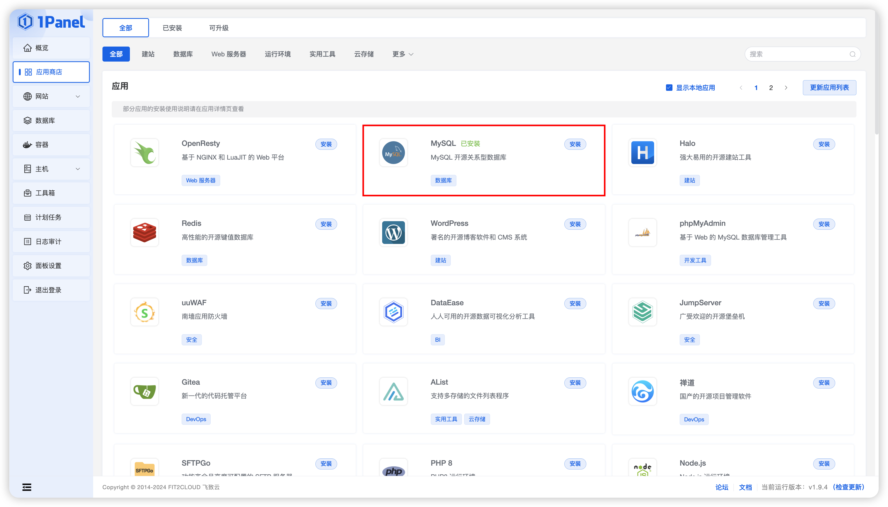
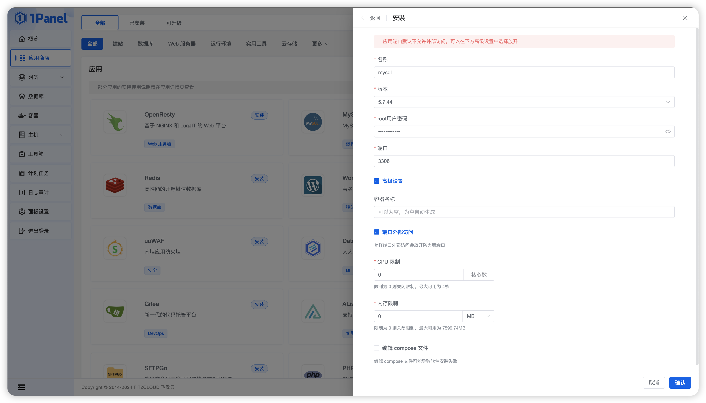
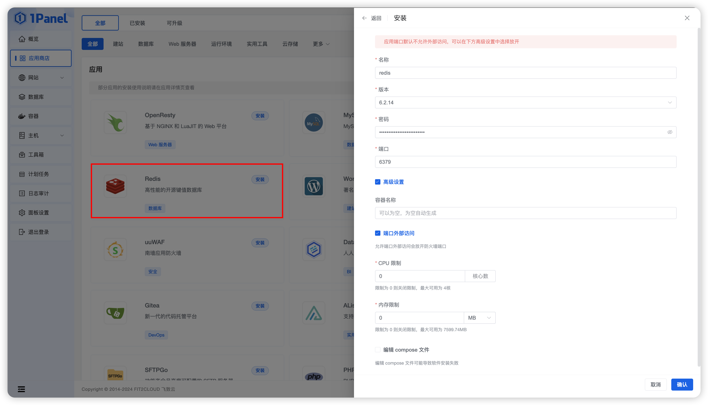
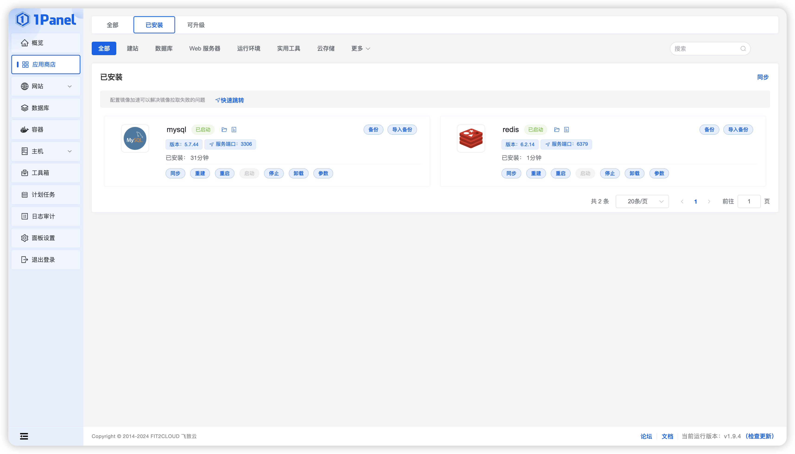
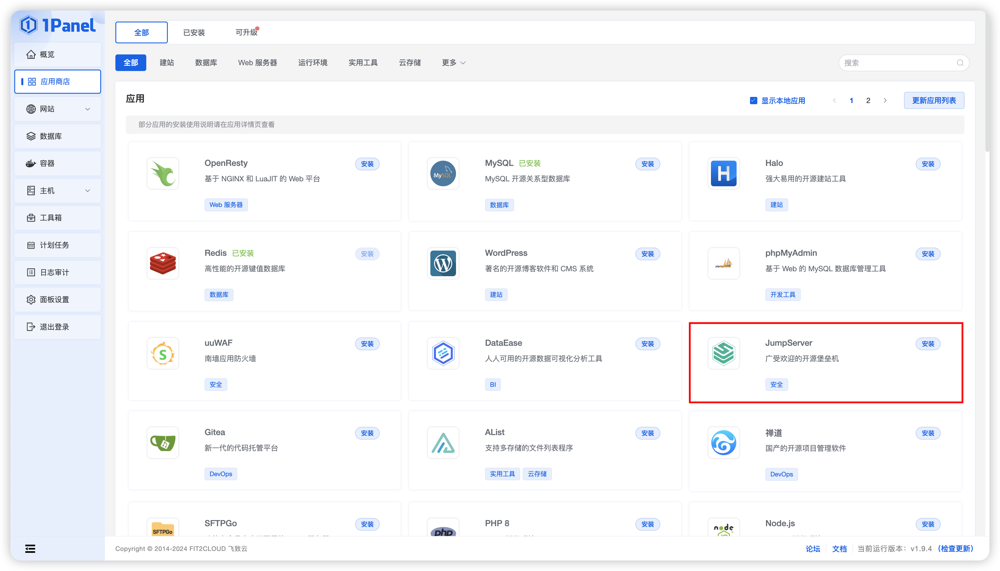
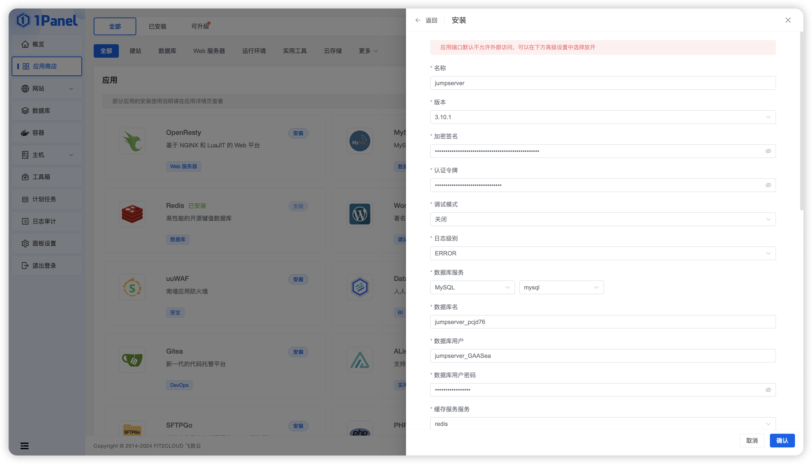
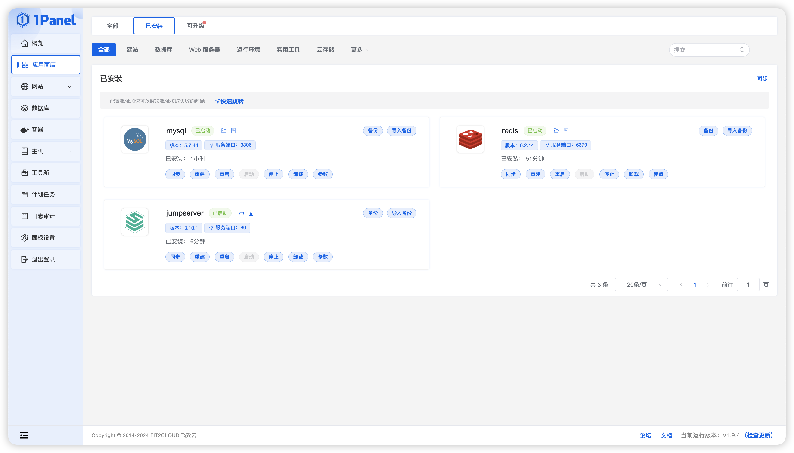
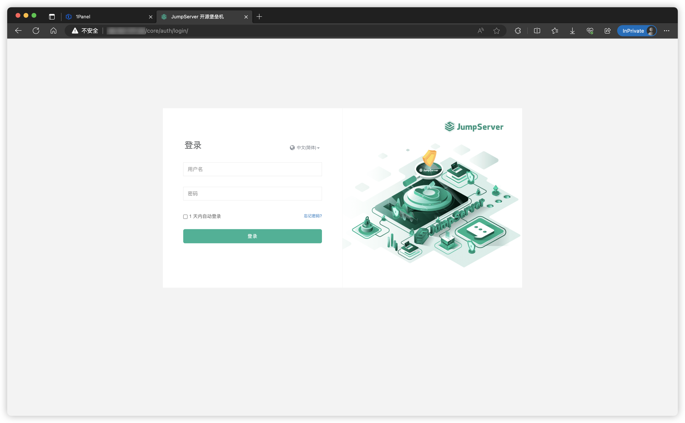

# 1Panel安装

## 1. 安装 1Panel
!!! tip ""
    - 关于 1Panel 的安装部署与基础功能介绍，请参考 [1Panel 官方文档](https://1panel.cn/docs/installation/online_installation/) 。
    - 在完成了 1Panel 的安装部署后，根据提示网址打开浏览器进入 1Panel，如下界面。


## 2. 安装数据库
!!! tip ""
    - 在安装 JumpServer 之前，需要先在 1Panel 上安装所需的软件 MySQL 和 Redis。

### 2.1 安装 MySQL 数据库
!!! tip ""
    - 点击页面左侧的`应用商店`模块，其中选择 MySQL 点击安装，选择 5.7.xx 版本 。





!!! tip ""
    - 详细参数说明：

!!! tip ""

    | 参数    |             说明              |
    | ------- | ---------------------------- |
    | 名称 | 创建的 MySQL 应用名称。 |
    | 版本 | 创建的 MySQL 应用版本。 |
    | root用户密码 | 安装 MySQL 应用的 root 用户密码。 |
    | 端口 | MySQL 应用的服务端口。 |
    | 容器名称 | MySQL 应用的容器名称。 |
    | 端口外部访问 | 允许端口外部访问回放开防火墙端口。 |
    | CPU 限制 | MySQL 应用可以使用的 CPU 核心数。 |
    | 内存限制 | MySQL 应用可以使用的内存大小。 |
    | 编辑 compose 文件 | 支持自定义 compose 文件启动容器。 |

### 2.2 安装 Redis 数据库
!!! tip ""
    - 点击页面左侧的`应用商店`模块，其中选择 Redis 点击安装。



!!! tip ""
    - 详细参数说明：

!!! tip ""

    | 参数    |             说明              |
    | ------- | ---------------------------- |
    | 名称 | 创建的 Redis 应用名称。 |
    | 版本 | 创建的 Redis 应用版本。 |
    | 密码 | 安装 Redis 应用的 root 用户密码。 |
    | 端口 | MySQL 应用的服务端口。 |
    | 容器名称 | MySQL 应用的容器名称。 |
    | 端口外部访问 | 允许端口外部访问回放开防火墙端口。 |
    | CPU 限制 | MySQL 应用可以使用的 CPU 核心数。 |
    | 内存限制 | MySQL 应用可以使用的内存大小。 |
    | 编辑 compose 文件 | 支持自定义 compose 文件启动容器。 |

### 2.3 数据库状态检查
!!! tip ""
    - 点击页面左侧的`应用商店`模块，切换至`已安装`的应用列表，检查 MySQL 和 Redis 服务状态变为已启动。



## 3. 安装 JumpServer 

!!! tip ""
    - 点击页面左侧的`应用商店`模块，其中选择 JumpServer 点击安装。



!!! tip ""
    - 在应用详情页选择最新的 JumpServer 版本进行安装，并进行相关参数设置。



!!! tip ""
    - 详细参数说明：

!!! tip ""

    | 参数    |             说明              |
    | ------- | ---------------------------- |
    | 名称 | 创建的 JumpServer 应用名称。 |
    | 版本 | 创建的 JumpServer 应用版本。 |
    | 加密签名 | JumpServer 的 SECRET_KEY，保持默认即可，迁移环境请保存该 SECRET_KEY。 |
    | 认证令牌 | JumpServer 的 BOOTSTRAP_TOKEN，保持默认即可，迁移环境请保存该 BOOTSTRAP_TOKEN。 |
    | 调试模式 | 支持开启调试模式。 |
    | 日志级别 | 日志级别，支持配置 DEBUG、INFO、WARNING、ERROR、CRITICAL 级别。 |
    | 数据库服务 | JumpServer 应用使用的 MySQL 数据库应用，支持下拉选择已安装的 MySQL 数据库应用，1Panel 会自动配置 JumpServer 使用该数据库。 |
    | 数据库名 | JumpServer 应用使用的数据库名称，1Panel 会在选中的数据库中自动创建这个数据库。 |
    | 数据库用户密码 | JumpServer 应用使用的数据库用户密码，1Panel 会在选中的数据库中自动为上一步创建的用户配置该密码。 |
    | 缓存服务服务 | JumpServer 应用使用的 Redis 数据库应用，支持下拉选择已安装的 Redis 数据库应用，1Panel 会自动配置 JumpServer 使用该数据库。 |
    | 缓存服务服务密码 | JumpServer 应用使用的 Redis 数据库密码，1Panel 会在选中的数据库中自动创建配置该密码。 |
    | Web 端口 | 通过 HTTP 协议访问 JumpServer 前端页面。 |
    | SSH 端口 | SSH Client 方式使用终端工具连接 JumpServer，比如 Xshell、PuTTY、MobaXterm 等终端工具。 |
    | Magnus MySQL 端口 | DB Client 方式连接 MySQL 数据库资产。 |
    | Magnus Mariadb 端口 | DB Client 方式连接 MariaDB 数据库资产。 |
    | DOMAINS | 定义可信任的访问 IP, 请根据实际情况修改, 如果是公网 IP 请改成对应的公网 IP。。 |
    | 容器名称 | JumpServer 应用的容器名称。 |
    | 端口外部访问 | 允许端口外部访问回放开防火墙端口。 |
    | CPU 限制 | JumpServer 应用可以使用的 CPU 核心数。 |
    | 内存限制 | JumpServer 应用可以使用的内存大小。 |
    | 编辑 compose 文件 | 支持自定义 compose 文件启动容器。 |

!!! tip ""
    - 点击页面左侧的`应用商店`模块，切换至`已安装`的应用列表，检查 JumpServer 服务状态变为已启动。



## 4. 访问 JumpServer 
!!! info "安装成功后，通过浏览器访问登录 JumpServer"
    ```sh
    地址: http://<1Panel 服务器 IP 地址>:<JumpServer 服务运行端口>
    用户名: admin
    密码: admin
    ```



