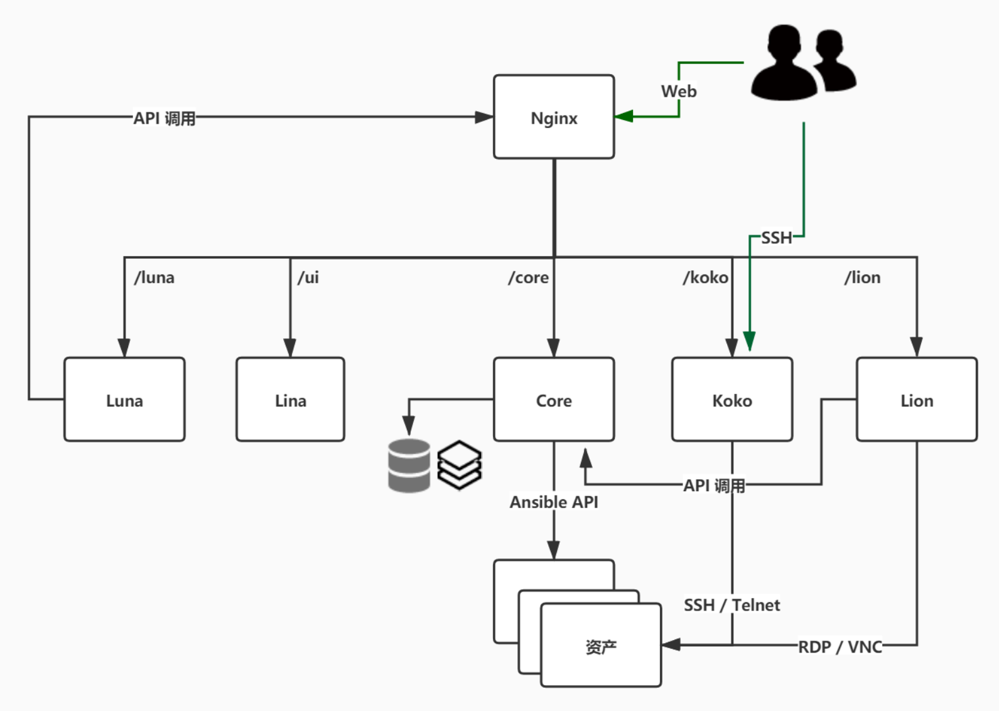

# Environment Instructions

!!! warning "Windows platform recommends using VSCode's Remote SSH feature to compile on Linux"

## 1 Architecture Diagram

!!! tip ""
    - JumpServer is divided into multiple components. The rough architecture is shown in the figure below. [Lina][lina] and [Luna][luna] are pure static files, ultimately integrated by [Nginx][nginx].

## 2 Database Requirements

!!! tip ""
    - Choose between MySQL and MariaDB; JumpServer needs to use MySQL or MariaDB to store data.

    | Component | Version | MySQL Version | MariaDB Version | Redis Version |
    | --- | --- | --- | --- | --- |
    | JumpServer | v4.10.9 | >= 5.7 | >= 10.3 | >= 6.0 |

## 3 Deployment Order

!!! tip ""
    1. Core environment deployment
    2. KoKo environment deployment
    3. Lina environment deployment
    4. Luna environment deployment
    5. Lion environment deployment
    6. Magnus environment deployment
    7. Nginx environment deployment
    8. JumpServer environment integration

[nginx]: http://nginx.org/
[lina]: https://github.com/jumpserver/lina/
[vue]: https://cn.vuejs.org/
[element_ui]: https://element.eleme.cn/
[luna]: https://github.com/jumpserver/luna/
[angular_cli]: https://github.com/angular/angular-cli
[core]: https://github.com/jumpserver/jumpserver/
[django]: https://docs.djangoproject.com/
[gunicorn]: https://gunicorn.org/
[celery]: https://docs.celeryproject.org/
[flower]: https://github.com/mher/flower/
[daphne]: https://github.com/django/daphne/
[python]: https://www.python.org/downloads/
