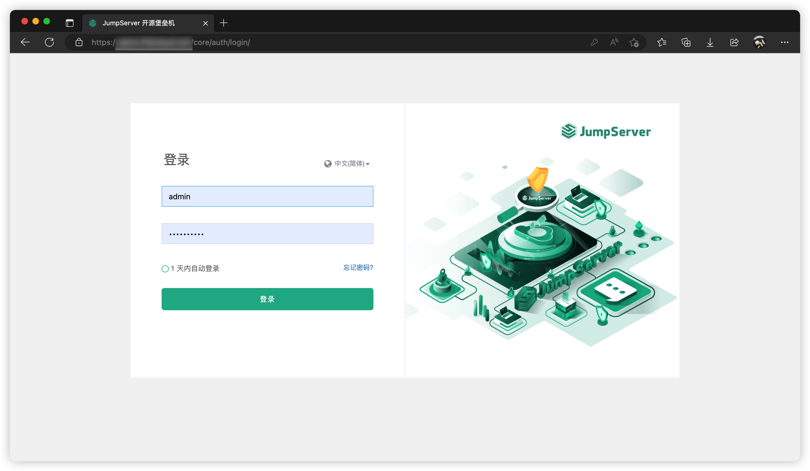

# 在线安装

!!! tip "[JumpServer 部署环境要求可点击后进行参考](../linux_stand_alone/requirements.md)"

## 1 安装部署
!!! tip ""
    - 支持主流 Linux 发行版本（基于 Debian / RedHat，包括国产操作系统）
    - Gentoo / Arch Linux 请通过 [源码安装](../source_install/requirements.md)

!!! tip ""
    === "中国大陆"
        <div class="termy">
        ```console
        // root@localhost:/opt#
        $ curl -sSL https://resource.fit2cloud.com/jumpserver/jumpserver/releases/latest/download/quick_start.sh | bash

        ---> 100%
        <span style="color: green;">[Success]</span>: download install script to /opt/jumpserver-installer-{{jumpserver.tag}}
        [Info]: Start executing the installation script.
        [Info]: In an automated script deployment, note the message prompts on the screen.
        ---> 100%
        <span style="color: green;">[Success]</span>: The Installation is Complete.

        For more commands, you can enter <span style="color: red;">jmsctl --help</span> to view help information.
        ```
        </div>
    === "其他地区"
        <div class="termy">
        ```console
        // root@localhost:/opt#
        $ curl -sSL https://github.com/jumpserver/jumpserver/releases/latest/download/quick_start.sh | bash

        ---> 100%
        <span style="color: green;">[Success]</span>: download install script to /opt/jumpserver-installer-{{jumpserver.tag}}
        [Info]: Start executing the installation script.
        [Info]: In an automated script deployment, note the message prompts on the screen.
        ---> 100%
        <span style="color: green;">[Success]</span>: The Installation is Complete.

        For more commands, you can enter <span style="color: red;">jmsctl --help</span> to view help information.
        ```
        </div>

!!! info "安装完成后 JumpServer 配置文件路径为： /opt/jumpserver/config/config.txt。 此处以 x86_64 系统为例，其它架构请下载对应安装包。"

!!! tip ""
    ```sh
    cd /opt/jumpserver-installer-{{ jumpserver.tag }}-amd64-{{ jumpserver.installer }}

    # 启动
    ./jmsctl.sh start

    # 停止
    ./jmsctl.sh down

    # 卸载
    ./jmsctl.sh uninstall

    # 帮助
    ./jmsctl.sh -h
    ```

## 2 环境访问
!!! tip ""
    **安装成功后，通过浏览器访问如下信息登录 JumpServer：**

    ```sh
    地址: http://目标服务器IP地址:服务运行端口
    用户名: admin
    密码: admin #第一次登陆需要修改密码
    ```
