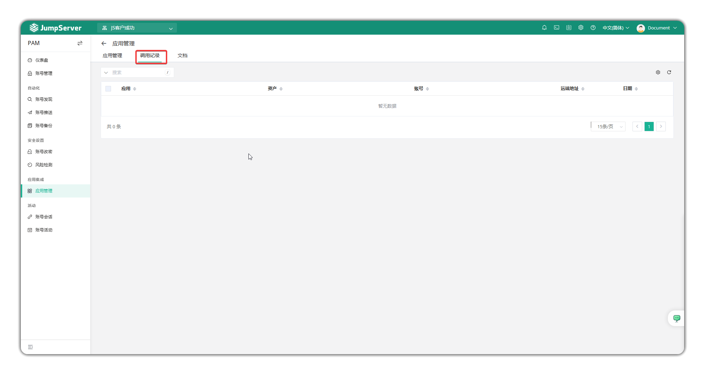
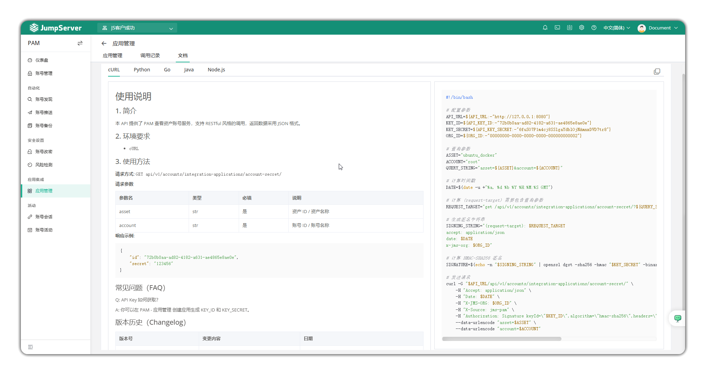

# 应用管理
!!! tip ""
    - 点击左侧栏的`应用管理`即进入应用管理界面。
    - 应用用于允许外部系统调用和检索存储在 JumpServer 中的账户和密码(通过API接口访问)。

## 1 创建应用
!!! tip ""
    - 点击`创建`按钮，即新建一个应用。
    - 可以设置应用的名称、上传图标、指定账号策略和IP白名单、设置是否激活、设置备注。

## 2 调用记录
!!! tip ""
    - 点击`调用记录`，可以查看应用的调用记录。

## 3 文档
!!! tip ""
    - 点击`文档`，可以查看基于cURL、Python、Go、Java、Node.js的API调用示例。
    - 本API提供了PAM查看资产账号服务，支持RESTful风格的调用，返回数据采用JSON格式。
    - 关于API文档，请参考: https://docs.jumpserver.org/zh/v4/dev/rest_api/
