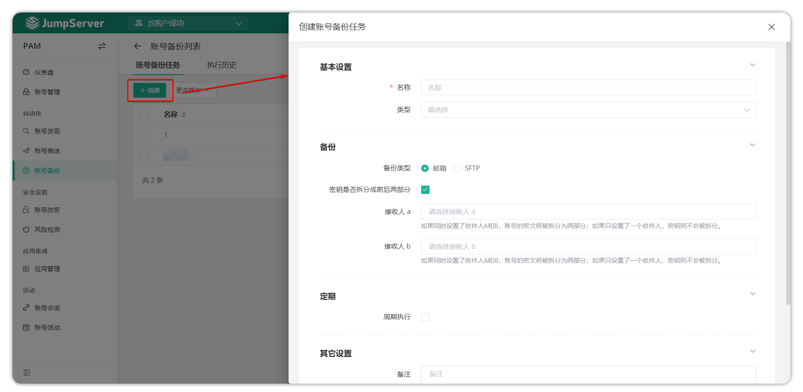
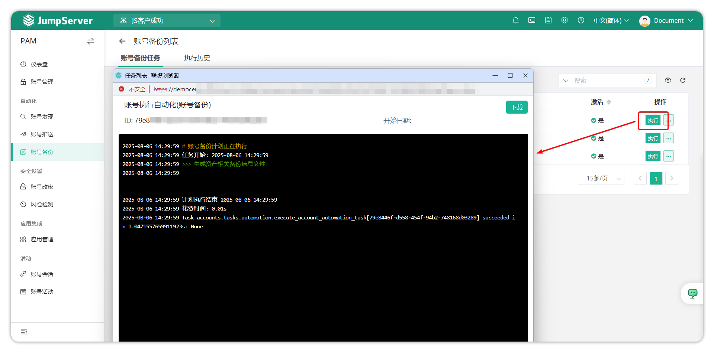
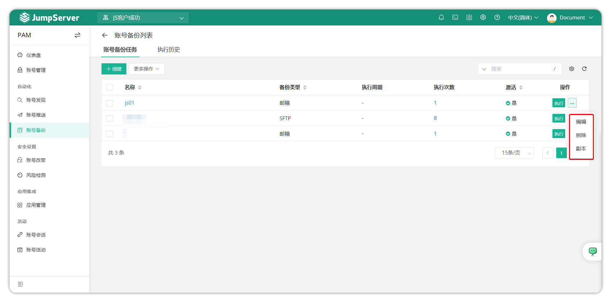
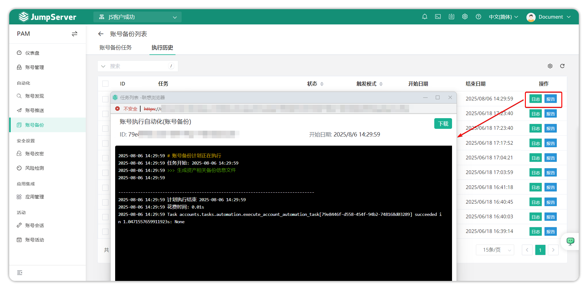

# 账号备份
## 1.功能简述
!!! tip ""
    - 为了防止不可控因素导致服务器出现数据损坏、资产账户丢失等问题，环境无法正常运行的情况，JumpServer 支持了账户备份功能，该功能可备份 JumpServer 上所有的资产账户。备份策略可选择即时备份和定时备份。
## 2.账号备份任务
!!! tip ""
    - 单击**账户备份任务**页面上的``创建``按钮，创建一个用于账户备份的自动化任务。完整填写账户备份任务的信息并确认设置以创建。

!!! tip "详细参数说明"
|参数    |说明|
|--------|-------------------|
|名称    |账号备份任务的名称。|
|类型    |需要备份账号的类型，可以根据账号类型创建备份任务。|
|备份类型|JumpServer 支持将账号通过表格的方式备份到邮箱中，或通过SFTP 的方式备份。|
|密钥是否拆分成前后两部分|是否将账号的密钥拆分，保证安全。|
|收件人 A|备份后的账号会发送一封邮件给用户，设置接收邮件的用户。账号的密钥会被拆分成前后两部分。|
|收件人 B|备份后的账号会发送一封邮件给用户，设置接收邮件的用户。账号的密钥会被拆分成前后两部分。
|计划执行|设置此备份任务是否为计划任务。备份任务可以计划定期执行或手动执行。|
|定时执行|设置该备份任务是否定时任务，备份任务支持定时执行或手动执行。|

!!! tip ""
    - 选择``执行``功能，执行推送账号功能。执行后，可以查看任务执行状态。

!!! tip ""
    - 点击账号备份任务旁边的``更多``按钮，进行编辑、删除和复制。

## 3.执行历史
!!! tip ""
    - 此页主要显示帐户备份任务执行的历史记录、执行日志以及有关帐户备份的详细信息。
