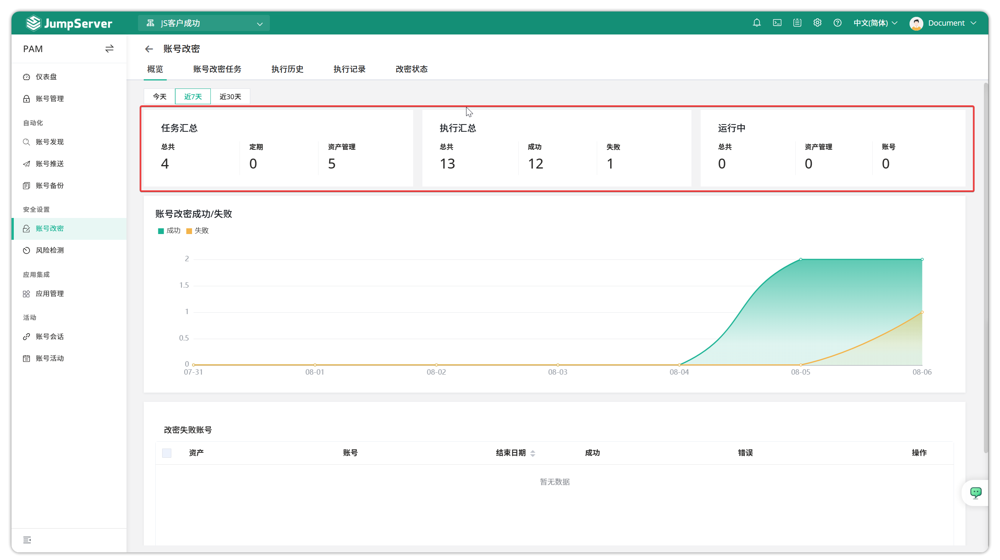
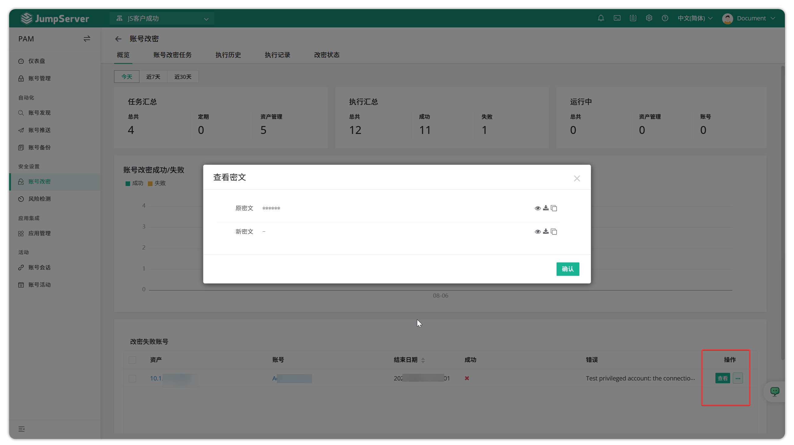
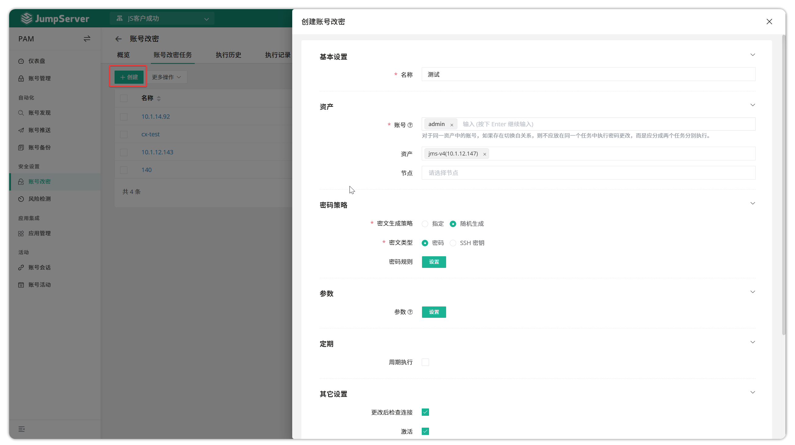
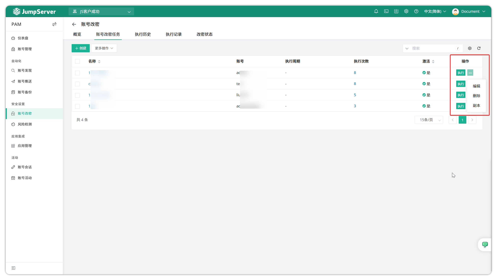
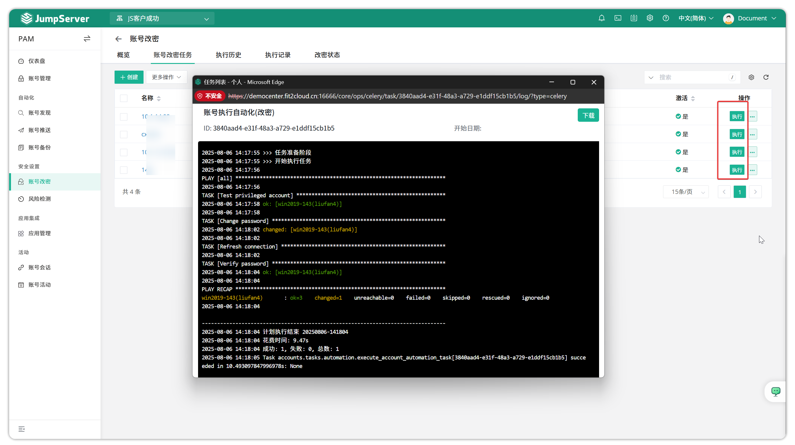
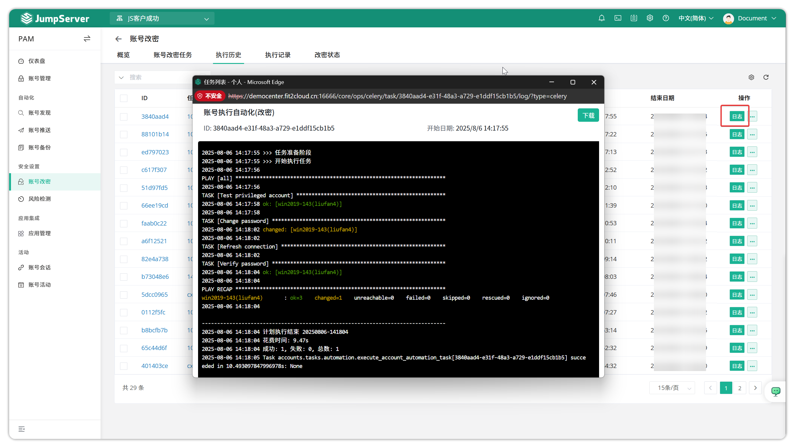
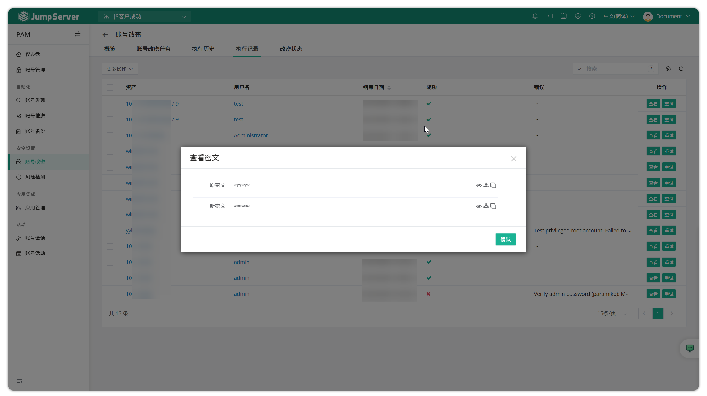

# 账号改密
!!! tip ""
    - 账号改密是为了满足用户的安全需求，定期修改资产中的用户密码，减少人力操作。
    - 账号改密任务更改资产上的用户密码使用该资产的特权账号进行操作 **此操作需要资产的账号列表中有特权账号** 。
    - 账号改密目前不支持更改 Windows 域账号密码。
    - 由于 **修改特权用户的密码** 为高风险操作，所以 JumpServer 默认不允许修改特权用户的密码；修改资产的特权账号密码的功能默认不开启，需管理员用户在配置文件中添加选项，重启堡垒机后生效。
!!! info ""
    - JumpServer 配置文件默认位于： **/opt/jumpserver/config/config.txt** 
    - 开启修改特权账号密码功能的配置项为： **CHANGE_AUTH_PLAN_SECURE_MODE_ENABLED = false** 
## 1 概览
!!! tip ""
    - Jumpserver 支持对账号密码更改任务的概览，其中可以查看最近的账号密码更改任务的摘要、任务执行结果以及账号密码更改成功的统计和失败的统计。账号更改秘密概览页面如下：

!!! tip ""
    您可以在`改密失败账号`中查看具体的失败账号和失败原因。如果想查看密码更改任务中的旧密码和新密码，可以点击操作中的`查看`。此步骤需要用户在 JumpServer 中进行 MFA 验证。

## 2 账号改密任务
!!! tip "" 
    - 单击`账户密码任务`页面上的`创建`按钮，以创建用于修改账户密码的自动化任务。

!!! tip ""
    - 详细参数说明：

    | 参数                          | 说明                                                                 |
    |-------------------------------|----------------------------------------------------------------------|
    | 名称                          | 账号改密自动化任务的名称                                             |
    | 用户名                        | 被改密的用户。                                                       |
    | 资产                          | 需要被改密的资产。                                                   |
    | 节点                          | 需要被改密的资产节点组。                                             |
    | 密码策略 - 密文生成策略          | 选择被改密的用户的密码策略。                                         |
    |                               | ●  指定：管理员用户手动输入密码。                                     |
    |                               | ●  随机：JumpServer 自行生成密码。                                    |
    | 密码策略 - 密文类型              | 被修改的用户密文的类型。                                             |
    | 密码                          | 选择密文生成策略为指定，管理员用户输入密码。                         |
    |                               | 选择密文生成策略为随机，管理员用户设置密码生成规则，例如：密码长度、密码强弱规则等等。 |
    | 参数                          | 参数设置目前只针对 UNIX、AIX、LINUX 类型资产有效。                    |
    | 定时执行                      | 选择该自动化任务是否定时执行，设置定时任务执行时间。                 |
    | 收件人                        | 选择用户接受改密后的邮件通知信息。                                   |
!!! tip ""
    - 单击`执行`按钮立即运行自动化任务。单击`更多`按钮可编辑、删除或复制。

!!! tip ""
    - 检查执行日志。

## 3 执行历史
!!! tip ""
    - 此页面主要显示有关计划的帐户密码更改任务的详细信息，如执行日志和报告。请查看执行日志。

## 4 执行记录
!!! tip ""
    - 此页面主要显示已更改密码的每个账号的记录，您可以查看新旧密码并重试更改账号密码。查看新旧密码需要用户进行 MFA 验证。
