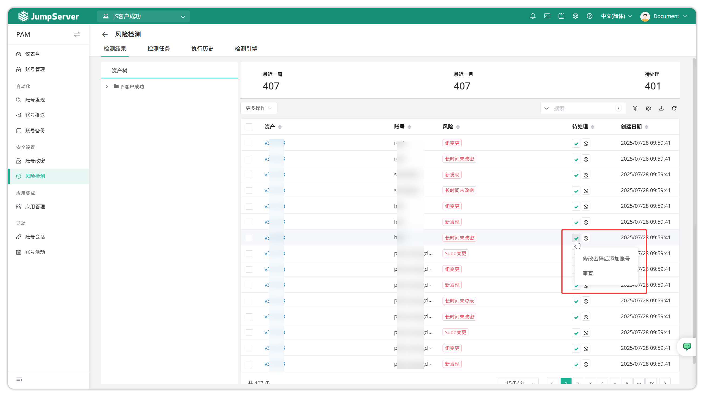
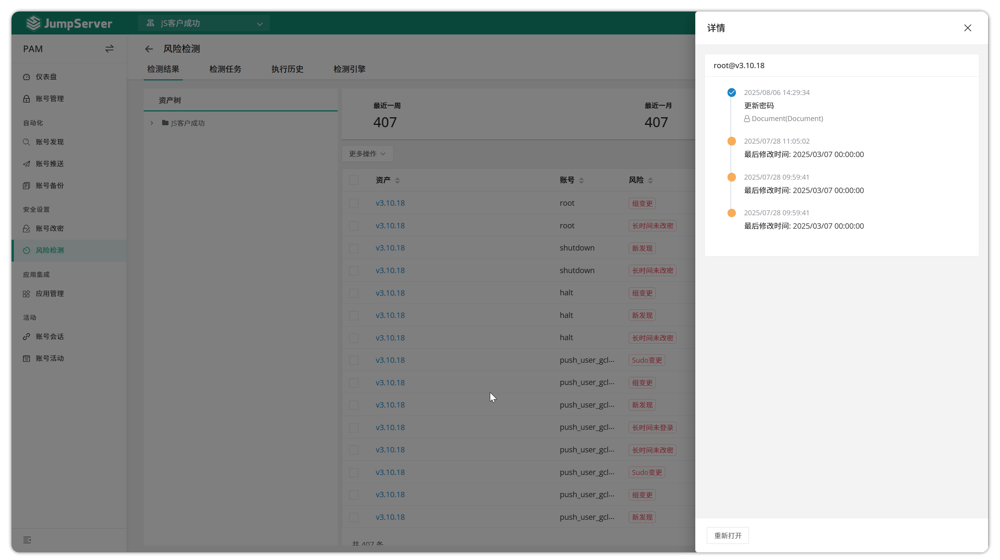
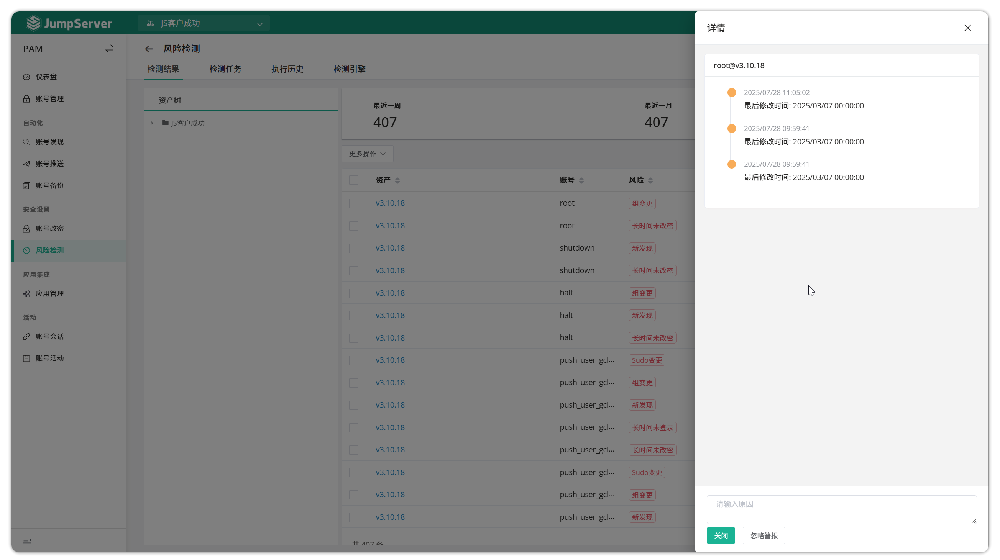
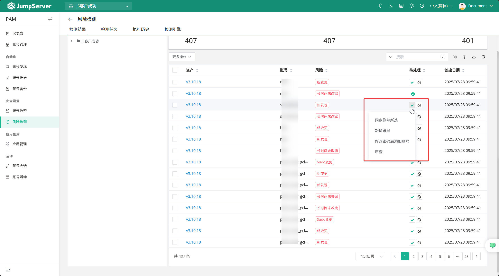
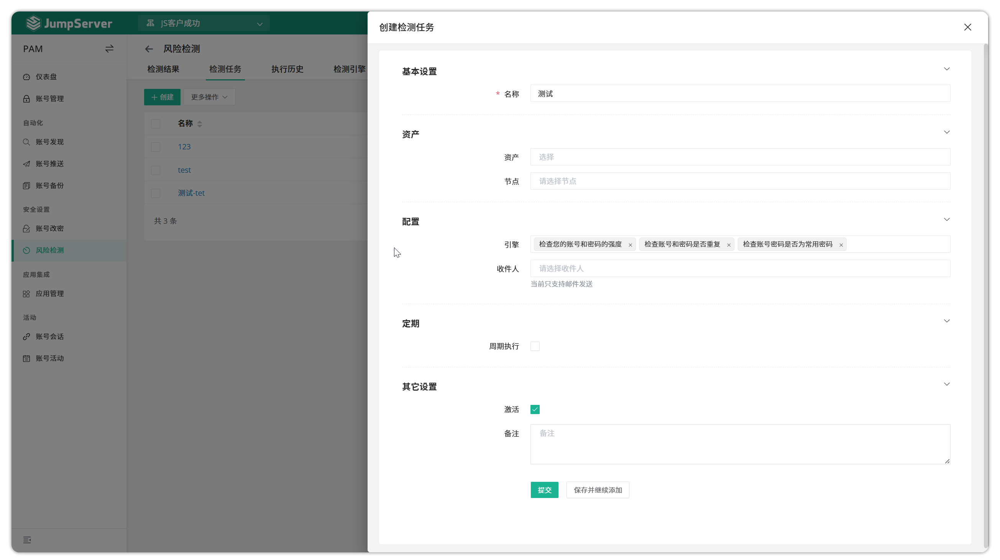
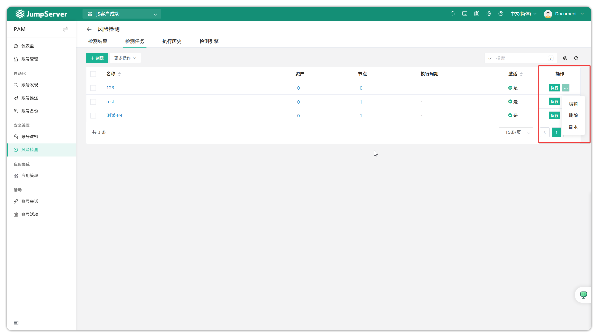
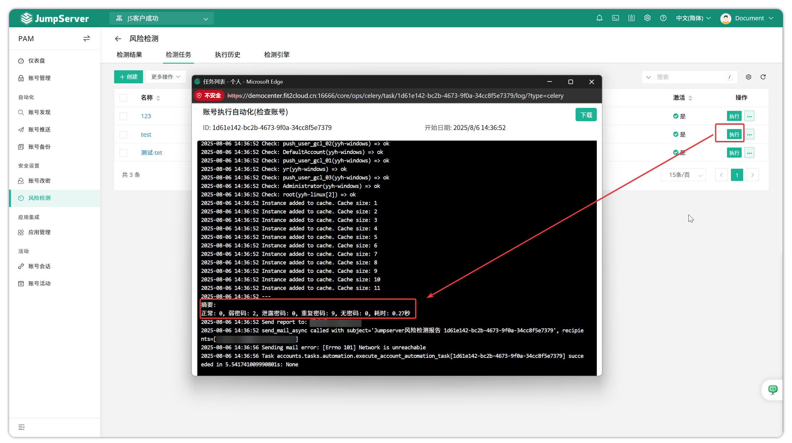
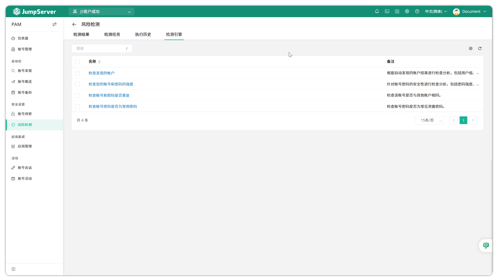

# 风险检测
## 1 检测结果
!!! tip ""
    - Jumpserver 支持账号风险检测功能，通过账号风险检测功能，可以预测账号风险状态，如长时间未登录、密码过期、弱密码、重复密码等，可以导出账号风险列表并进行审核，处理或忽略待处理风险。

!!! tip "如果密码重复或长时间为改密等风险类型，您可以点击账号右侧下拉箭头，按照提示更新密码或添加账号；也可以审核账户的风险内容："
    
    

!!! tip ""
    - 弱密码检测规则包括：密码长度是否小于 8 位、是否只包含一种字符类型、是否只包含数字、是否是常见的弱密码，如 123456、password、abc123 等。
!!! tip ""
    - 根据不同的账户风险类型选择相应的处理方式，新发现的账户可选择`同步删除`、`添加账户`、`密码修改后添加`等，处理完成后，风险状态变为已确认，若忽略风险，则风险状态变为忽略。

## 2 检测任务
!!! tip ""
    - 点击检测任务页面上的`创建`按钮，填写检测相关信息信息，创建账号风险检测任务。

!!! tip ""
    - 详细参数描述：

    | 参数    | 说明                                                                 |
    |---------|----------------------------------------------------------------------|
    | 名称    | 风险检测任务的名称。                                                |
    | 资产    | 需要帐户检测的资产。                                                |
    | 节点    | 需要进行账户检测的资产所在资产节点组。                              |
    | 引擎    | ●  检查您的账号和密码强度 ●  检查账号和密码是否重复 ●  检查账号密码是否为常用密码 |
    | 收件人  | 当前只支持电子邮件发送                                              |
    | 定期    | 周期执行设置                                                        |

!!! tip ""
    - 单击`执行`按钮，立即运行检测任务。单击`更多`按钮，编辑、删除或复制。

!!! tip ""
    - 检查执行日志。

## 3 执行历史
!!! tip ""
    - 该页面主要显示账户风险检测任务的历史记录，可以查看日志或报告。

## 4 检测引擎
!!! tip ""
    - 本模块主要显示当前使用的检测引擎及其对应的说明。
