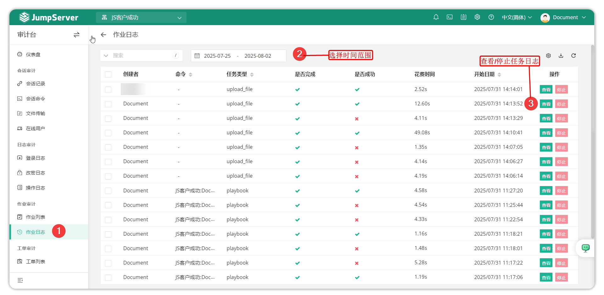
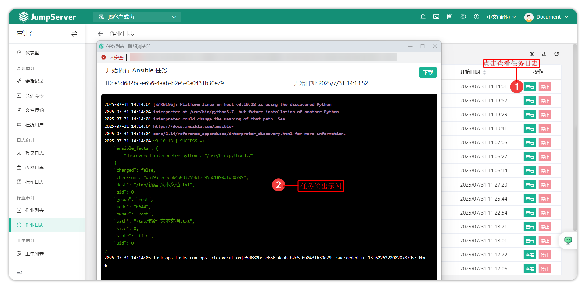

# Job Logs

## 1 Feature Overview

!!! tip ""
    - Enter the **Audit** page, click **Job Audit > Job Logs** to open the job logs page.
    - Job tasks are log information records of task execution in the user's job center functionality.
    - Main recorded information includes task creator, execution command, whether completed/successful, date, and other information, and can output execution task records.

!!! tip ""
    - Task log output example is shown below:

