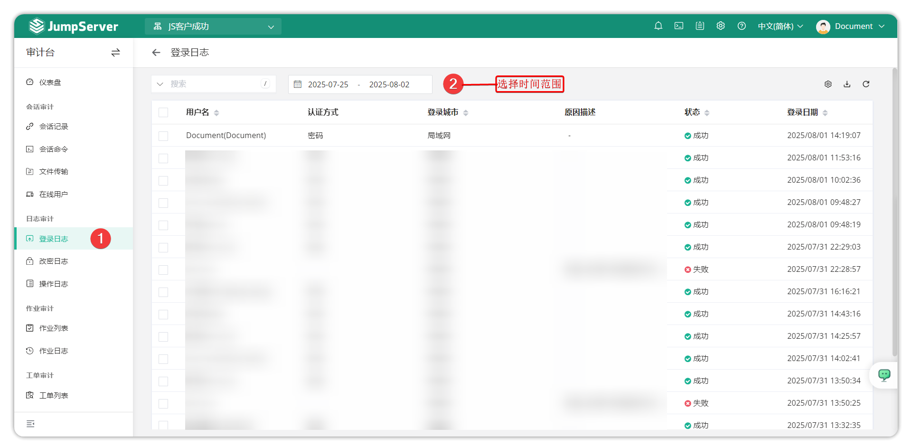

# Login Logs

## 1 Feature Overview

!!! tip ""
    - Enter the **Audit** page, click **Log Audit > Login Logs** to open the login logs page.
    - Login logs refer to user login logs of the JumpServer platform. On this page you can view detailed information about user logins to JumpServer including login type, login IP, login city, login date, login failure reasons, and other information.

