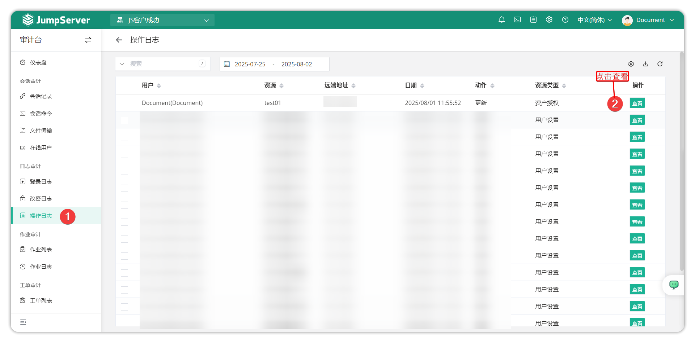
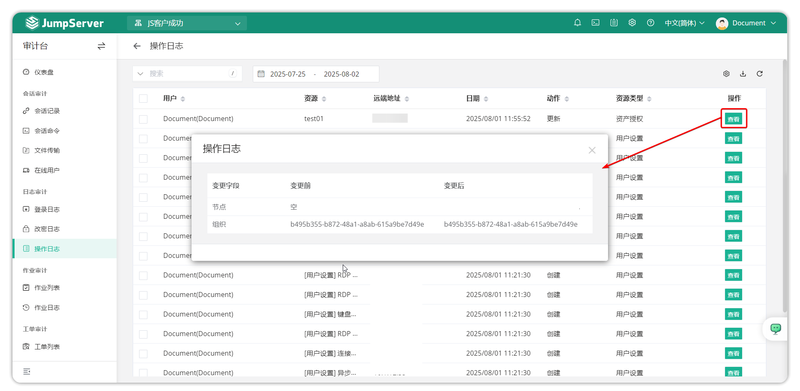

# Operation Logs

## 1 Feature Overview

!!! tip ""
    - Enter the **Audit** page, click **Log Audit > Operation Logs** to open the operation logs page.
    - Operation logs refer to management operation logs of the entire JumpServer platform. On this page you can view the user performing the operation, resource type, operation logs, and other information.
    - Specific operation changes can be viewed by clicking the **View** button after the operation log.

!!! tip ""
    - Auditors can view detailed changes of operation logs through the **View** button.

