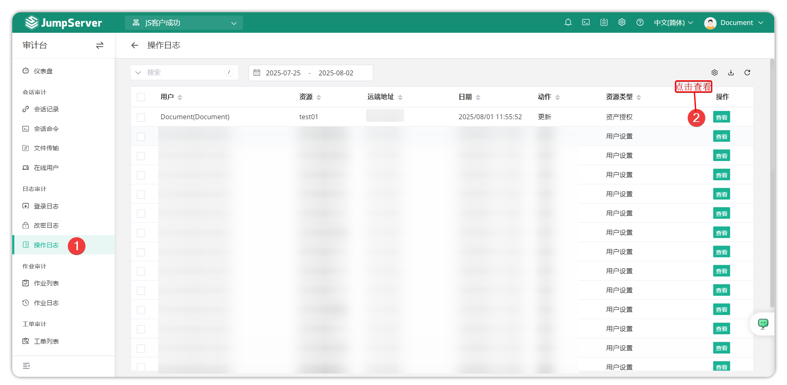
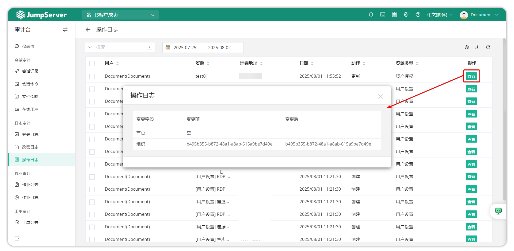

# 操作日志
## 1.功能概述
!!! tip ""
    - 进入 **审计台** 页面，点击 **日志审计 > 操作日志** ，进入操作日志页面。
    - 操作日志是指整个 JumpServer 平台的管理操作日志，在此页面可以查看操作的用户、资产类型、操作的日志等信息。
    - 具体的操作变更可以点击操作日志后方的 **查看** 按钮。

!!! tip "" 
    - 审计员可以通过 **查看** 按钮查看操作日志的详细变更。
