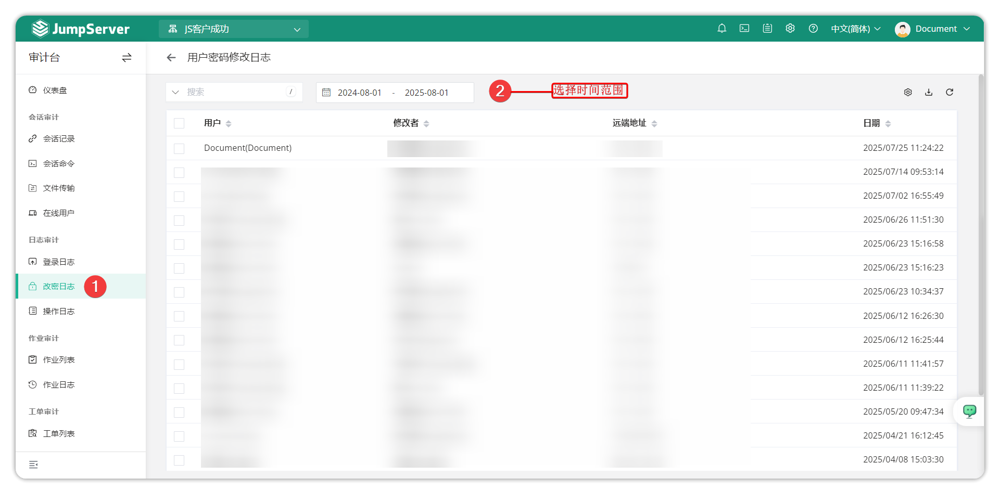

# Password Change Logs

## 1 Feature Overview

!!! tip ""
    - Click the **Audit** button on the navigation bar to open the **Audit** page.
    - Click **Log Audit > Password Change Logs** to open the **Password Change Logs** page.
    - Password change logs are for JumpServer platform user password changes, i.e., JumpServer user account password changes.
    - Main recorded information includes password change user, modifier, date, and other information.

