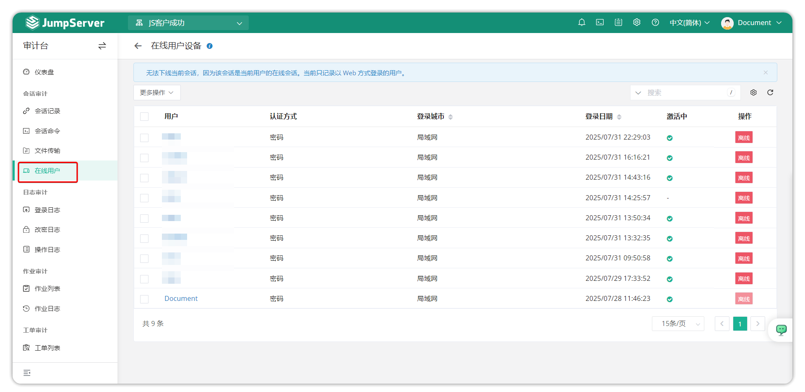

# Online Users

## 1 Feature Overview

!!! tip ""
    - Click the **Audit** button on the navigation bar to open the **Audit** page.
    - Click **Session Audit > Online Users** to open the **Online Users** page.
    - Through the **Online Users** page, you can view information about users currently logged in to JumpServer (currently limited to web login users), and control user logout from this page. Administrators or auditors can view logged-in users through the online users device feature.

