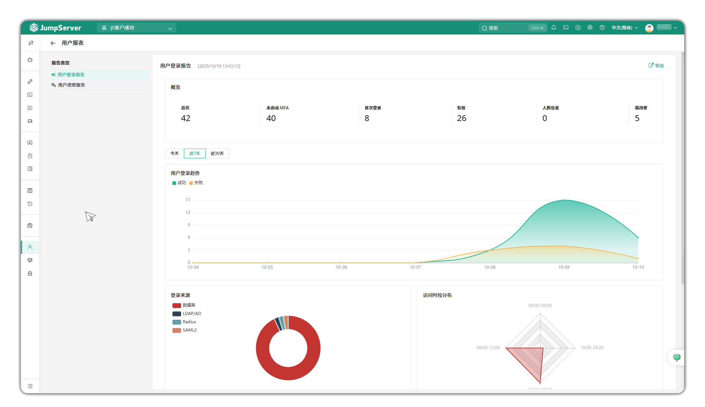
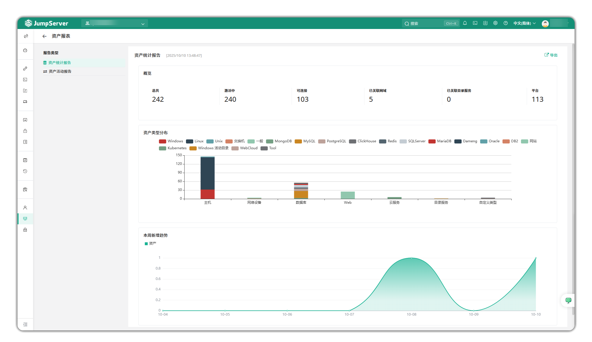
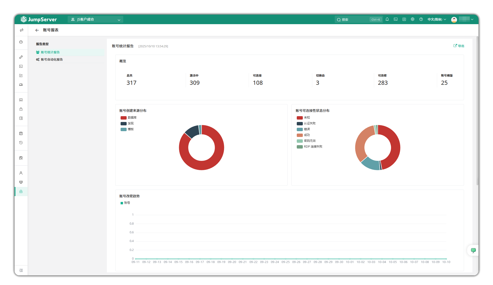

# Reports

!!! tip ""
    - Enter the **Audit** page, click **Session Audit > Reports** to open the reports page.
    - On the reports page you can view user login reports, user password change reports, asset statistics reports, asset activity reports, account statistics reports, account automation reports, supporting visual data analysis and export.

## 1 User Reports

!!! tip ""
    - On the user reports page you can view user login reports / user password change reports. You can view by today, last 7 days, last 30 days

## 2 Asset Reports

!!! tip ""
    - On the asset reports page you can view asset statistics reports / asset activity reports. Asset activity reports can be viewed by today, last 7 days, last 30 days

## 3 Account Reports

!!! tip ""
    - On the account reports page you can view account statistics reports / account automation reports. Account automation reports can be viewed by today, last 7 days, last 30 days

