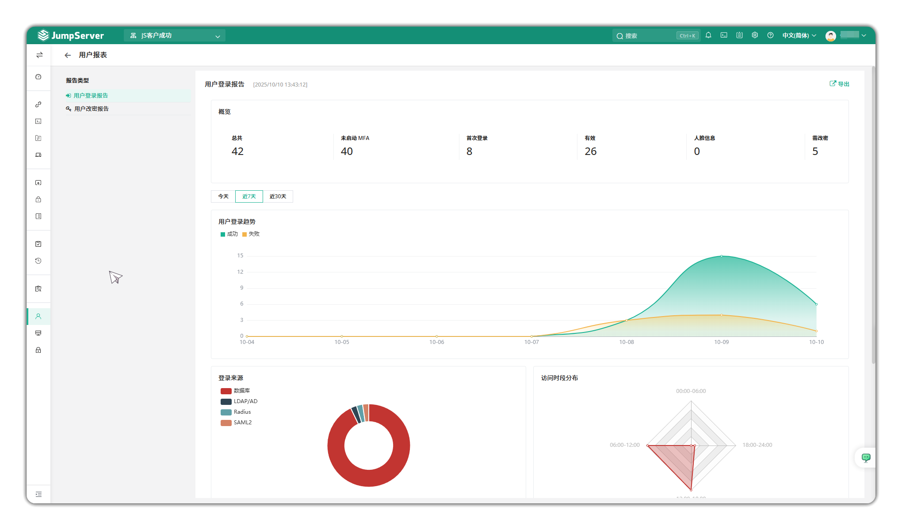
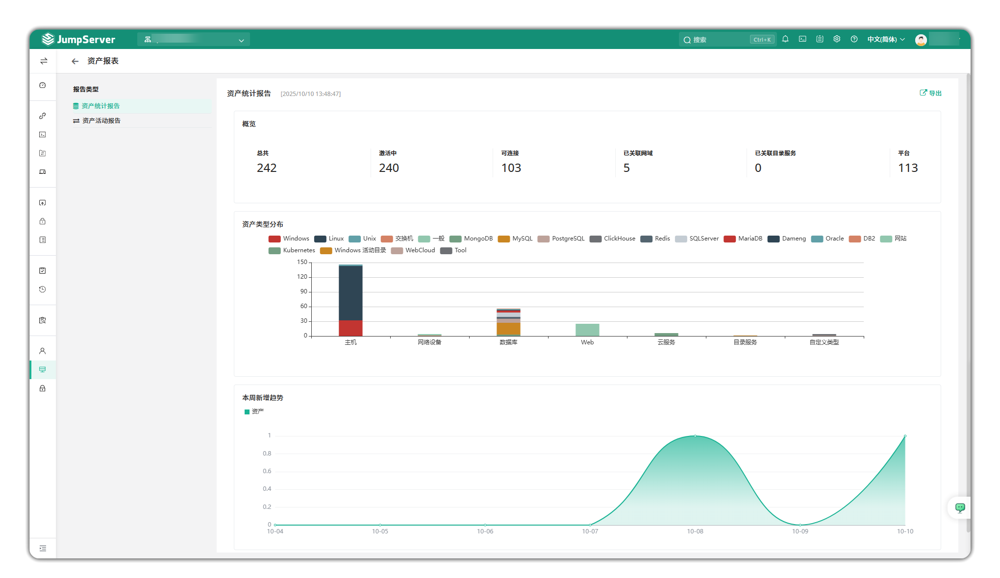
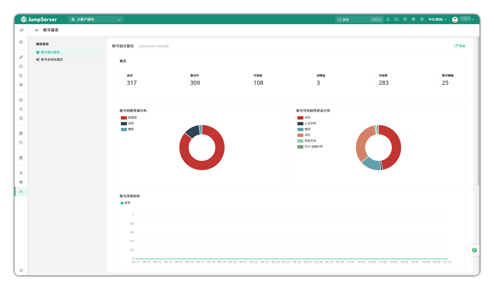

# 报表
!!! tip ""
    - 在报表页面可以查看用户登录报告 / 用户改密报告 / 资产统计报告 / 资产活动报告 / 账号统计报告 / 账号自动化报告, 支持可视化数据分析和导出。
## 用户报表
!!! tip ""
    - 在用户报表页面可以查看用户登录报告 / 用户改密报告 。 可按照今天，近 7 天， 近30 天进行查看

## 资产报表
!!! tip ""
    - 在资产报表页面可以查看资产统计报告 / 资产活动报告 。 其中资产活动报告可按照今天，近 7 天， 近 30 天进行查看

## 账号报表
!!! tip ""
    - 在登录报表页面可以查看账号统计报告 / 账号自动化报告 。 其中账号自动化报告可按照今天，近 7 天， 近 30 天进行查看

