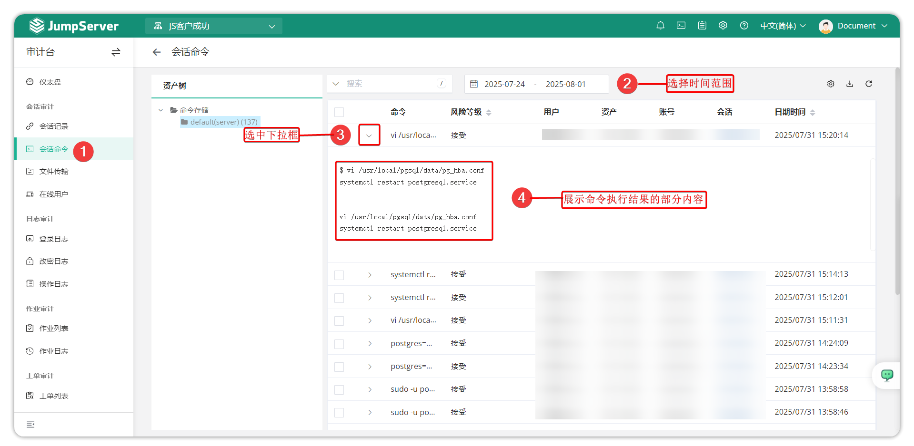
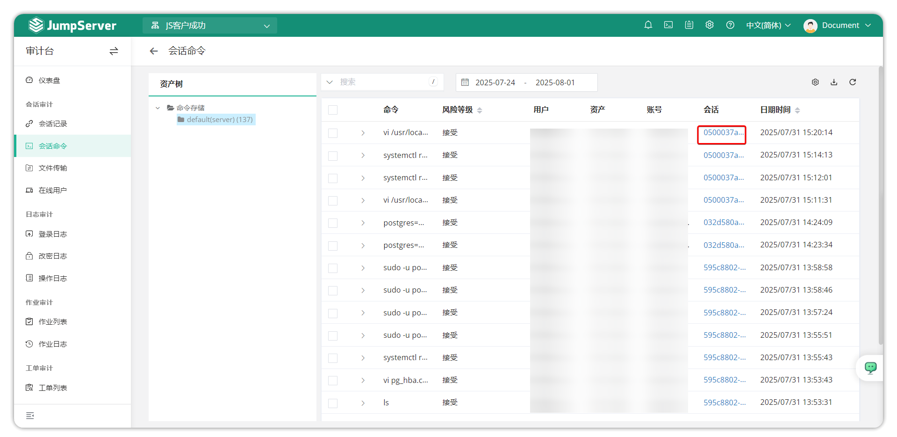
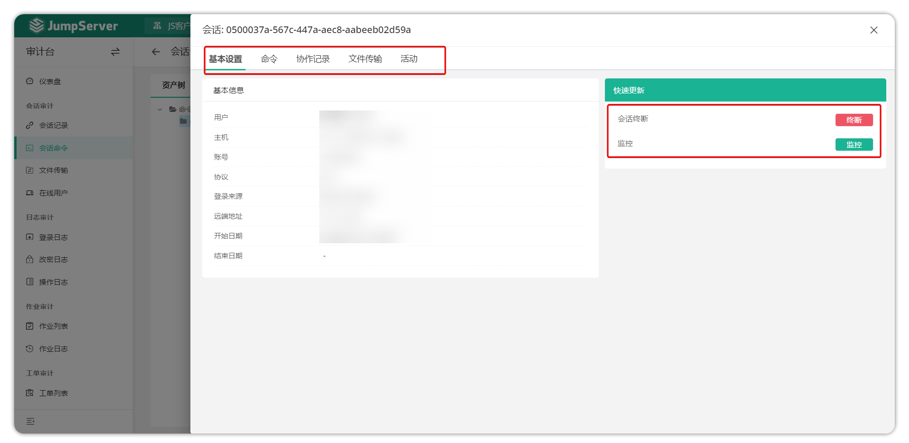

# Session Commands

## 1 Feature Overview

!!! tip ""
    - Enter the **Audit** page, click **Session Audit > Session Commands** to open the session commands page.
    - Session commands mainly display commands executed by users after asset connection. By clicking a specific record row, you can view detailed command execution results.
    - Click to switch to the **Session** commands page. Click the dropdown box shown to display partial output of command execution results.

!!! tip ""
    - Click the **Session** link to jump to the detailed session page. If the session has ended, you can view the session recording.

