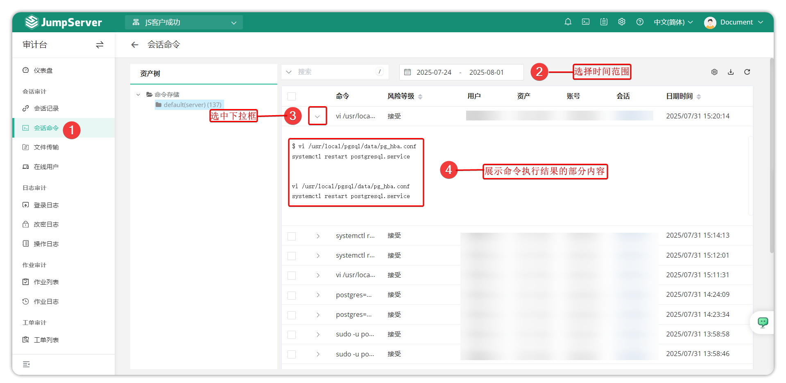
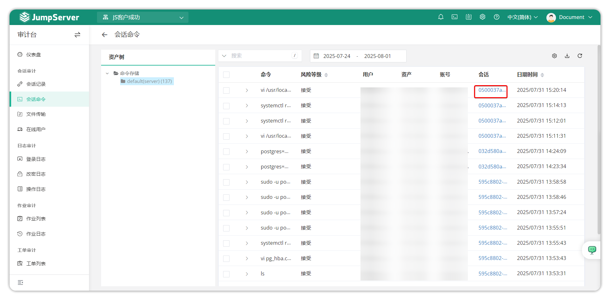
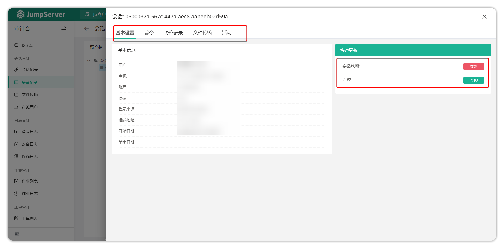

# 会话命令
## 1 功能概述
!!! tip ""
    - 进入 **审计台** 页面，点击 **会话审计 > 会话命令** ，进入会话命令页面。
    - 会话命令主要显示用户在资产连接后执行的命令，单击某一行记录，可以查看命令执行的详细结果。
    - 点击切换至 **会话** 命令页面。点击图示下拉框，可以展示命令执行结果的部分内容输出。

!!! tip "" 
    - 点击 **会话** 链接，会跳转到详细的会话页面，如果会话已结束可以查看会话录像。

