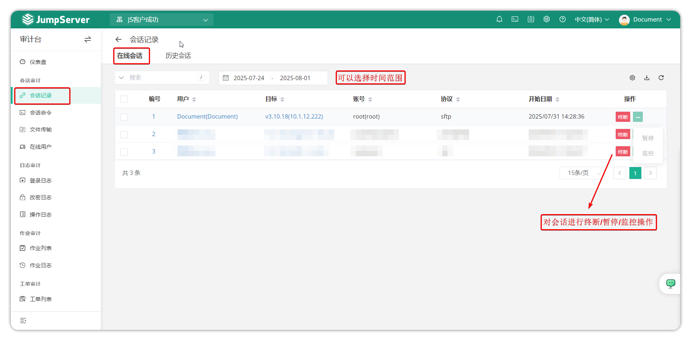
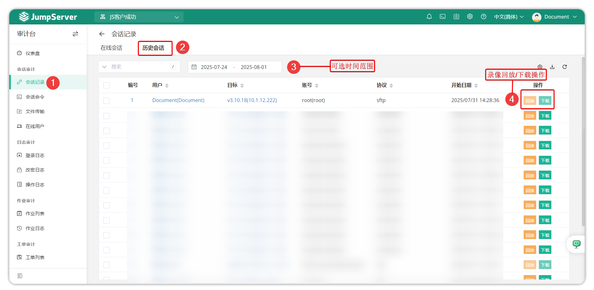
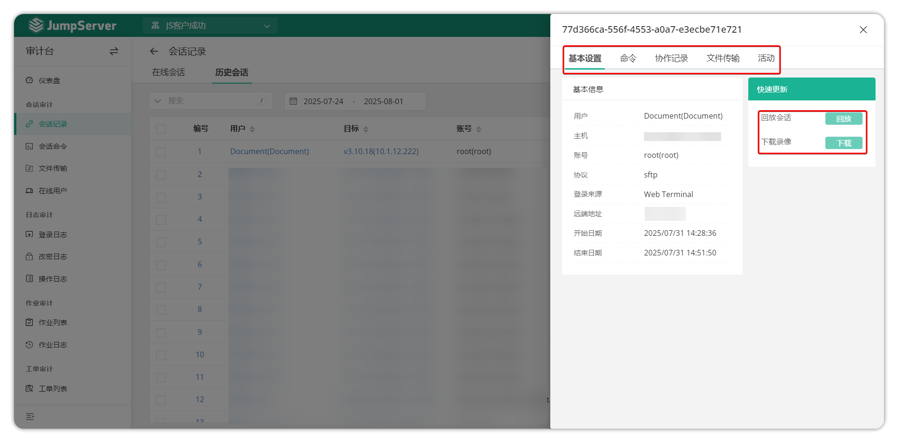

# Session Records

## 1 Feature Overview

!!! tip ""
    - Enter the **Audit** page, click **Session Audit > Session Records** to open the session records page.
    - Session records contain online sessions and historical sessions in two parts, mainly displaying detailed session records of asset logins, including user, protocol, remote address, session time, and session recordings.

## 2 Online Sessions

!!! tip ""
    - Online sessions allow you to view all currently active sessions of users logging into assets through JumpServer. Real-time monitoring is supported, and sessions can be terminated directly when non-compliant operations occur.
    - JumpServer real-time monitoring supports SSH and RDP protocol session connections. RDP client method sessions and database protocol sessions currently do not support real-time monitoring.

!!! tip ""
    - Click to switch to the **Session Records - Online Sessions** tab as shown:

## 3 Historical Sessions

!!! tip ""
    - Historical sessions allow you to view detailed information and operation recordings of all JumpServer asset connections, facilitating review and accountability.
    - JumpServer allows viewing recordings online in the browser or downloading recordings to local and playing them through JumpServer's offline recording player.

!!! tip ""
    - Click to switch to the **Session Records - Historical Sessions** tab as shown:

### 3.1 Session Details

!!! tip ""
    - Click the **Session Records - Historical Sessions** tab, then click the **Serial Number** button on this page to enter the session details page.

!!! tip ""
    - Detailed module descriptions:

| Module | Description |
| --- | --- |
| Basic Information | Basic information module mainly introduces the basic information of this session, including login user, login source, remote address, session start time and end time, etc. |
| Commands | Command module can query command records executed by the user during this session connection. |
| Collaboration Records | Collaboration records can query the record contents of session sharing during this session connection. |
| File Transfer | File transfer module can query files uploaded and downloaded during this session connection. |
| Activities | Displays the latest specific session connection activity record contents. |
