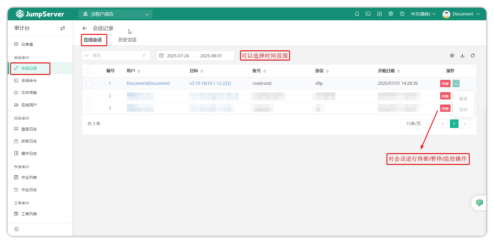
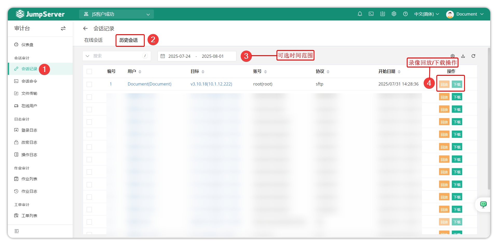
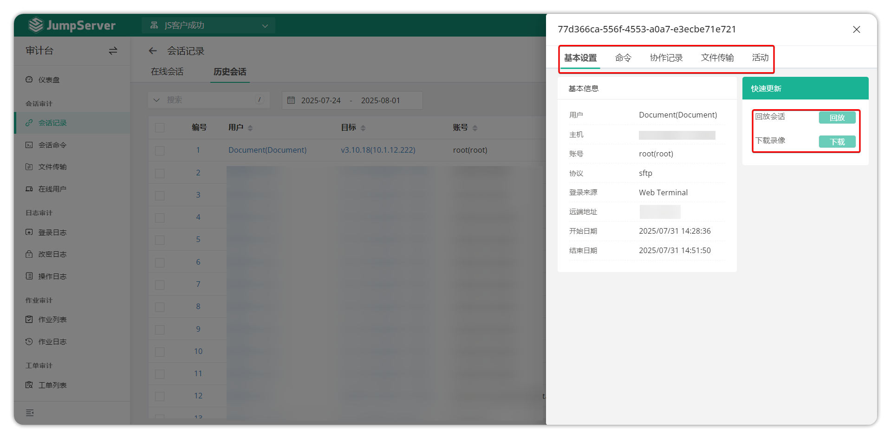

# 会话记录
## 1.功能简述
!!! tip "" 
    - 会话记录包含在线会话与历史会话两部分，主要展示的信息有登录资产的会话详细记录，包含用户、协议、远端地址、会话时间以及会话录像等。
## 2.在线会话
!!! tip "" 
    - 在线会话可以查看到所有目前正在使用 JumpServer 登录资产的会话。并且可以实时监控，在出现不合规操作时，可直接终断会话。
    - JumpServer 实时监控支持 SSH 协议与 RDP 协议的会话连接，RDP 客户端方式会话与数据库协议会话暂不支持实时监控。
!!! tip "" 
    - 点击切换至 **会话记录-在线会话** 页签，如图所示：

## 3.历史会话
!!! tip "" 
    - 历史会话可以查看所有 JumpServer 连接资产的详细信息以及操作录像，方便进行回溯与追责。
    - JumpServer 可以在线浏览器查看录像或者下载录像到本地通过 JumpServer 离线录像播放器播放录像。
!!! tip "" 
    - 点击切换至 **会话记录-历史会话** 页签，如图所示：

### 3.1 会话详情
!!! tip "" 
    - 点击 **会话记录-历史会话** 页签，该页面的``编号``按钮，可进入会话的详细信息页面。

!!! tip "" 
    - 详细模块说明：   
|模块	    |说明                                                                                       |
|-----------|-------------------------------------------------------------------------------------------|
|基本信息    |基本信息模块主要介绍该会话的基础信息，包含登录用户、登录来源、远端地址、会话开始时间与结束时间等。|
|命令        |命令模块可以查询到该会话连接过程中用户执行的命令记录。|
|协作记录    |协作可以查询到该会话连接过程中用户分享会话的记录内容。|
|文件传输    |文件传输模块可以查询到该会话连接过程中上传下载的文件。|
|活动        |展示最新该会话具体连接活动记录内容。|