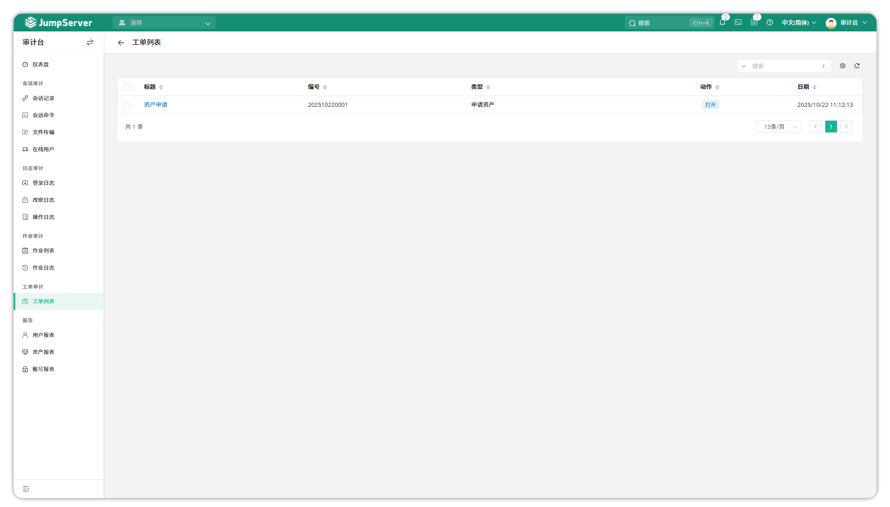
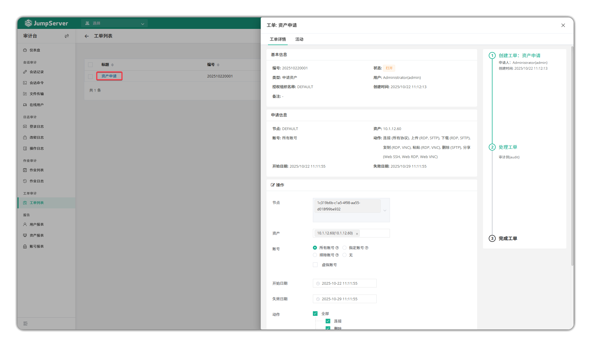

# Ticket List

!!! tip ""
    - Click the **Audit** button on the navigation bar to open the **Audit** page.
    - Click **Session Audit > Ticket List** to open the **Ticket List** page.
    - The ticket list page displays the list of tickets submitted by system users. Click on the corresponding ticket title to view ticket details.

**Ticket Details**

!!! tip ""
    - The ticket details page displays detailed ticket information, including ticket title, ticket content, ticket status, ticket handler, ticket creation time, etc.

