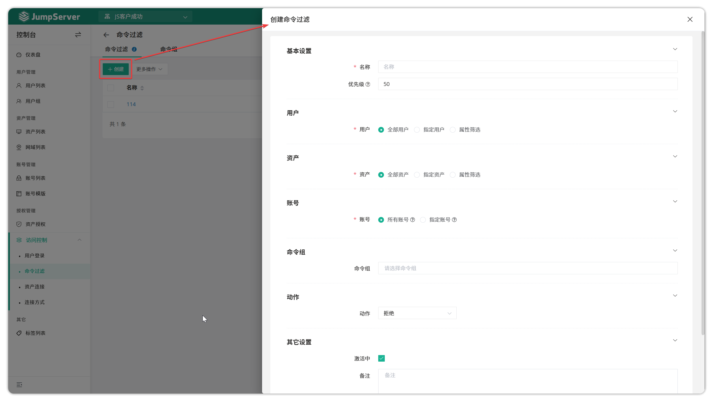
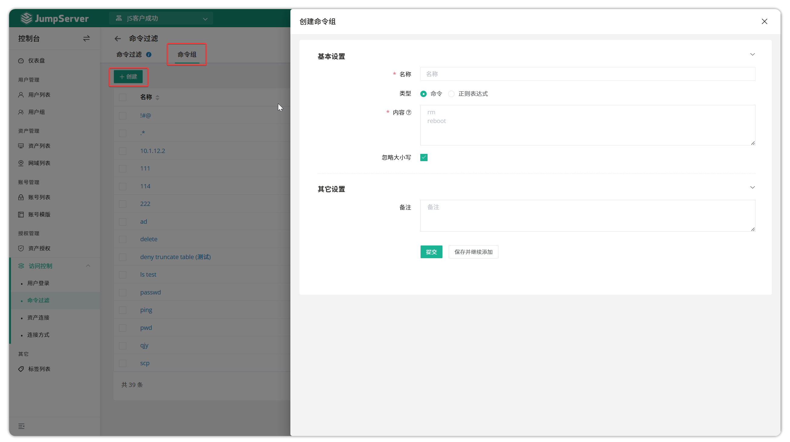
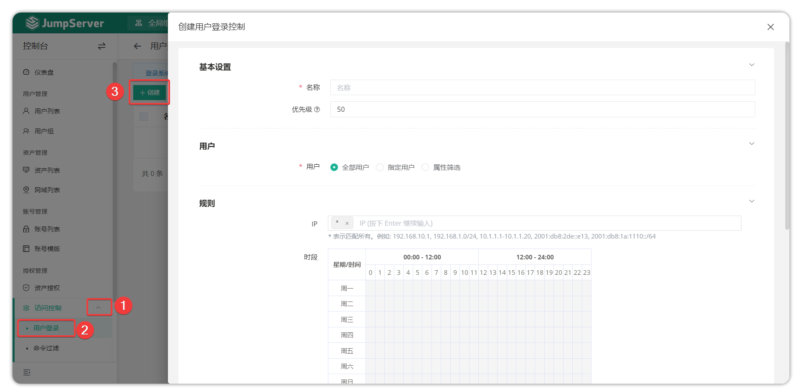
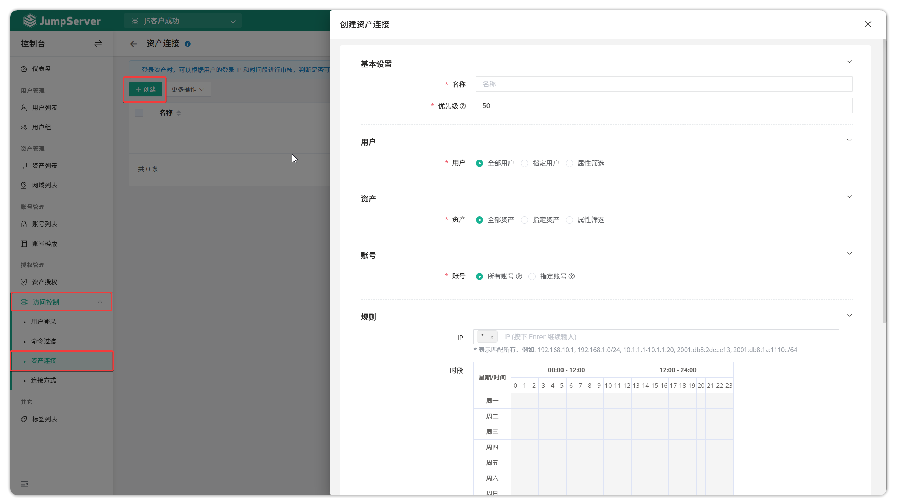
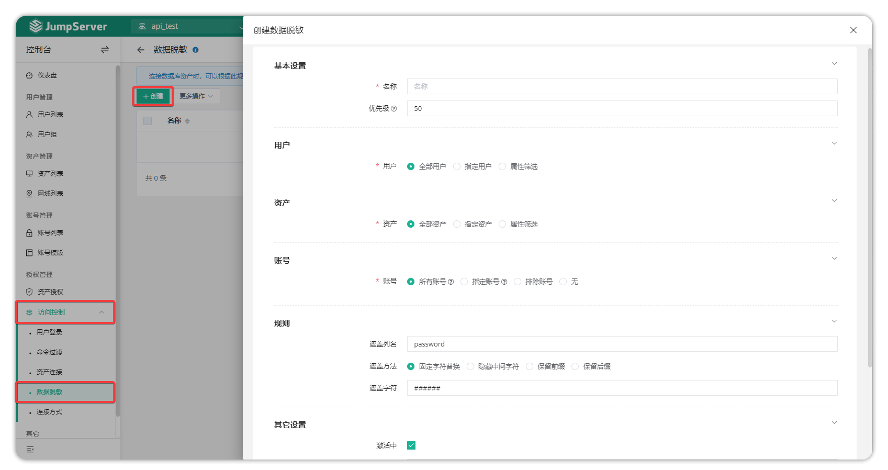
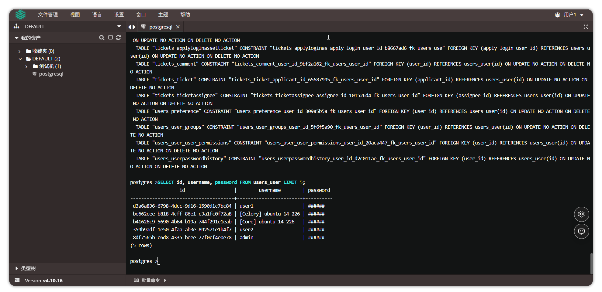
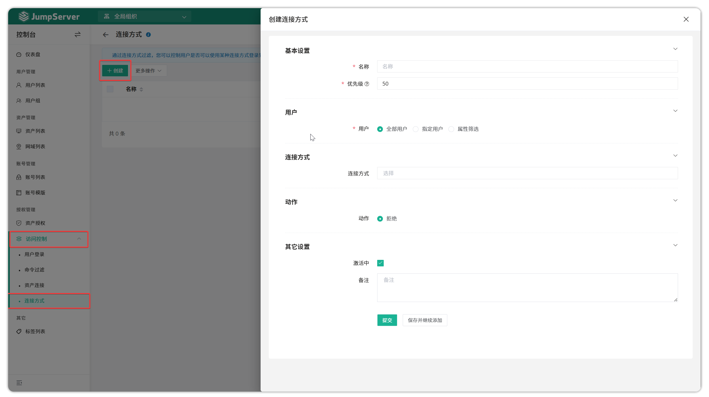

# Access Control

## 1 Command Filtering
### 1.1 Overview
!!! tip ""
    - Go to the Console page, click **Account Management > Account List** to open the account list page.
    - JumpServer supports filtering commands used during session processes and setting command filtering rules.
    - Command filters can be bound to JumpServer users, assets, and accounts used to connect to assets. One command filter can be bound to multiple command groups. When a bound user uses a bound account to connect to a bound asset and execute commands, the command must be matched by all command groups bound to the filter. Higher priority rules are matched first. When a matching rule is found, the action specified by that rule is executed. If no matching rule is found, the command executes normally.

### 1.2 Create command filter
!!! tip ""
    - This page allows creating, deleting, updating, and viewing command filters.
    - Click the **Command Filter** tab on the **Command Filtering** page to open the command filter page.
    - Click the **Create** button in the top-left corner to create a command filter.

!!! tip ""
    Detailed parameter descriptions:

| Parameter | Description |
|-----------|-------------|
| Name | The name of the command filter |
| Users | • **All users**: All user resources • **Specified users**: Specified user resources • **Property filter**: Filter target resources by matching property values |
| Assets | • **All assets**: All asset resources • **Specified assets**: Specified asset resources • **Property filter**: Filter target resources by matching property values |
| Account | • **All accounts**: All account resources • **Specified accounts**: Specified account resources |
| Command Groups | The command groups associated with this command filter. When a matching user executes these commands using a matching account on a matching asset, the corresponding action is executed |
| Action | • **Deny**: Deny asset login • **Accept**: Allow asset login • **Review**: Approval personnel receive a command review notification and can allow or deny the corresponding action • **Alert**: Send alert information to designated personnel when a matching command is detected |
| Priority | The priority of the command filter, priority range 1~100, lower values have higher priority, default 50 |

### 1.3 Create command group
!!! tip ""
    - Command groups can be bound to command filters. Command groups currently support two types of syntax: regular expressions and commands.
    - Click the **Command Groups** tab on the **Command Filtering** page to open the command group page.
    - Click the **Create** button in the top-left corner to create a command group.

!!! tip ""
    Detailed parameter descriptions:

| Parameter | Description |
|-----------|-------------|
| Name | The name of the command group |
| Type | Regular expression means matching commands through regular expressions; command means filtering specific commands |
| Content | Content can be multi-line text; each line represents a matching rule |
| Ignore Case | Fill in the command regardless of case; filter according to rules |

## 2 User login
!!! warning "Note: User login review is a JumpServer Enterprise edition feature."
### 2.1 Overview
!!! tip ""
    - JumpServer supports secondary review functionality for user login.
    - Based on security policies, the system can restrict user login based on JumpServer login user attributes. When secondary review action is set, approval personnel review the user login.

### 2.2 Create user login rule
!!! tip ""
    - Click the **Create** button on the **Access Control - User Login** page and fill in the user login rule information.

!!! tip ""
    Detailed parameter descriptions:

| Parameter | Description |
|-----------|-------------|
| Name | The name of the user login rule |
| Priority | The priority of the user login rule, priority range 1~100, lower values have higher priority, default 50 |
| Users | Specify the users matched by the login rule All users: The login rule matches all users Specified users: The login rule matches specified users Property filter: The login rule matches users matched by property rules |
| IP Group | Specify the login IP restricted by the login rule, format is a comma-separated string, `*` matches all. Examples: 192.168.10.1, 192.168.1.0/24, 10.1.1.1-10.1.1.20, 2001:db8:2de::e13, 2001:db8:1a:1110::/64. This IP is the user's login IP |
| Time Window | Specify the time period restricted by the login rule |
| Action | Specify the action when the login rule is executed: • Deny: When a user login matches the above rule, deny the user login • Accept: When a user login matches the above rule, accept the user login • Review (X-Pack): When a user login matches the above rule, send a ticket to approval personnel for approval before allowing login • Notify: When a user login matches the above rule, send notification to specified users |
| Enabled | Specify whether the login rule is active |

## 3 Asset connection (X-Pack)
!!! info "Note: Asset connection review is a JumpServer Enterprise edition feature."
### 3.1 Overview
!!! tip ""
    - JumpServer supports secondary review functionality for asset connections.
    - Based on security policies, the system can restrict asset connections based on three dimensions: JumpServer login user, asset information, and account information. When secondary review action is set, approval personnel review the asset connection.
### 3.2 Create asset connection rule
!!! tip ""
    - Click the **Create** button on the **Access Control - Asset Connection** page and fill in the asset connection rule information.

!!! tip ""
    - Detailed parameter descriptions:

    | Parameter | Description |
    |-----------|-------------|
    | Name | The name of the asset connection rule |
    | Priority | The priority of the asset connection rule, priority range 1~100, lower values have higher priority, default 50 |
    | Users | • **All users**: All user resources • **Specified users**: Specified user resources • **Property filter**: Filter target resources by matching property values |
    | Assets | • **All assets**: All asset resources • **Specified assets**: Specified asset resources • **Property filter**: Filter target resources by matching property values |
    | Account | • **All accounts**: All account resources • **Specified accounts**: Specified account resources |
    | Login IP | Restrict the IP address for asset connection |
    | Time Window | Restrict the time period for asset connection |
    | Action | • **Deny**: Deny asset connection • **Accept**: Allow asset connection • **Review**: Allow or deny connection after approval by designated approvers • **Notify**: Send notification to designated recipients when rule is triggered • **Password rotation**: Automatically execute asset account password change after login  **Note**: Enabling **Password rotation** requires adding the parameter `CHANGE_SECRET_AFTER_SESSION_END=true` to the configuration file and restarting JumpServer |

## 4 Data masking (X-Pack)
!!! info "Note: Query result data masking is a JumpServer Enterprise edition feature."
> Client-based connections (Magnus component) for databases other than MySQL are currently not supported for data masking.
### 4.1 Feature overview
!!! tip ""
    - JumpServer supports data masking for query results when connecting to database assets.
    - Through data masking rules, you can set sensitive data to be masked for users when they get query results (globally effective).

### 4.2 Create data masking rule
!!! tip ""
    - Click the **Create** button on the **Permission Management > Data Masking** page and fill in the data masking rule information.

!!! tip ""
    After completing the creation of data masking rules, connect to a database asset at the web terminal for testing and verification. Taking a PostgreSQL database as an example, after connecting to the designated PostgreSQL database asset via the web CLI, execute a query statement as shown in the following query example (where "password" is the specified masked column name).

!!! tip ""
    Detailed parameter descriptions:

| Parameter | Description |
|-----------|-------------|
| Name | The name of the data masking rule |
| Priority | The priority of the data masking rule, priority range 1~100, lower values have higher priority, default 50 |
| Users | • **All users**: All user resources • **Specified users**: Specified user resources • **Property filter**: Filter target resources by matching property values |
| Assets | • **All assets**: All asset resources • **Specified assets**: Specified asset resources • **Property filter**: Filter target resources by matching property values |
| Account | • **All accounts**: All account resources • **Specified accounts**: Specified account resources |
| Rules | • **Mask column names**: Support multiple field names, comma-separated, supports wildcards. For example: Single field name `password` means only mask `password` field Multiple field names: `password,secret` means mask `password` and `secret` Wildcard `*`: `password*` means mask field names with `password` prefix Wildcard `*`: `.*password` means mask field names with `password` suffix • **Mask method**: Mask data according to the selected method |

## 5 Connection method (X-Pack)
!!! info "Note: Connection method control is a JumpServer Enterprise edition feature."
### 5.1 Feature overview
!!! tip ""
    - JumpServer supports controlling connection methods when connecting to assets.
    - Through connection method filtering, you can control whether users can use a certain connection method to log in to assets. Based on your rules, some connection methods can be allowed while others are prohibited (globally effective).

### 5.2 Create connection method control rule
!!! tip ""
    - Click the **Create** button on the **Permission Management > Connection Method** page and fill in the connection method control rule information.

!!! tip ""
    Detailed parameter descriptions:

| Parameter | Description |
|-----------|-------------|
| Name | The name of the connection method control rule |
| Priority | The priority of the connection method control rule, priority range 1~100, lower values have higher priority, default 50 |
| Users | • **All users**: All user resources • **Specified users**: Specified user resources • **Property filter**: Filter target resources by matching property values |
| Connection Method | Asset connection methods provided by JumpServer, common ones include: Web CLI, Web SFTP, SSH, Web GUI, database client, etc. |
| Action | The action when a connection method control rule is matched: • **Deny**: Deny use of the connection method restricted in the rule |
