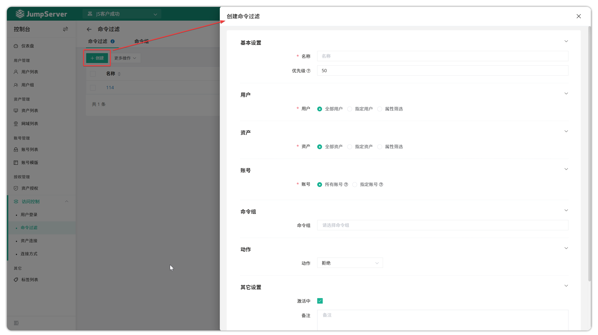

# 访问控制

## 命令过滤
### 功能概述
!!! tip ""
    - 进入控制台页面，点击 **账号管理 > 账号列表** ，进入账号列表页面。
    - JumpServer 支持对会话过程中使用的命令进行过滤，设置命令过滤规则。
    - 命令过滤器可以绑定 JumpServer 用户、资产、连接资产使用的用户，一个命令过滤可以绑定多个命令组。当绑定的用户用资产绑定账号去连接绑定的资产执行命令时，这个命令需要被绑定过滤器的所有命令组进行匹配，高优先级先被匹配；当某一条规则被匹配到后，会根据该规则的动作执行，如果没有匹配到对应的规则，命令即正常执行。

### 命令过滤的创建
!!! tip ""
    - 该页面可以针对命令过滤器进行创建、删除、更新、查看。
    - 点击 `命令过滤` 页面中的 `命令过滤` 页签即进入命令过滤器的页面。
    - 点击该页面左上角的 `创建` 按钮，即可创建命令过滤器。

!!! tip ""
    详细参数说明：

| 参数     | 说明                                                                 |
|----------|----------------------------------------------------------------------|
| 名称     | 命令过滤器的名称                                                     |
| 用户     | • **所有用户**：所有用户资源； • **指定用户**：指定用户资源； • **属性筛选**：根据属性名来匹配属性值筛选目标资源 |
| 资产     | • **所有资产**：所有资产资源； • **指定资产**：指定资产资源； • **属性筛选**：根据属性名来匹配属性值筛选目标资源 |
| 帐号     | • **所有帐号**：所有帐号资源； • **指定帐号**：指定帐号资源                     |
| 命令组   | 该命令过滤器关联的命令组，当匹配到的JumpScrew使用匹配到的系统用户登录匹配到的资产执行这些命令时执行相应的动作 |
| 动作     | • **拒绝**：拒绝登录资产； • **接收**：允许登录资产； • **审批**：审批人会收到命令复核通知，即可允许或拒绝相应动作执行； • **告警**：当匹配号指令时，发送告警信息给指定人员 |
| 优先级   | 命令过滤器的优先级，优先级可选范围为1~100，数值越小规则匹配越优先，默认为50         |

### 命令组的创建
!!! tip ""
    - 命令组可以绑定到命令过滤器中，命令组目前支持两种语法，分别是正则表达式和命令。
    - 点击`命令过滤`页面的`命令组`页签即进入命令过滤器的页面。
    - 点击该页面左上角的`创建`按钮，即可创建命令组。

!!! tip ""
    详细参数说明：

| 参数         | 说明                                                                 |
|--------------|----------------------------------------------------------------------|
| 名称         | 命令组的名称                                                         |
| 类型         | 正则表达式表示通过正则表达式进行命令匹配，命令则表示过滤某固定命令               |
| 内容         | 内容可以是多行文本，每一行代表一条匹配规则                                     |
| 忽略大小写    | 指将填入的命令不论大小写，一律按规则进行筛选                                   |

## 用户登录
!!! warning "注：用户登录审批为 JumpServer 企业版功能。"
### 功能概述
!!! tip ""
    - JumpServer 支持对用户登录进行二次复核功能。
    - 依据安全策略，系统可以针对 JumpServer 登录用户属性来对用户的登录进行限制，当设置二次复核动作时，执行审批人审批用户登录。

### 用户登录规则的创建
!!! tip ""
    - 点击 **访问控制-用户登录** 页面的 `创建` 按钮，填写用户登录规则的信息。

!!! tip ""
    详细参数说明：

| 参数  | 说明                                                                     |
|-------|--------------------------------------------------------------------------|
|名称	|用户登录规则的名称                                                          |
|优先级	|用户登录规则的优先级，优先级可选范围为1~100，数值越小规则匹配越优先，默认为50  |
|用户   |指定该登录规则匹配的用户 所有用户：该登录规则匹配所有用户 指定用户：该登录规则匹配指定用户 属性筛选：该登录规则匹配属性规则匹配到的用户|
|IP 组 |指定该登录规则生效所限制的登录 IP，格式为逗号分隔的字符串, `*` 表示匹配所有例如:192.168.10.1, 192.168.1.0/24, 10.1.1.1-10.1.1.20, 2001:db8:2de::e13, 2001:db8:1a:1110::/64该 IP 是指用户登录时的 IP|
|时段  |指定该登录规则所限制的用户登录时间段|
|动作  |指定该登录规则被执行时的动作:  • 拒绝：当用户登录匹配到上述规则拒绝该用户登录 • 接受：当用户登录匹配到上述规则接受该用户登录 • 审批(X-Pack)：当用户登录匹配到上述规则发送工单给审批人员，审批人员通过后允许用户登录 • 通知：当用户登录匹配到上述规则时，发送通知信息给指定的用户|
|激活中 |指定该登录规则是否生效|

## 资产连接(X-Pack)
!!! info "注: 资产连接复核为 JumpServer 企业版功能。"
### 功能概述
!!! tip ""
    - JumpServer 支持对资产连接进行二次复核功能。
    - 依据安全策略，系统可以针对 JumpServer 登录用户、资产信息、账号信息三个维度对资产的连接进行限制，当设置二次复核动作时，执行审批人审批资产连接。
### 资产连接规则的创建
!!! tip ""
    - 点击`访问控制-资产连接`页面的`创建`按钮，填写资产连接规则的信息。

!!! tip ""
    - 详细参数说明：

    | 参数      | 说明                                                                 |
    |-----------|----------------------------------------------------------------------|
    | 名称      | 资产连接规则的名称                                                   |
    | 优先级    | 资产连接规则的优先级，优先级可选范围为1~100，数值越小规则匹配越优先，默认为50 |
    | 用户      | • **所有用户**：所有用户资源； • **指定用户**：指定用户资源； • **属性筛选**：根据属性名来匹配属性值筛选目标资源 |
    | 资产      | • **所有资产**：所有资产资源； • **指定资产**：指定资产资源； • **属性筛选**：根据属性名来匹配属性值筛选目标资源 |
    | 帐号      | • **所有帐号**：所有帐号资源； • **指定帐号**：指定帐号资源                   |
    | 登录IP    | 限制资产连接的IP地址                                                 |
    | 时段      | 限制资产连接的时间段                                                 |
    | 动作      | • **拒绝**：拒绝连接资产； • **接收**：允许连接资产； • **审批**：经过设置的审批人审批允许或者拒绝连接； • **通知**：指定接收人，触发规则后发送通知 |

## 连接方式(X-Pack)
!!! info "注：连接方式控制为 JumpServer 企业版功能。"
### 功能简介
!!! tip ""
    - JumpServer 支持在资产连接时进行连接方式的控制。
    - 通过连接方式过滤，您可以控制用户是否可以使用某种连接方式登录到资产上。根据您设定的规则，某些连接方式可以被放行，而另一些连接方式则被禁止（全局生效）。

### 连接方式控制规则的创建
!!! tip ""
    - 点击 `权限管理-连接方式` 页面的 `创建` 按钮，填写连接方式控制规则的信息。

!!! tip ""
    详细参数说明：

| 参数       | 说明                                                                 |
|------------|----------------------------------------------------------------------|
| 名称       | 连接方式控制规则的名称                                               |
| 优先级     | 连接方式控制规则的优先级，优先级可选范围为1~100，数值越小规则匹配越优先，默认为50 |
| 用户       | • **所有用户**：所有用户资源； • **指定用户**：指定用户资源； • **属性筛选**：根据属性名来匹配属性值筛选目标资源 |
| 连接方式   | JumpServer提供的资产连接方式，常见的有：Web Cli、Web SFTP、SSH、Web GUI、数据库客户端等 |
| 动作       | 匹配到连接方式控制规则时做出的动作:  • **拒绝**：拒绝使用规则中限制的连接方式 |