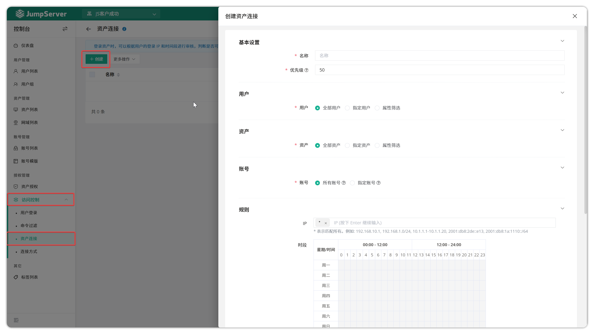

# 资产连接
!!! warning "注：资产连接复核为 JumpServer 企业版功能。"
## 1 功能简述
!!! tip ""
    - JumpServer 支持对资产连接进行二次复核功能。
    - 依据安全策略，系统可以针对 JumpServer 登录用户、资产信息、账号信息三个维度对资产的连接进行限制，当设置二次复核动作时，执行审批人审批资产连接。
## 2 资产连接规则的创建
!!! tip ""
    - 点击`访问控制-资产连接`页面的`创建`按钮，填写资产连接规则的信息。

!!! tip ""
    - 详细参数说明：

    | 参数      | 说明                                                                 |
    |-----------|----------------------------------------------------------------------|
    | 名称      | 资产连接规则的名称。                                                 |
    | 优先级    | 资产连接规则的优先级，优先级可选范围为1~100，数值越小规则匹配越优先，默认为50。 |
    | 用户      | • **所有用户**：所有用户资源； • **指定用户**：指定用户资源； • **属性筛选**：根据属性名来匹配属性值筛选目标资源。 |
    | 资产      | • **所有资产**：所有资产资源； • **指定资产**：指定资产资源； • **属性筛选**：根据属性名来匹配属性值筛选目标资源。 |
    | 帐号      | • **所有帐号**：所有帐号资源； • **指定帐号**：指定帐号资源。                   |
    | 登录IP    | 限制资产连接的IP地址。                                               |
    | 时段      | 限制资产连接的时间段。                                               |
    | 动作      | • **拒绝**：拒绝连接资产； • **接收**：允许连接资产； • **审批**：经过设置的审批人审批允许或者拒绝连接； • **通知**：指定接收人，触发规则后发送通知。 |