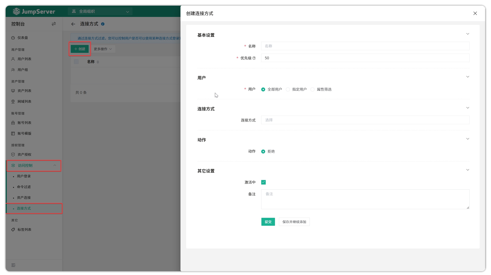

# 连接方式
!!! info "注：连接方式控制为 JumpServer 企业版功能。"
## 1 功能简介
!!! tip ""
    - JumpServer 支持在资产连接时进行连接方式的控制。
    - 通过连接方式过滤，您可以控制用户是否可以使用某种连接方式登录到资产上。根据您设定的规则，某些连接方式可以被放行，而另一些连接方式则被禁止（全局生效）。
## 2 连接方式控制规则的创建
!!! tip ""
    - 点击`权限管理-连接方式`页面的`创建`按钮，填写连接方式控制规则的信息。

!!! tip ""
    - 详细参数说明：

    | 参数       | 说明                                                                 |
    |------------|----------------------------------------------------------------------|
    | 名称       | 连接方式控制规则的名称。                                             |
    | 优先级     | 连接方式控制规则的优先级，优先级可选范围为1~100，数值越小规则匹配越优先，默认为50。 |
    | 用户       | A. "所有用户"：所有用户资源； B. "指定用户"：指定用户资源； C. "属性筛选"：根据属性名来匹配属性值筛选目标资源。 |
    | 连接方式   | JumpServer提供的资产连接方式，常见的有：Web Cli、Web SFTP、SSH、Web GUI、数据库客户端等 |
    | 动作       | 匹配到连接方式控制规则时做出的动作。 A. "拒绝"：拒绝使用规则中限制的连接方式。 |