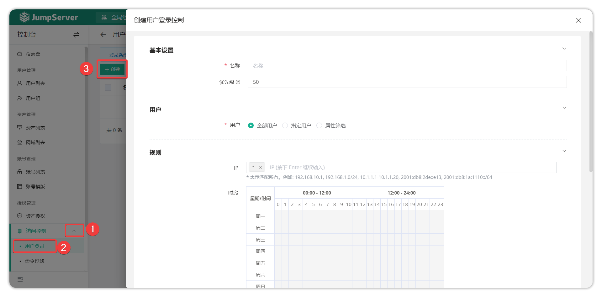

# 用户登录
## 1.功能简述
!!! tip ""
    - JumpServer 支持对用户登录进行二次复核功能。
    - 依据安全策略，系统可以针对 JumpServer 登录用户属性来对用户的登录进行限制，当设置二次复核动作时，执行审批人审批用户登录。

## 2.用户登录规则的创建
!!! tip ""
    - 点击 **访问控制-用户登录** 页面的 ``创建`` 按钮，填写用户登录规则的信息。

!!! tip "详细参数说明"
| 参数  | 说明                                                                     |
|-------|--------------------------------------------------------------------------|
|名称	|用户登录规则的名称。                                                        |
|优先级	|用户登录规则的优先级，优先级可选范围为1~100，数值越小规则匹配越优先，默认为50。|
|用户   |指定该登录规则匹配的用户。 所有用户：该登录规则匹配所有用户。 指定用户：该登录规则匹配指定用户。 属性筛选：该登录规则匹配属性规则匹配到的用户。|
|IP 组 |指定该登录规则生效所限制的登录 IP，格式为逗号分隔的字符串, *表示142匹配所有。例如:192.168.10.1, 192.168.1.0/24, 10.1.1.1-10.1.1.20, 2001:db8:2de::e13, 2001:db8:1a:1110::/64。该 IP 是指用户登录时的 IP。|
|时段  |指定该登录规则所限制的用户登录时间段。|
|动作  |指定该登录规则被执行时的动作。 拒绝：当用户登录匹配到上述规则拒绝该用户登录。 接受：当用户登录匹配到上述规则接受该用户登录。 审批：当用户登录匹配到上述规则发送工单给审批人员，审批人员通过后允许用户登录。 通知：当用户登录匹配到上述规则时，发送通知信息给指定的用户。|
|激活中 |指定该登录规则是否生效。|
