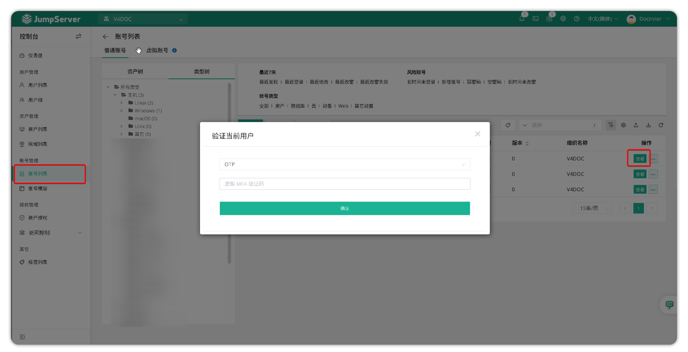
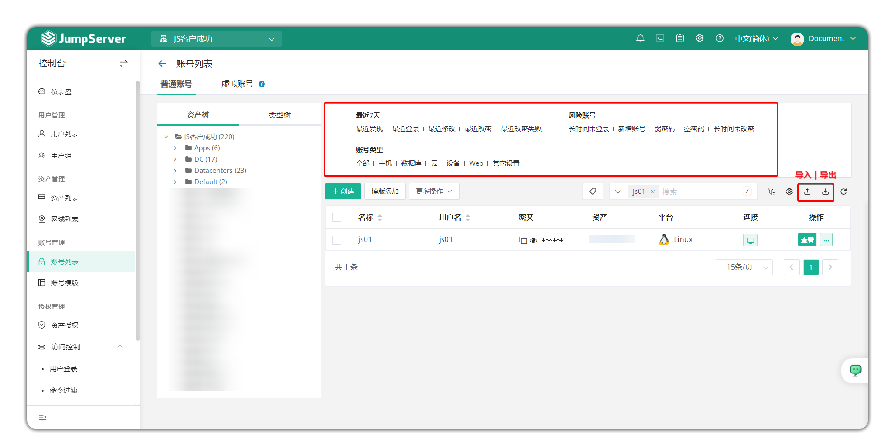
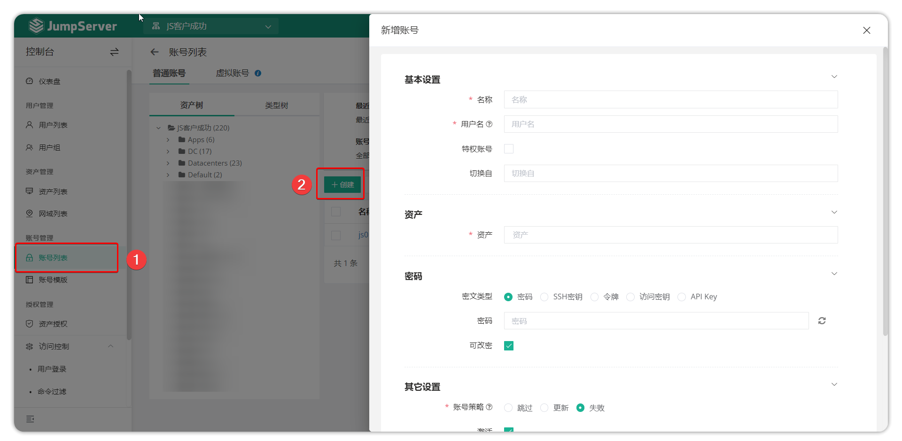
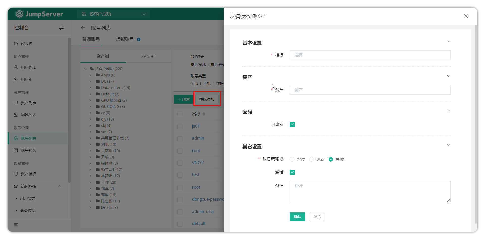
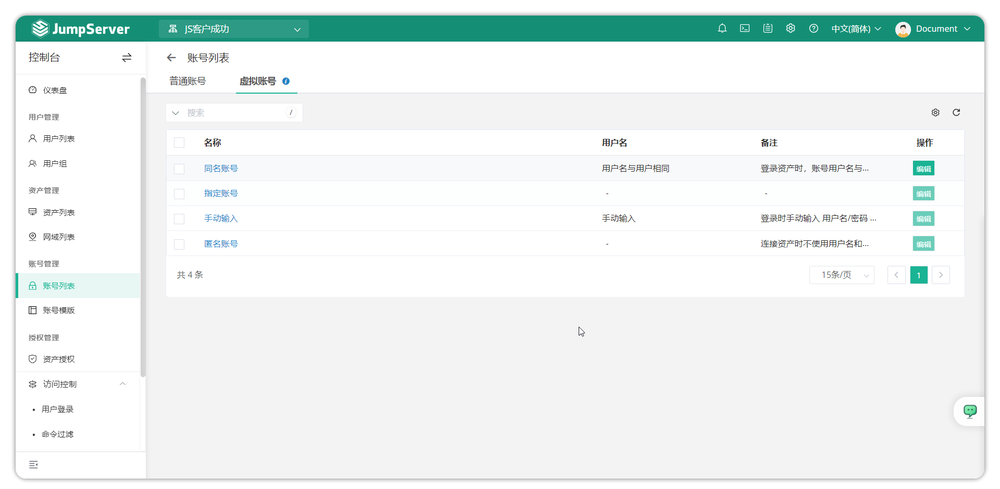

# Account List
## 1 Overview
!!! tip "" 
    - Go to the Console page, click **Account Management > Account List** to open the account list page.
    - JumpServer supports managed account management for assets.

## 2 Features
### 2.1 View account information
!!! tip "" 
    - Click the asset tree or type tree on the left side of the page to select a node or asset to view the account information associated with the asset (by default, admin MFA verification is required)

!!! tip "Hint"
    - MFA verification is required to view detailed account information such as account passwords.
    - For security, JumpServer defaults to requiring MFA verification to view passwords. To disable MFA verification, add the configuration `SECURITY_VIEW_AUTH_NEED_MFA=False` to the JumpServer configuration file (default: `/opt/jumpserver/config/config.txt`) and restart the JumpServer service.
### 2.2 Account information import/export
!!! tip "" 
    - You can bulk export account information. JumpServer supports exporting detailed information and passwords of all accounts associated with assets.Exported files are password-protected. You can modify this password in Preferences, accessible via the user avatar in the top-right corner. Account filtering can quickly filter the account list based on account type and risk accounts.

### 2.3 Add account
!!! tip "" 
    - JumpServer supports bulk associating one account with multiple assets (account adding feature). Click the **Add** button on the account list page, select the assets to associate with the account, fill in the account details, and bulk associate the account with the assets.

| Parameter           | Description                                                  |
| ------------------- | ------------------------------------------------------------ |
| Name                | User identification name, can be repeated.                   |
| Username            | Login account for accessing JumpServer, cannot be repeated.  |
| Privileged Account  | Accounts to be executed first during batch processing; supports duplicate settings. |
| Su Switch           | This account switched to another account                     |
| Asset               | Select created assets from the list; multiple selections are allowed. |
| Password            | Authenticate with a password encrypted by the algorithm, suitable for logging in to assets via protocols such as SSH and RDP. |
| SSH Key             | Implement passwordless login by configuring the private key file; the corresponding public key needs to be configured on the asset, supporting OpenSSH format. |
| Token               | Typically used for the ciphertext type required when creating Kubernetes asset accounts |
| Password Changeable | When enabled, JumpServer can periodically change the password of this account on the asset through the account password change function. |
| Account Policy      | When creating an account, if the key type is non-compliant, it restricts the key (Skip / Update / Fail). |
| Skip                | When the account policy is executed, if the account does not meet the conditions or does not require processing, the system will skip this account without any operation. |
| Update              | Indicates that the system will update the permissions or configuration of the account according to the policy, such as modifying the permission scope or validity period. |
| Fail                | Indicates that an error occurred during the application of the account policy, such as insufficient permissions, unreachable target asset, or configuration conflict, resulting in the policy not taking effect. |
| Active              | Restrict normal account login                                |
| Remarks             | Optional field, used to fill in the account description information, which is convenient for administrators to identify and manage. |

### 2.4 Add account template
!!! tip "" 
    - Click the **Template Add** button on the account list page, select the assets to associate the account template with, choose the account template to add, and bulk associate the account template with the assets.

| Parameter           | Description                                                  |
| ------------------- | ------------------------------------------------------------ |
| Template            | Select an existing account template.                         |
| Node                | Set an existing node; you can select the authorized node corresponding to the asset. |
| Asset               | Select a created asset from the list.                        |
| Password Changeable | When enabled, JumpServer can periodically change the password of this account on the asset through the account password change function. |
| Account Policy      | When creating an account, if the key type is non-compliant, it restricts the only action (Skip / Update / Fail). |
| Active              | Restrict normal account login                                |
| Remarks             | Optional field, used by administrators to configure remark information for this account template. |

## 3 Virtual accounts
!!! tip "" 
    - In certain scenarios during authorization rule creation, virtual accounts are used to log in to assets. The virtual account page supports viewing details of virtual accounts. JumpServer supports allowing AD/LDAP users to log in to assets with JumpServer user passwords when authorization rules authorize accounts with the same name.

