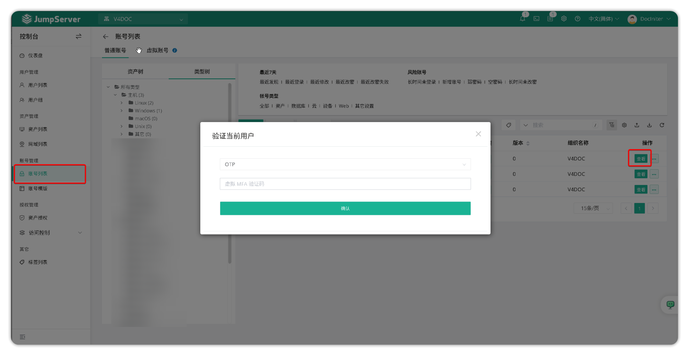
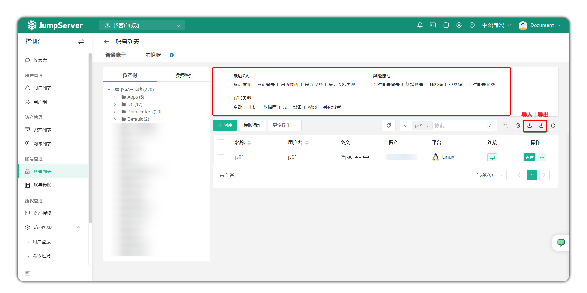
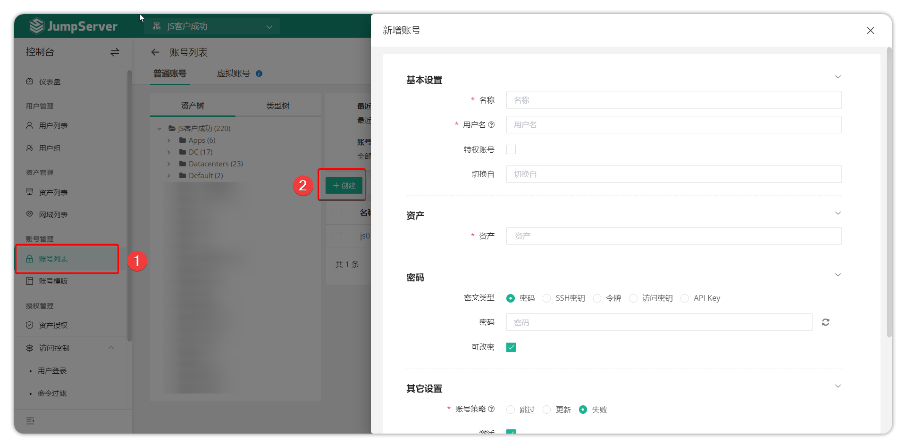
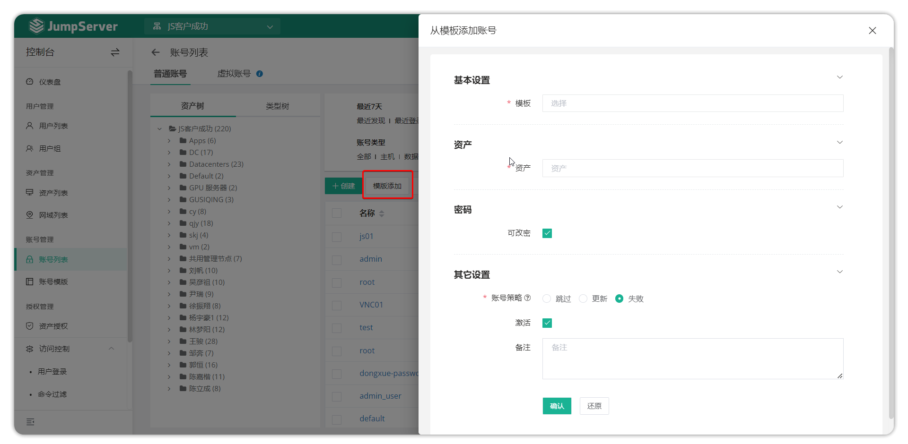
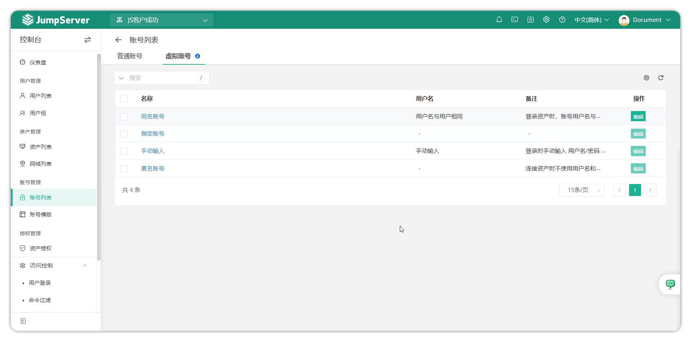

# 账号列表
## 1.功能简述
!!! tip "" 
    - JumpServer 支持对资产的账号进行托管管理。

## 2.功能使用
### 2.1 账号信息的查看
!!! tip "" 
    - 点击页面左侧的资产树或者类型树选择节点或者资产，可以查看相关资产关联的账号信息(默认需要校验管理员账户的 MFA)

!!! tip "提示"
    - 查看账号详细信息例如账号密码时需要验证用户的 MFA。
    - JumpServer 为提高安全性，默认查看密码需要校验 MFA；如需取消验证 MFA，可以在 JumpServer 的配置文件(默认为 /opt/jumpserver/config/config.txt)中添加配置项 ``SECURITY_VIEW_AUTH_NEED_MFA=False`` 并重启 JumpServer 服务。
### 2.2 账号信息导入/导出
!!! tip "" 
    - 可以针对账户信息批量导出，JumpServer 支持导出所有资产关联账号的详细信息与账号密码。账号筛选可根据账号类型、风险账号可以快速筛选账号列表。

### 2.3 添加账号
!!! tip "" 
    - JumpServer 支持将一个账号批量关联给多个资产，即账号添加功能。点击账号列表页面的 ``添加`` 按钮，选择需要将账号关联的资产，填写需要关联的账号相关信息，即可批量的关联账号给资产。

### 2.4 添加账号模板
!!! tip "" 
    - 点击账号列表页面的``模版添加``按钮，选择需要将资产关联给的资产，选择需要添加的账号模版，即可批量的关联账号模版给资产。

## 3.虚拟账号
!!! tip "" 
    - 在授权规则创建时，某些场景下会使用虚拟账号登录资产。虚拟账号页面支持对虚拟账户的详情进行查看。JumpServer支持当授权规则中授权了同名账户时，AD/LDAP 用户使用 JumpServer 用户密码登录资产。
