# Asset List

## 1 Overview
!!! tip ""
    - Go to the **Console** page, click **Asset Management > Asset List** to open the asset list page.
    - The asset list page includes asset tree and type tree, asset types, asset creation, asset updates, asset details, asset deletion and other functional modules.
  
## 2 Asset tree and type tree
### 2.1 Asset tree
!!! tip ""
    - The asset tree displays all assets in a hierarchical structure organized by nodes.
    - Asset tree root nodes cannot have duplicate names. Right-click on a node to add, delete, and rename nodes, as well as perform asset-related operations.

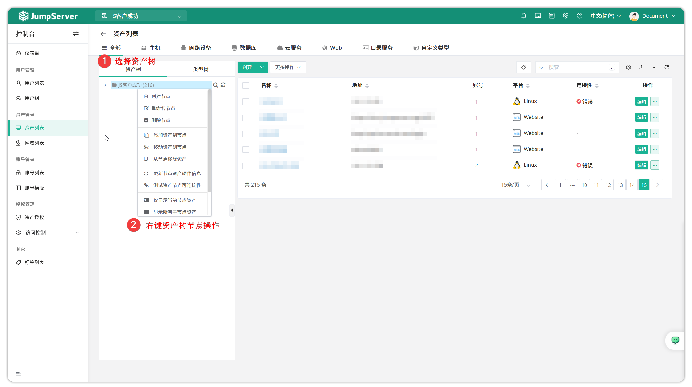

!!! tip ""
    Detailed parameter descriptions:

| Parameter | Description |
|-----------|-------------|
| Create Node | Create a new child node under the current node |
| Rename Node | Rename the node |
| Delete Node | Delete the current node |
| Add Assets to Node | Add assets from other nodes to the current node; assets in the original node are not removed |
| Move Assets to Node | Move assets from other nodes to the current node; assets in the original node are removed |
| Update Node Asset Hardware Info | Start an automation task to batch update hardware information for assets under the current node. Note: Assets under the current node must have automation tasks enabled with correctly configured privileged users; this feature only supports SSH protocol. |
| Test Asset Node Connectivity | Start an automation task to batch test the connectivity of assets under the current node. Note: Assets under the current node must have automation tasks enabled with correctly configured privileged users; this feature only supports SSH protocol. |
| Show Current Node Assets Only | Only display assets under the current node, excluding assets in child nodes |
| Show All Child Node Assets | Display assets in the current node and all child nodes, regardless of multi-level nesting |
| Verify Asset Count | Verify the asset count under the current node |
| Show Node Details | Display detailed information about the current node, including node ID, name, and full path |

### 2.2 Type tree
!!! tip ""
    - The type tree is another way to categorize assets. JumpServer organizes hosts, network devices, databases, and other resources as assets. The type tree mainly displays the count of each asset type for a more intuitive view of asset distribution.

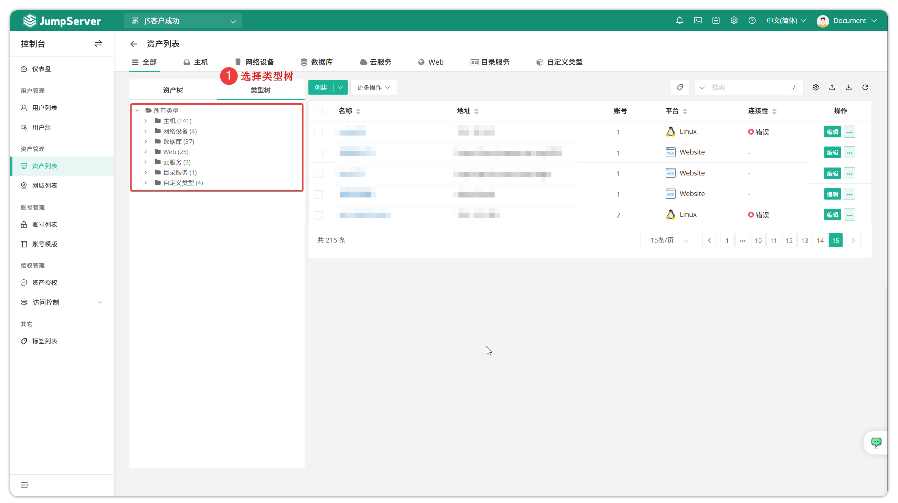

## 3 Asset types
!!! info "Note: Oracle, SQL Server, ClickHouse, Dameng, DB2 databases are JumpServer Enterprise edition features."
!!! tip ""
    - JumpServer categorizes hosts, network devices, databases, and other resources as assets.
    - Host types default to include Linux, Windows, and Unix assets.
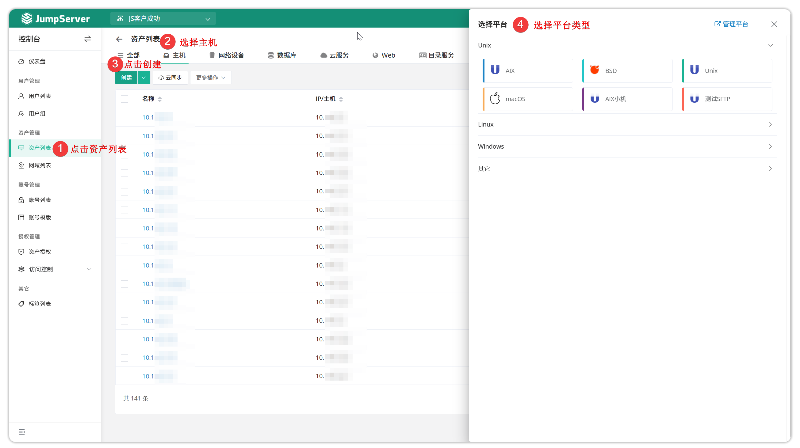

!!! tip ""
    - Network device types default to include General, Cisco, Huawei, and H3C.
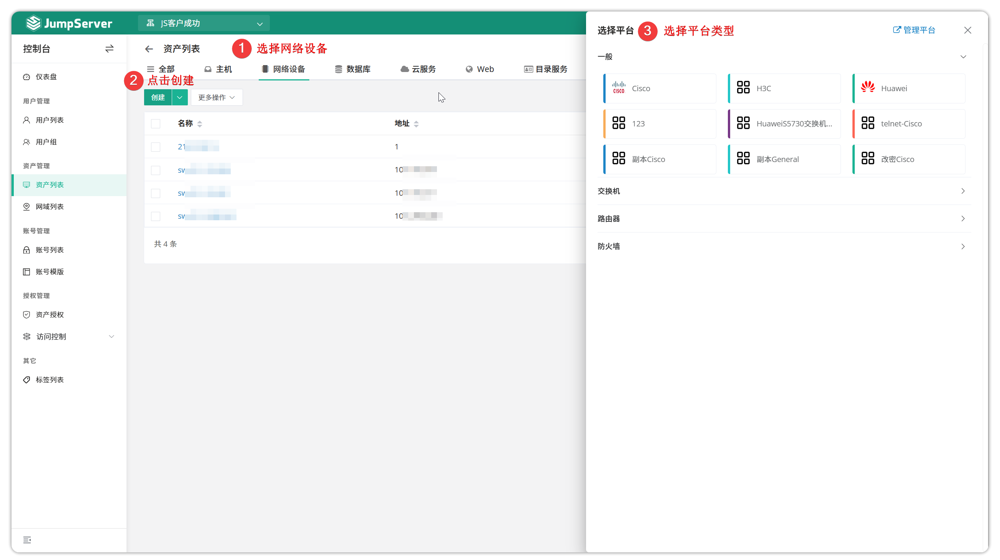

!!! tip ""
    - Database types default to include MySQL, MariaDB, PostgreSQL, Redis, MongoDB, Oracle, SQL Server, ClickHouse, Dameng, and DB2.
    - Some databases support TLS encrypted connections through koko, such as MySQL, SQL Server, etc.
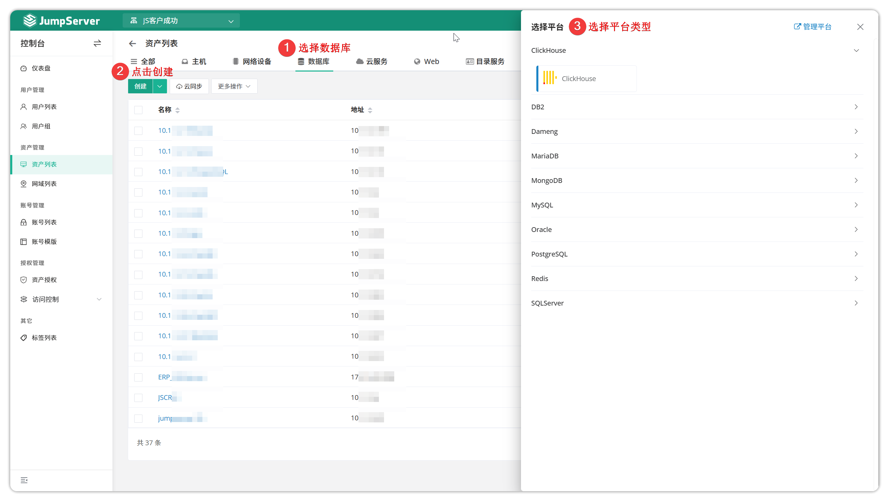

!!! tip ""
    - Cloud services default to include private cloud VMs and Kubernetes.
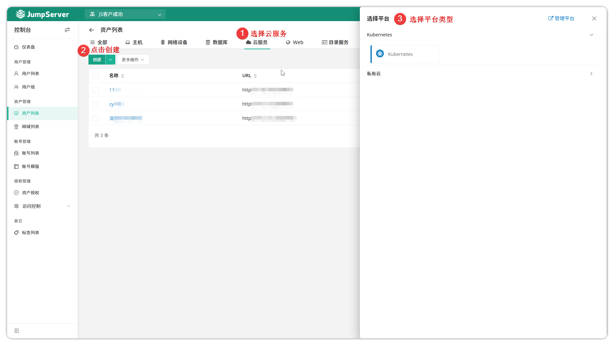

!!! tip ""
    - Web type assets include website resources. For detailed Web asset configuration, see [Creating Web Assets](web_assets.md).
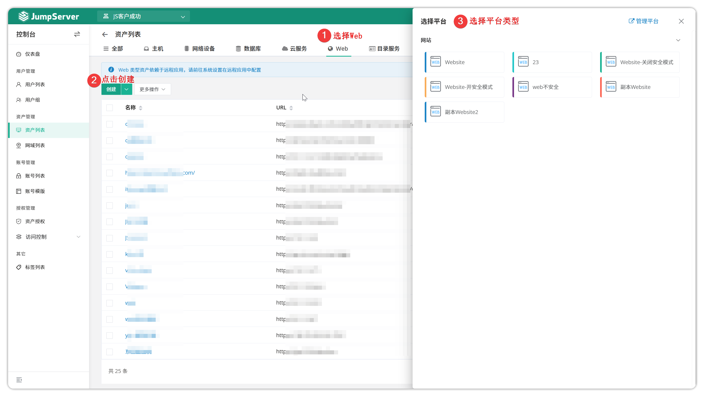

!!! tip ""
    - Directory Service is used for centralized storage, management, and querying of network resource information. Common implementations include LDAP and Active Directory.
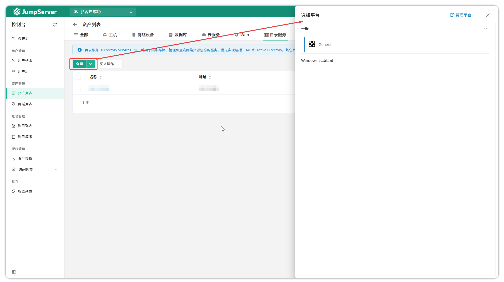

!!! tip ""
    - In addition to built-in asset types, JumpServer supports custom asset types through remote applications, such as test software, note-taking software, etc.
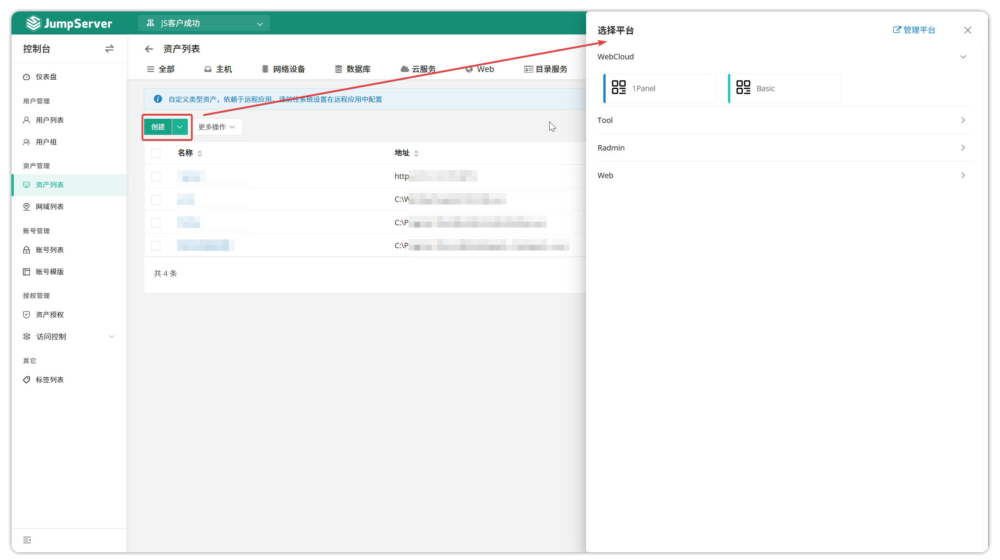

## 4 Asset creation
### 4.1 Manually create a single asset

!!! tip ""
    - JumpServer supports manual asset creation. Asset creation requires filling in basic information such as asset name, IP address, accounts, node information, etc.
    - Click the **Create** button in the top-left corner of the page and select a Linux asset to open the asset creation page, then fill in the asset details.
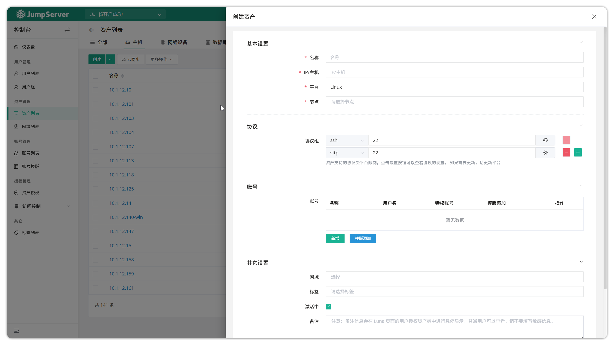
!!! tip ""
    - Detailed parameter descriptions:

| Parameter | Description |
|-----------|-------------|
| Name | Required. The asset name in JumpServer, unrelated to the computer name; must be unique |
| IP/Hostname | Required. The real address of the asset, supporting domain names and IP addresses. Duplicates are allowed. |
| Asset Platform | Default parameter. The asset platform; different platforms can set different character encodings, connection parameters, and password change commands |
| Node | Required. The node to which the asset belongs |
| Protocol Group | Required. Protocols used to access the asset; one or more protocols can be selected |
| Account List | Optional. Accounts used to log in to the asset; multiple accounts can be created. Accounts are bound to assets. |
| Domain | Optional. For assets across network segments, access through a domain gateway as a proxy is required |
| Label | Optional. Add labels to the asset for easier management |
| Active | Required. Whether the asset is available for use |

### 4.2 Bulk import assets via Excel
!!! tip ""
    - JumpServer supports bulk asset creation and updates through Excel import.
    - For the first import, click the Import button in the top-right corner of the asset list, download the template, fill in the information to create or update, then import the file.
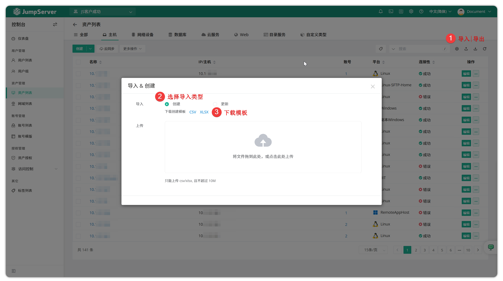

### 4.3 Cloud sync (x-pack)
!!! info "Note: Cloud sync is a JumpServer Enterprise edition feature."
!!! tip ""
    - JumpServer supports cloud host synchronization. Currently supported cloud platforms include: Alibaba Cloud, Tencent Cloud, Huawei Cloud, Baidu Cloud, JD Cloud, Kingsoft Cloud, AWS, Azure, Google Cloud, UCloud, VMware, QingCloud, China Telecom Cloud, OpenStack, ZStack, Nutanix, Fusion Compute, Shenzhen Xinfengfu Cloud Platform, Alibaba Cloud Private Cloud, and LAN.
    - Click the Account List tab on the cloud sync page to create cloud accounts.

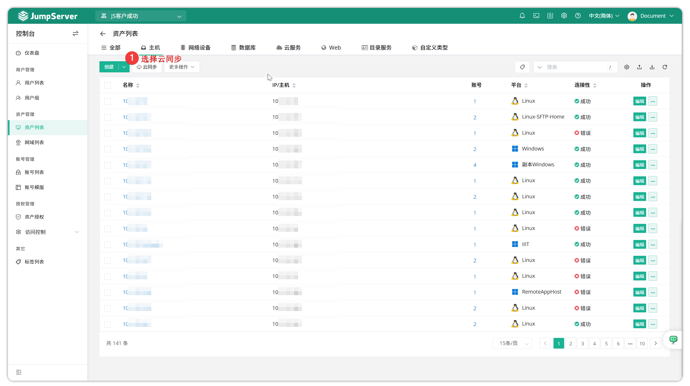

!!! tip ""
    - Then fill in the cloud account. Using Tencent Cloud as an example (obtain Tencent Cloud keys from the Tencent Cloud account page):

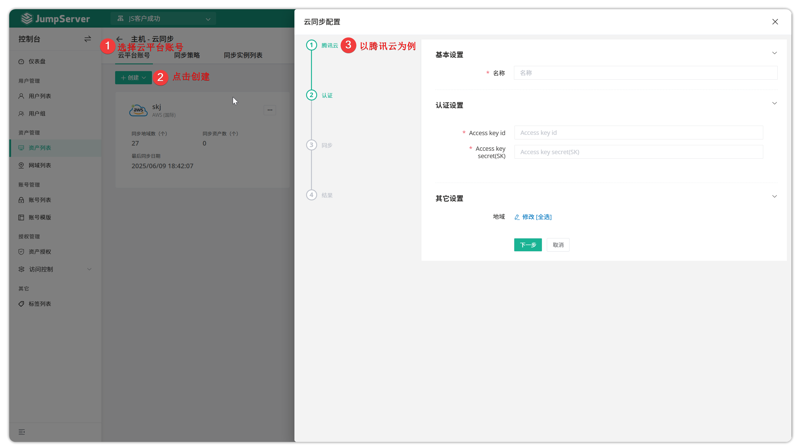

!!! tip ""
    - After successfully creating a cloud account, it will appear on the cloud provider page. JumpServer admins can create multiple cloud account types to synchronize cloud hosts.
    - Select `Online Sync` to synchronize cloud resources on the page.

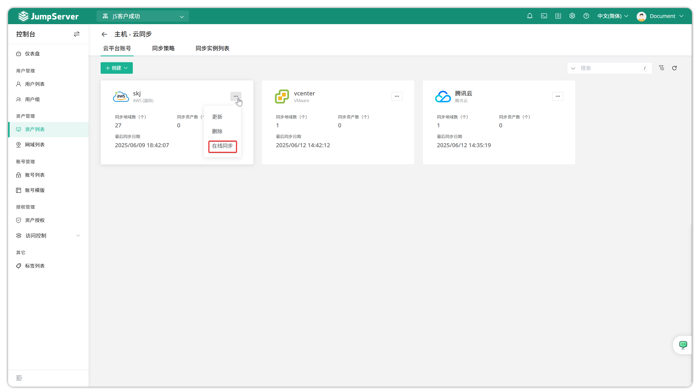

!!! tip ""
    - Start the sync and wait for the task to complete, select hosts, and click to import.
    - Check the import results in the asset list. If the imported assets are found in the asset list, the cloud account asset synchronization is working normally.

!!! info "Cloud sync task auto-release behavior (feature in v4.10.4 and later)"
    - After enabling "Cloud sync task auto-release", if the first sync selected regions A and B, and later modifications keep only region A, the system will not automatically release assets previously synced from region B on the next sync (older versions would).
    - To offload assets from removed regions, manually execute release or configure cleanup logic in policies separately to avoid accidentally deleting resources still in use.
   
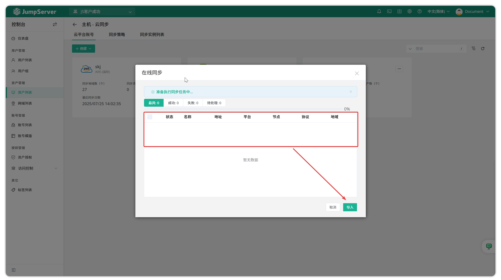

!!! tip ""
    - If users need to establish specific sync rules during the cloud sync process, they can define sync policies. The steps to create a sync policy are as follows:
    - Fill in the information and click `Submit` at the bottom to create the policy.
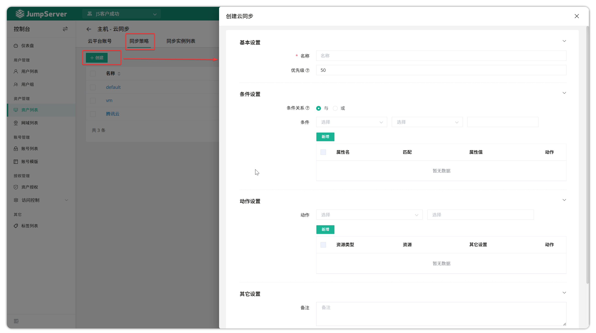

!!! tip ""
    - Detailed parameter descriptions:

| Parameter | Description |
|-----------|-------------|
| Name | The name of the cloud sync policy |
| Priority | The priority of the sync policy. 1-100, lower numbers have higher priority |
| Condition Relationship | AND: Execute the action only when all conditions match. OR: Execute the action when at least one condition matches |
| Condition | Policy rules used to match assets on cloud platforms. For example, instance name, platform name, and address |
| Action Settings | Policy actions executed on JumpServer after successfully matching assets. It can set platforms, nodes, regions, and account templates for successfully synced assets |

## 5 Update assets
!!! tip ""
    - When you need to update an asset's information, click the **Update** button next to the asset to open the asset information update page and update the asset details.

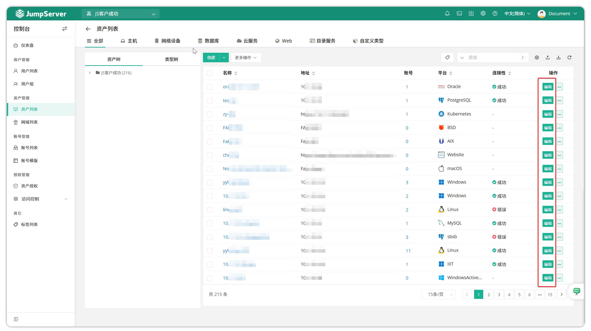

## 6 Asset details
!!! tip ""
    - Click the asset name to open the asset detail page, which displays detailed information including basic info, accounts, authorization rules, activity logs, etc.

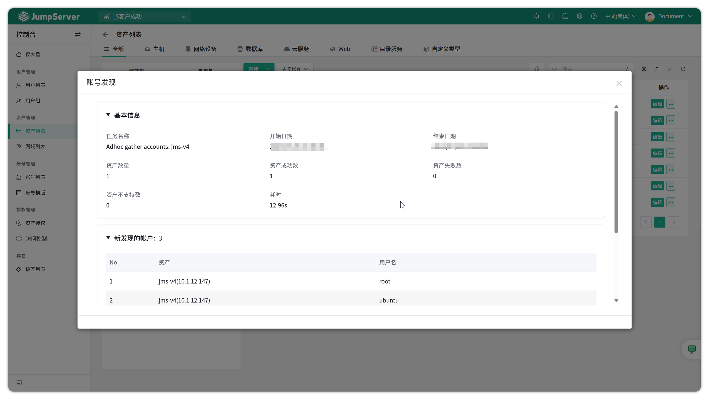
