# 资产列表

## 1 功能概述
!!! tip ""
    - 进入 **控制台** 页面，点击 **资产管理 > 资产列表** ，进入资产列表页面。
    - 资产列表页面包含资产树与类型树、资产类型、资产创建、资产更新、资产详情、资产删除等功能模块。
  
## 2 资产树与类型树
### 2.1 资产树
!!! tip ""
    
    - 资产树是对资产类别的一个划分，对于每个资产，可以按照不同维度进行划分，同一资产可以存在多维度的划分，例如：按照组织划分、按照项目划分、按照协议划分等等。
    - 划分节点后，可以灵活的分配用户权限，达到高效管理主机的目的。
    - 资产树根节点不能重名，右击节点可以添加、删除和重命名节点，以及资产的相关操作。

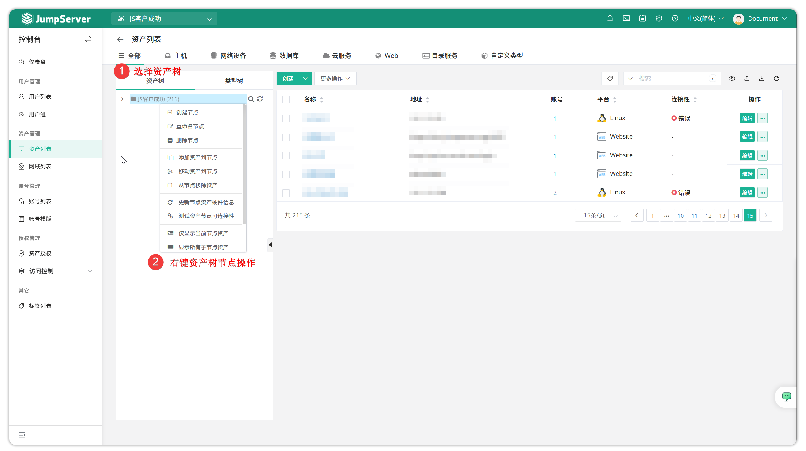

!!! tip ""
    详细参数说明:

| 参数                     | 说明                                                                                                                                 |
|--------------------------|--------------------------------------------------------------------------------------------------------------------------------------|
| 创建节点                 | 在当前节点下创建一个新的子节点                                                                                                     |
| 重命名节点               | 重命名节点                                                                                                                         |
| 删除节点                 | 删除当前节点                                                                                                                       |
| 添加资产到节点           | 将其他节点的资产添加到当前节点下，原节点下资产不会被移除                                                                           |
| 移动资产到节点           | 将其他节点的资产移动到当前节点下，原节点下的资产会被移除                                                                           |
| 更新节点资产硬件信息     | 拉起自动化任务，批量更新当前节点下资产硬件信息。注：需当前节点下的资产开启了自动化任务并配置正确的特权用户，该功能只支持 SSH 协议    |
| 测试资产节点可连接性     | 拉起自动化任务，批量更新当前节点下资产的可连接性。注：需当前节点下的资产开启了自动化任务并配置正确的特权用户，该功能只支持 SSH 协议  |
| 仅显示当前节点资产       | 只显示当前节点下的资产，不显示子节点下的资产                                                                                       |
| 显示所有子节点资产       | 当前节点下和所有子节点下的资产都显示出来，不论子节点下是否还有多层子节点                                                           |
| 校对资产数量             | 校对当前节点下的资产数量                                                                                                           |
| 显示节点详情             | 显示当前节点的详细信息，包含节点ID、名称与全称                                                                                     |

### 2.2 类型树 
!!! tip ""
    - 类型树是对资产的另一种区分，JumpServer将主机、网络设备、数据库等均归类于JumpServer资产，类型树主要主要统计每一种类型的资产数量更直观的查看资产分布。

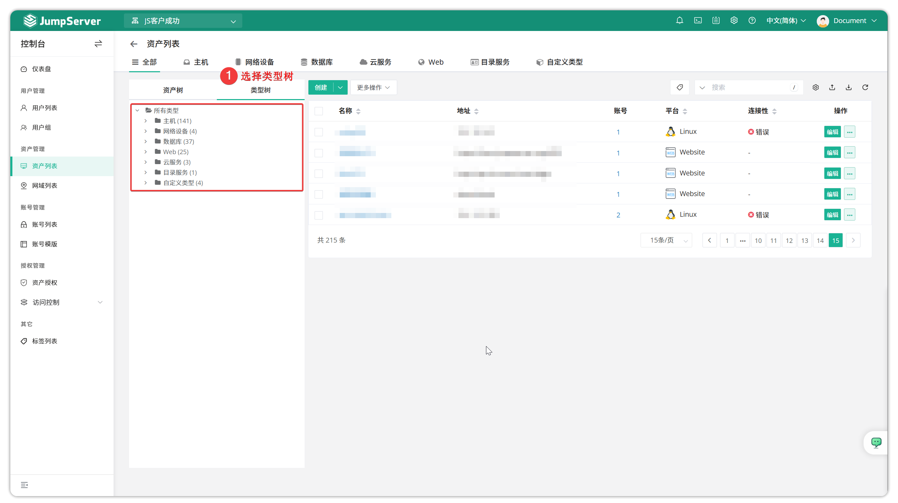

## 3 资产类型
!!! info "注: Oracle、SQL Server、ClickHouse、Dameng、DB2、ClickHouse 数据库均为 JumpServer 企业版功能。"
!!! tip ""
    - JumpServer 将主机、网络设备、数据库等等均归类于 JumpServer 资产。
    - 管理员用户可以自行在平台列表中自定义平台类型。
    - 主机类型中默认包含 Linux 资产、Windows 资产、Unix 资产等。
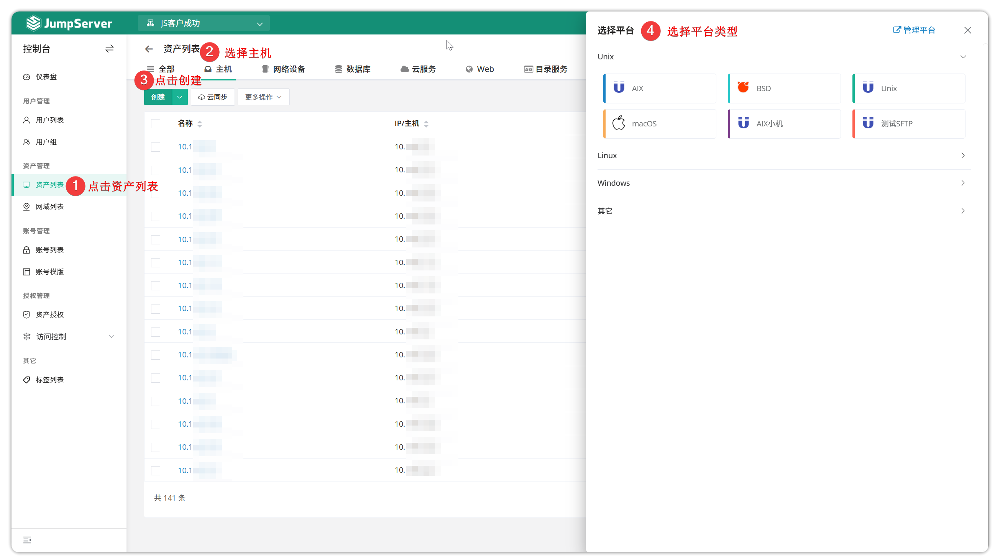

!!! tip ""
    - 网络设备类型中默认包含 General、Cisco、Huawei、H3C。
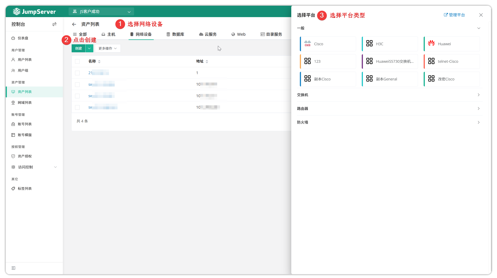

!!! tip ""
    - 数据库类型中默认包含 MySQL、MariaDB、PostgreSQL、Redis、MongoDB、Oracle、SQLServer、ClickHouse、Dameng、DB2。
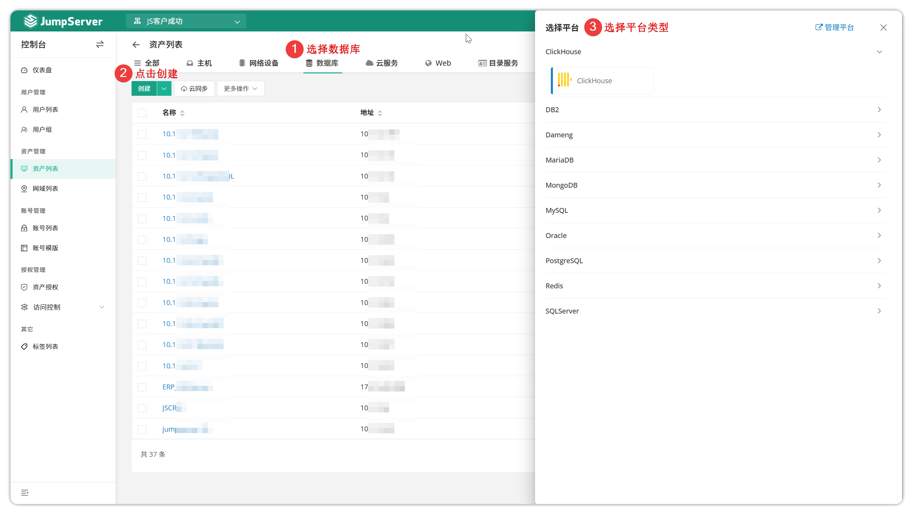

!!! tip ""
    - 云服务中默认包含私有云 VM 与 Kubernetes。
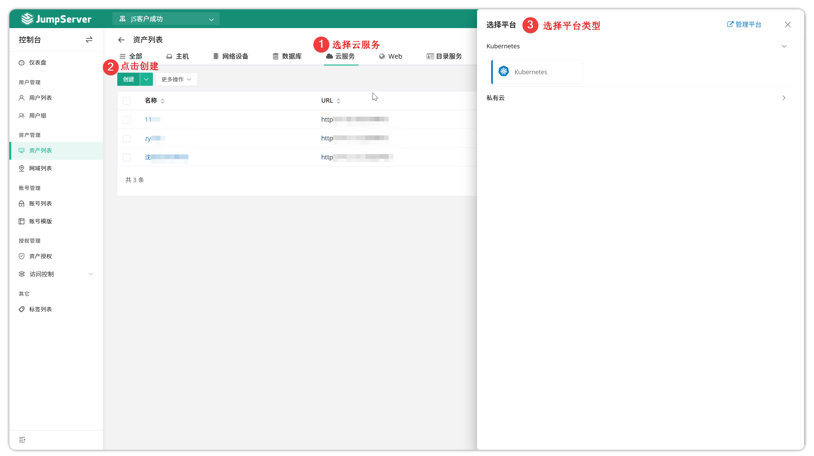

!!! tip ""
    - Web 类型中默认包含网站类资产。Web 类型资产详细配置见 [创建Web资产](web_assets.md)。

!!! tip ""
    - 目录服务（DirectoryService）是一种用于集中存储、管理和查询网络资源信息的服务，常见实现包括LDAP和ActiveDirectory。
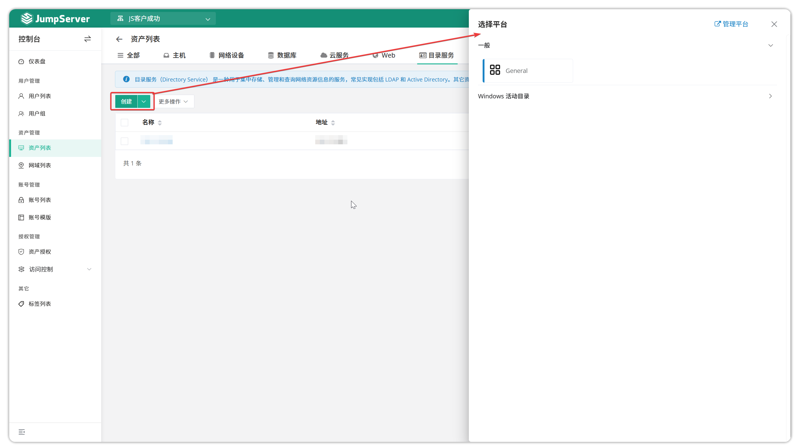

!!! tip ""
    - 除堡垒机内置的资产类型之外，JumpServer支持以远程应用的方式自定义资产类型，例如：测试软件，笔记软件等等。
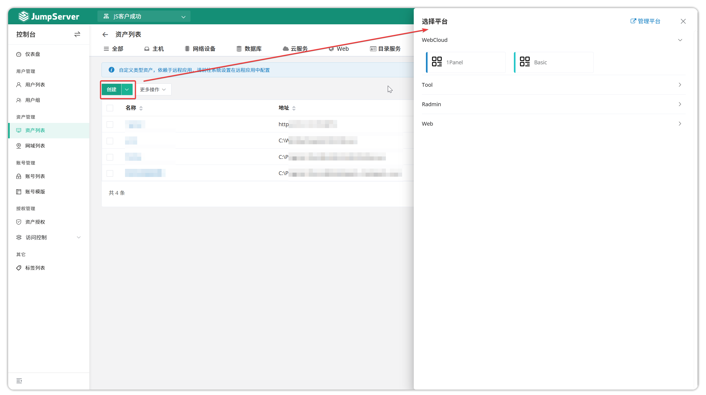

## 4 资产创建
### 4.1 手动创建单个资产

!!! tip ""
    - JumpServer 支持手动创建资产，资产的创建需要填入资产的基本信息、账号、节点信息等必要信息。
    - 点击 `资产列表`-`主机`（以 Linux 主机为例）
    - 点击页面左上角的 `创建` 按钮，选择Linux资产，进入资产创建页面，填写资产详细信息。
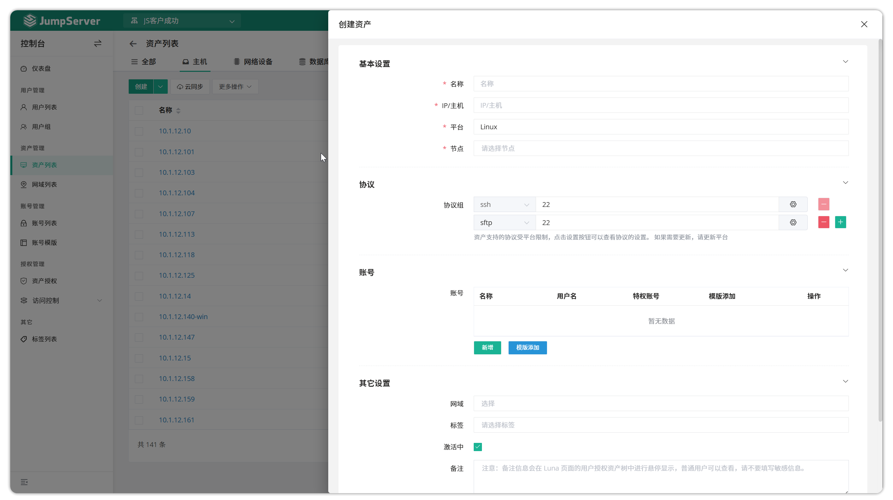
!!! tip ""
    - 详细参数说明:

| 参数       | 说明                                                                                     |
|------------|------------------------------------------------------------------------------------------|
| 名称       | 必填项，该资产在 JumpServer 中的名称，与资产本身计算机名无关，不可重名                |
| IP/主机    | 必填项，资产的真实地址，支持域名、IP地址。允许重复                                         |
| 资产平台   | 默认项，资产的资产平台，各个平台可以设置不同的字符编码及连接参数以及改密命令          |
| 节点       | 必填项，该资产所属于的节点                                                            |
| 协议组     | 必填项，资产访问时用到的协议，可选一个或多个                                          |
| 账号列表   | 可选项，用于登录该资产的账号，可创建多个账号。账号与资产绑定                                  |
| 网域       | 可选项，针对某些跨网段资产，需要以网域网关为代理进行访问                   |
| 标签       | 可选项，给该资产添加的标签，方便管理                                                  |
| 激活       | 必选项，该资产是否可使用                                                              |

### 4.2 通过 Excel 批量导入资产
!!! tip ""
    - JumpServer 支持通过 Excel 表格导入进行批量创建、更新资产。
    - JumpServer 提供两种模板信息，csv 与 xlsx 模板。
    - 首次导入资产，可点击资产列表的右上角导入按钮，下载导入模板后根据模板提示填写需要导入或更新的信息，填写完成后在导入页面导入文件即可。
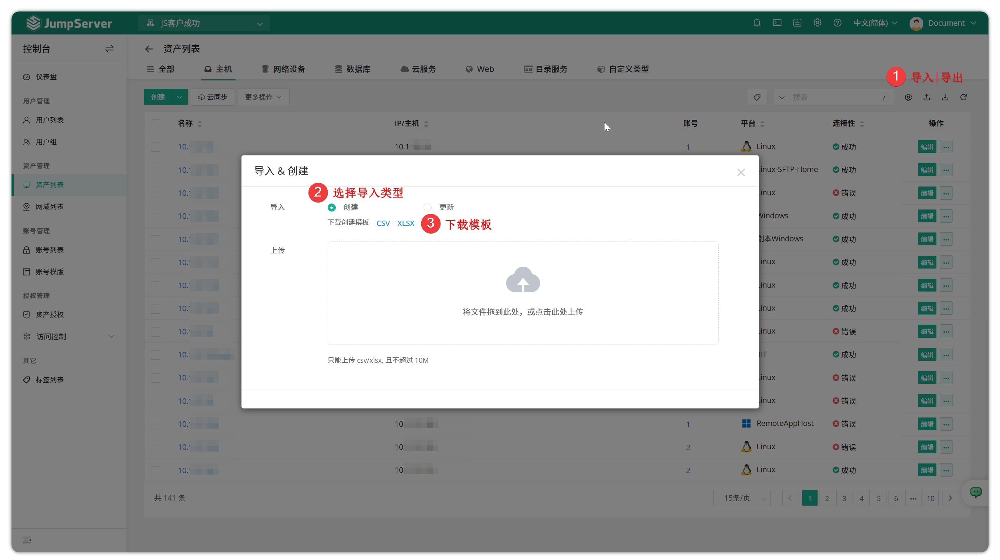

### 4.3 云同步(x-pack)
!!! info "注: 云同步为 JumpServer 企业版功能。"
!!! tip ""
    - JumpServer 支持云主机同步功能，目前支持的云平台包括：阿里云、腾讯云、华为云、百度云、京东云、金山云、AWS、Azure、谷歌云、UCloud、VMware、青云、天翼云、OpenStack、ZStack、Nutanix、Fusion Compute、深信服云平台、阿里云专有云、局域网。
    - 点击页面左侧的 `资产列表` 按钮，进入资产列表页面。点击资产列表页面的主机页签，点击 `云同步` 按钮，进入云同步页面。
    - 点击云同步页面的账号列表页签，在此页面上创建云账号。

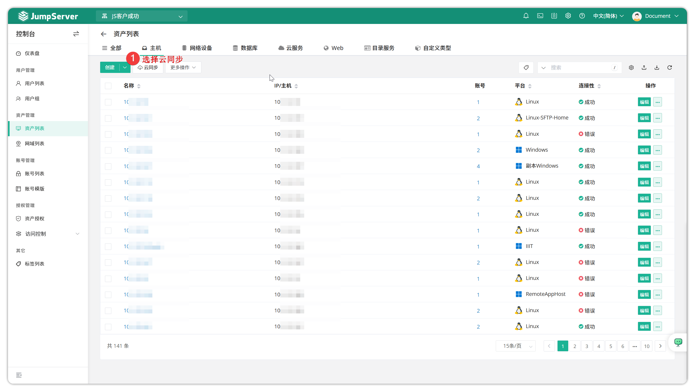

!!! tip ""
    - 然后填写云账号，以腾讯云为例（从腾讯云账号页面获取相关的腾讯云密钥）：

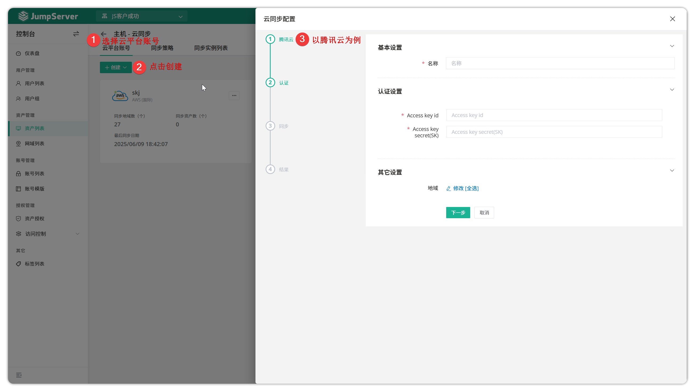

!!! tip ""
    - 成功创建云账号后，会显示在云提供商页面上，JumpServer 管理员可以创建多种类型的云账号，以同步云主机。
    - 选择 `在线同步` 以同步页面上的云资源。

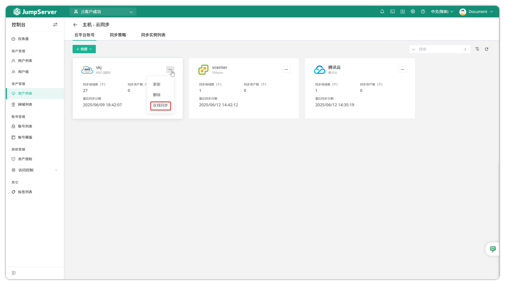

!!! tip ""
    - 开始同步并等待任务完成，选择主机，然后单击以导入。
    - 检查资产列表中的导入结果。如果在资产列表中可以找到导入的资产，则表示该云帐户的资产同步功能正常运行。
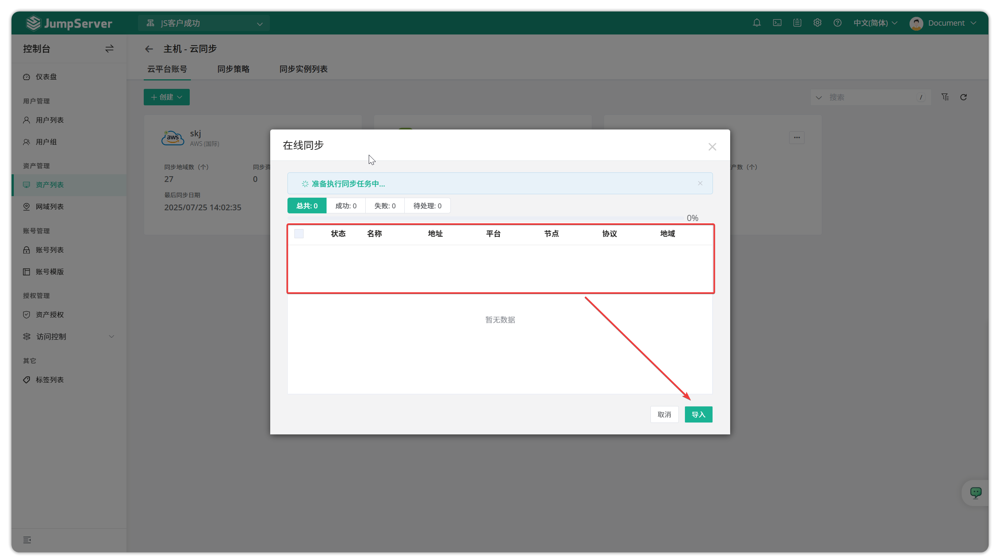

!!! tip ""
    - 如果用户需要在云同步过程中建立特定的同步规则，可以通过定义同步策略来实现。创建同步策略的步骤如下：
    - 单击云同步页面上的 `同步策略` 选项卡，以在此页面上创建同步策略。
    - 填写信息，然后单击最下方 `提交` 创建策略。
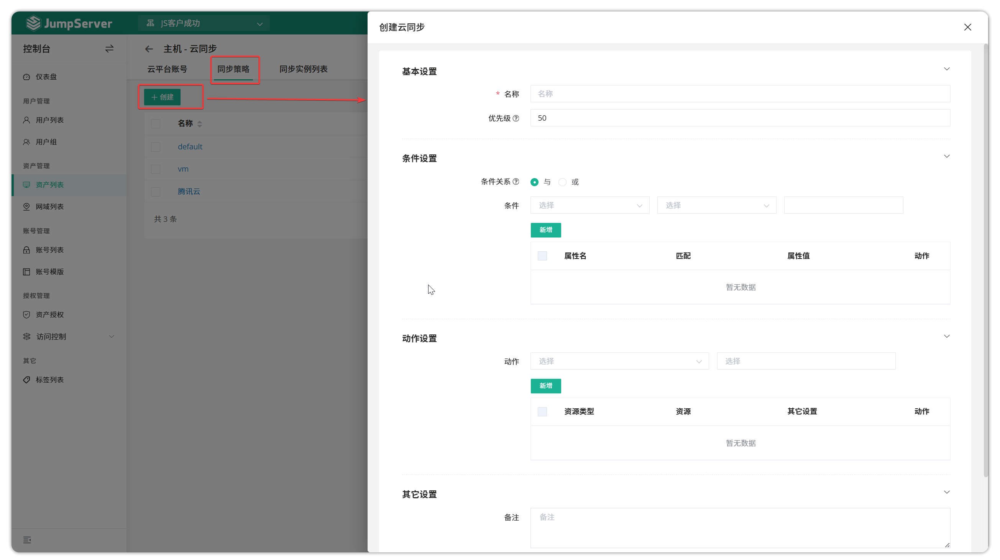

!!! tip ""
    - 详细参数描述:

| 参数       | 描述                                                                                     |
|------------|------------------------------------------------------------------------------------------|
| 名称       | 云同步策略的名称                                                                         |
| 优先级     | 此同步策略的优先级。1-100，数字越小，优先级越高                                       |
| 条件关系   | 并且：只有当所有条件匹配时，才会执行该操作。或者：当至少一个条件匹配时，将执行该操作  |
| 条件       | 策略规则用于匹配云平台上的资产。例如实例名称、平台名称和地址                          |
| 动作设置   | 策略操作是在成功匹配资产后在 JumpServer 上执行的具体操作。它可以将平台、节点、区域和帐户模板设置为成功同步的资产 |

## 5 资产更新
!!! tip ""
    - 当需求对某一个资产的信息进行更新时，可点击资产后方的 `更新` 按钮，进入资产信息更新页面，更新资产相关信息。

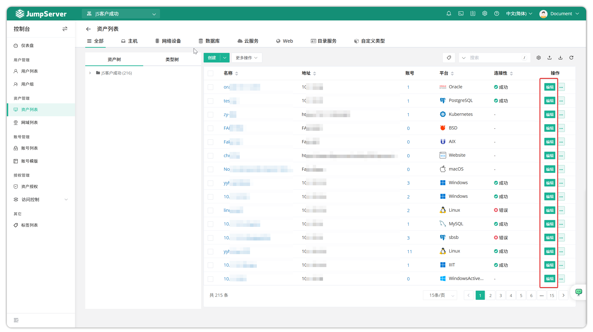

## 6 资产详情
!!! tip ""
    - 在 **资产列表** 页面点击相应 `资产名称`，进入 `资产详情` 页面。
    - 资产详情页包含的信息包括资产基本设置、资产账号列表、授权用户、会话记录、命令记录、资产活动记录。

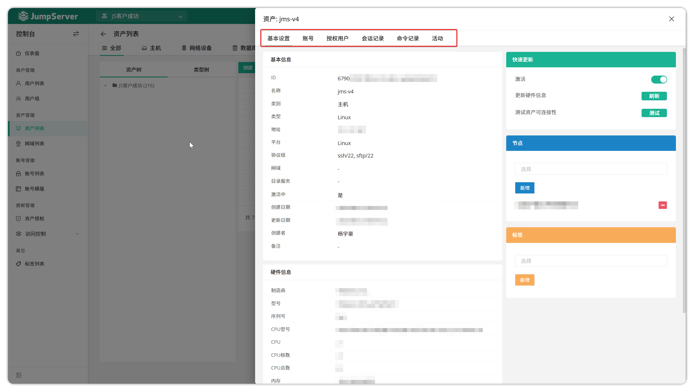

!!! tip ""
    - 详细参数说明：

    | 参数       | 说明                                                                                     |
    |------------|------------------------------------------------------------------------------------------|
    | 基本设置   | 基本信息模块主要介绍资产的信息，包括名称、协议、资产平台等                            |
    | 快速更新   | 快速更新模块主要进行资产的自动化任务执行，例如：更新资产硬件信息与资产可连接性        |
    | 节点       | 节点模块可以调整资产所属的模块                                                        |
    | 标签       | 标签模块可以查看资产所属的标签                                                        |
    | 账号   | 账号列表模块主要包含资产绑定的账号信息，在此模块进行账号的增加、删除、查看、修改      |
    | 授权用户   | 授权用户模块主要介绍资产被授权的用户以及用户组并查看对应的授权规则                    |
    | 会话记录   | 会话记录模块记录该资产的会话信息，包括连接用户、连接时间等                            |
    | 命令记录   | 命令记录模块主要记录该资产上执行过的命令记录                                          |
    | 活动   | 活动记录模块主要查看资产最近30次的日志，包含更新日志和会话记录                        |

## 7 资产删除
!!! tip ""
    - 当需要删除某个资产时，可以点击相应的资产后方的 `···` 按钮，选择 `删除` 按钮，点击删除即可。
    
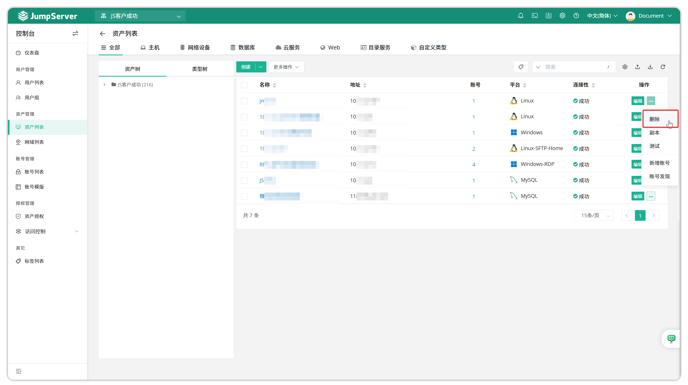

## 8 克隆资产
!!! tip ""
    - 要复制特定资产，可以单击该资产旁边的 `···` 按钮，然后选择 `副本` 选项。
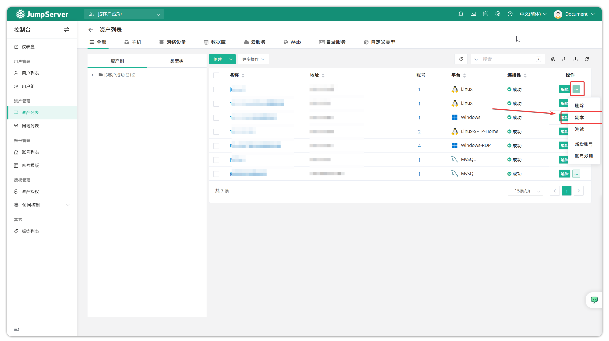

## 9 新增账号
!!! tip ""
    - 单击该资产旁边的 `更多` 按钮，选择 `新增账号` 选项。可以直接在此处添加资产账号。
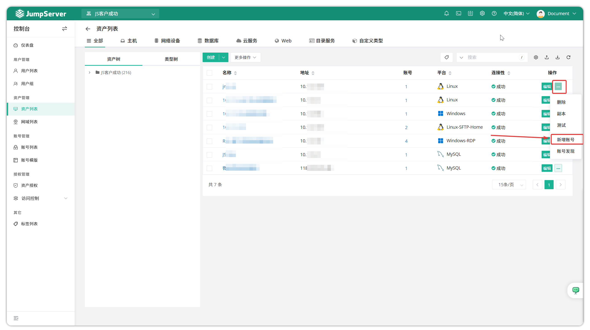
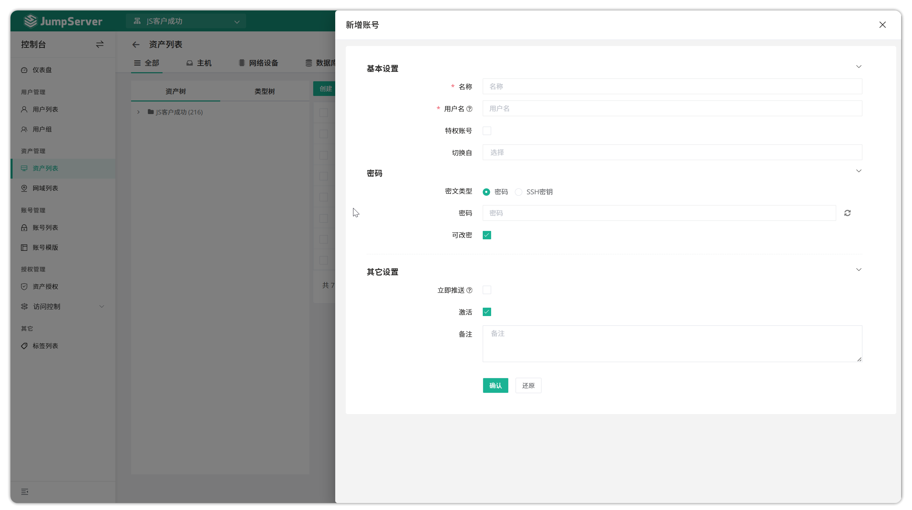

## 10 发现账号
!!! tip ""
    - 单击该资产旁边的 `···` 按钮，选择 `账号发现` 选项。可以对该资产执行账号发现任务。
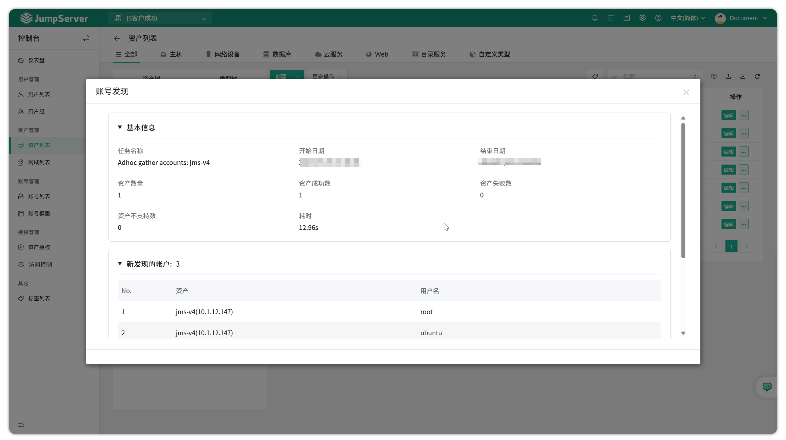