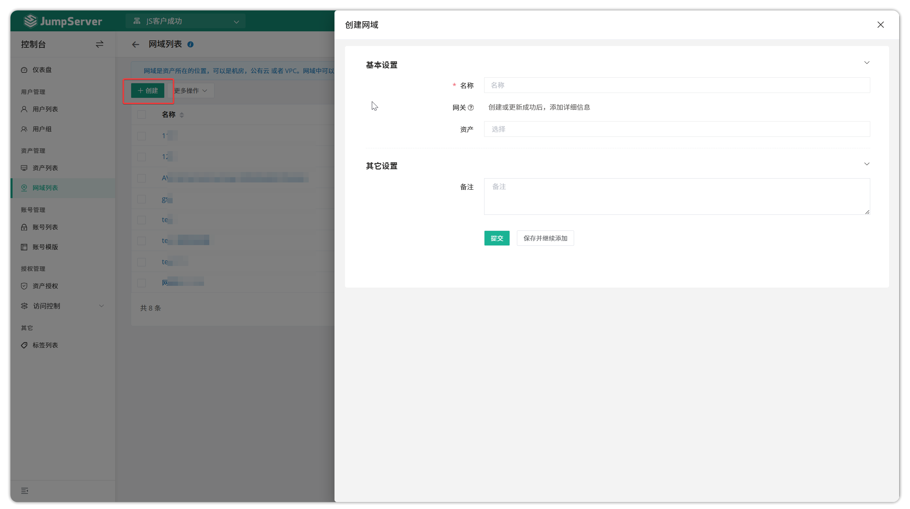
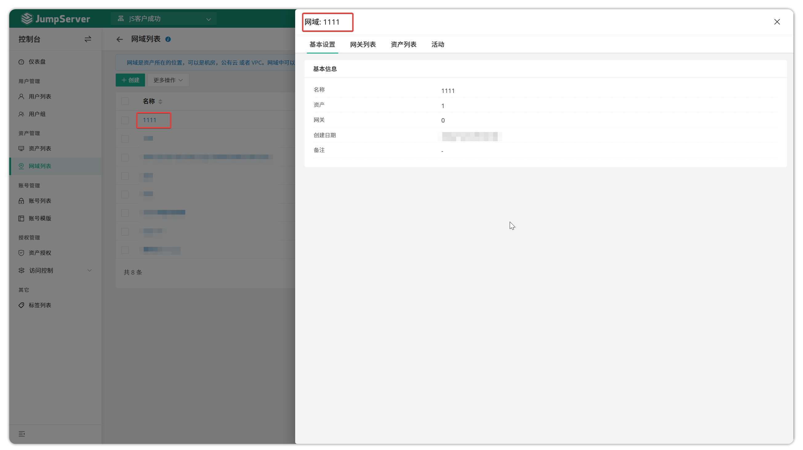
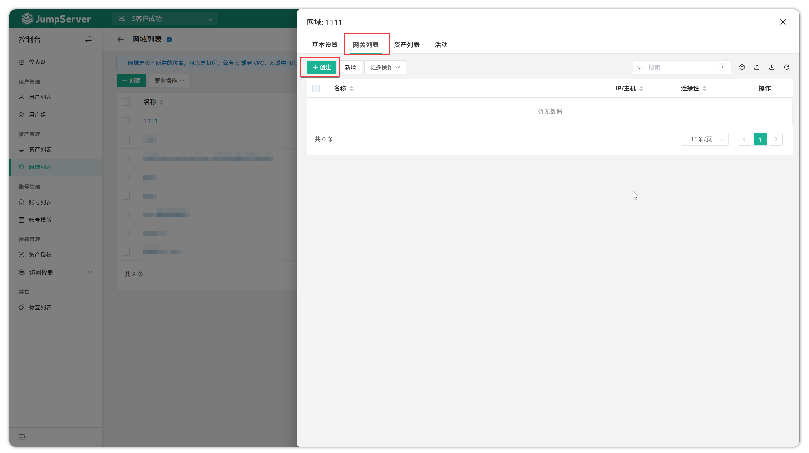
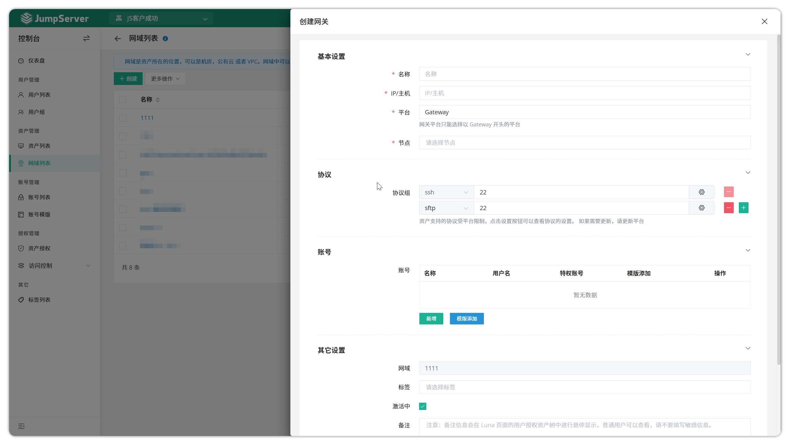
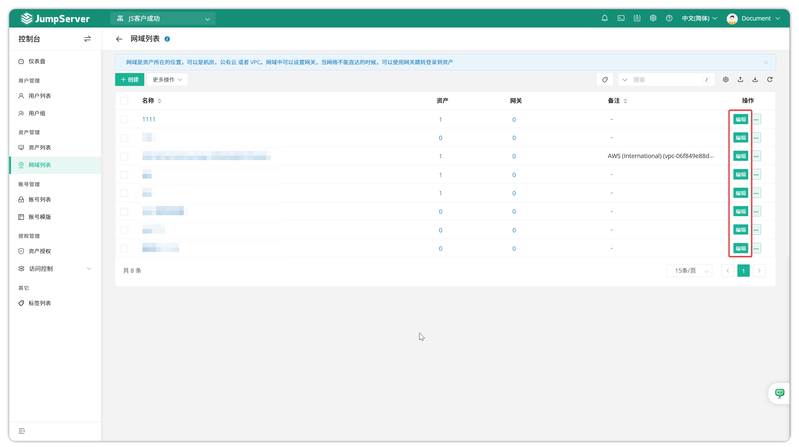
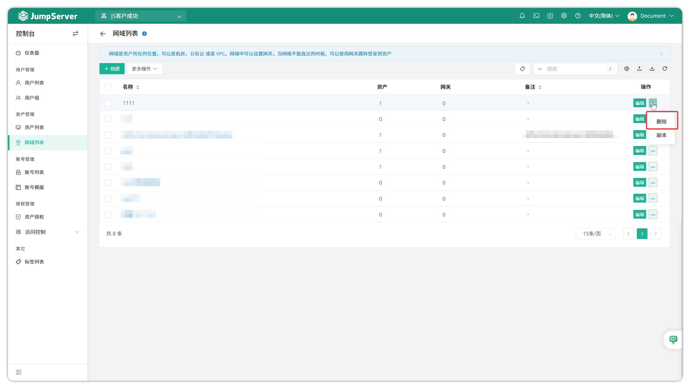
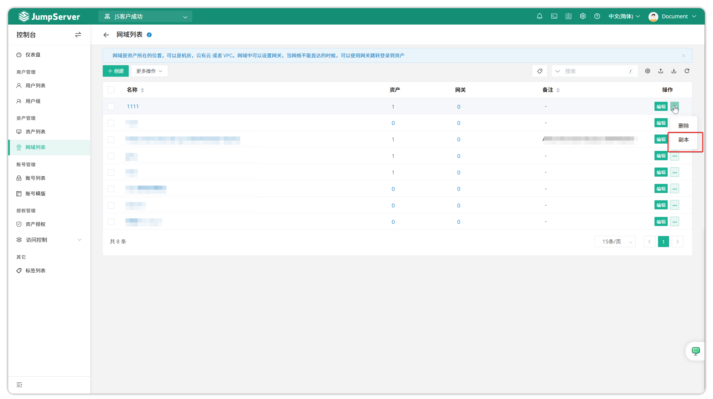
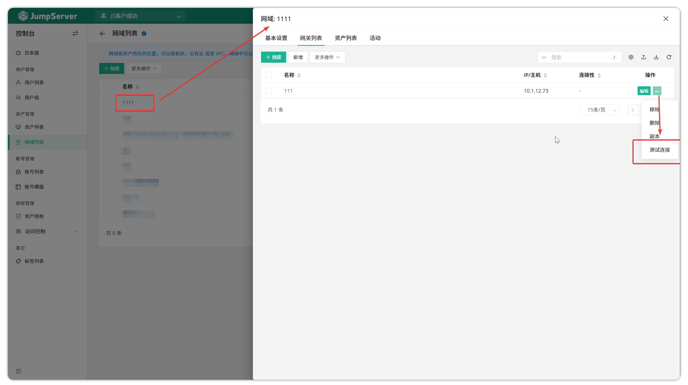
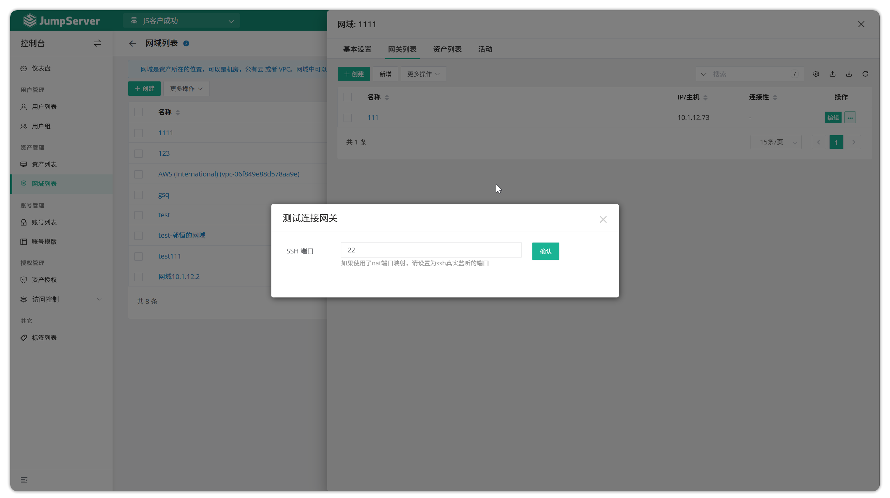

# Domain List
## 1 Overview
!!! tip ""
    - Go to the **Console** page, click **Asset Management > Domain List** to open the domain list page.
    - JumpServer supports the domain feature, which is designed to solve network connectivity issues between JumpServer and certain assets. The principle is to use a gateway server to establish an SSH tunnel for traffic forwarding.

## 2 Create a domain
!!! tip ""
    - Click the **Create** button on the **Domain List** page to open the domain information settings page and fill in the domain details.

!!! tip ""
    Detailed parameter descriptions:

| Parameter | Description |
|-----------|-------------|
| Name | The domain identification name |
| Assets | The assets that need to use the domain to communicate with JumpServer |

## 3 Domain details
!!! tip ""
    - Click the **Domain Name** button on the domain list page to open the domain detail page, which mainly contains the domain details page, gateway list page, and activity logs page.

!!! tip ""
    - Basic Settings: This module contains detailed information about the domain, such as its name and creation date.
    - Gateway List: This module is used to add, delete, update, and query gateways.
    - Asset List: Displays the asset list within the domain.
    - Activity: This module mainly records activity logs for the domain.

## 4 Create a gateway
!!! tip ""
    - On the domain detail page, click **Gateway List** to create gateway address information for the domain. JumpServer will jump from the gateway server to connect to assets. After creation, you can update, copy, and test gateway connectivity.

## 5 Update domain
!!! tip ""
    - When you need to update a domain's information, click the **Edit** button next to the domain to open the domain update page and update the domain details. When you need to modify the gateway information for the domain, click the **Domain Name** button to open the domain detail page and update the gateway information in the gateway module.

## 6 Delete domain
!!! tip ""
    - When you need to delete a domain, click the **Edit** button next to the domain and select **Delete**.

## 7 Clone domain
!!! tip ""
    - To copy a specific domain, click the **···** button next to the corresponding domain and select **Copy**.

## 8 Test connection
!!! tip ""
    - To test the connectivity of a gateway, click the **More** button next to the corresponding domain and select **Test Connection**.

!!! tip ""
    - Then select the port for which you want to test connectivity.

