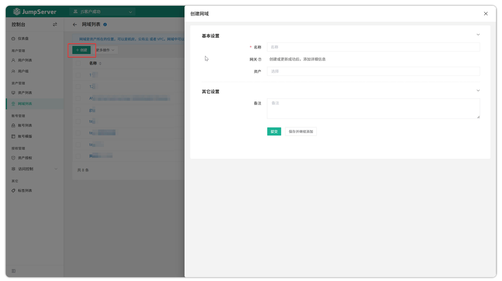
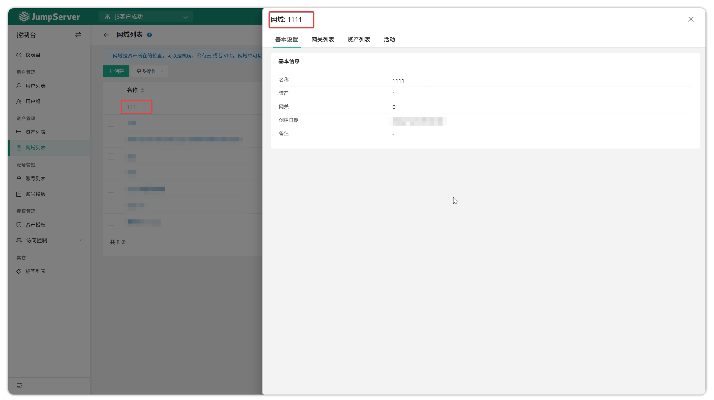
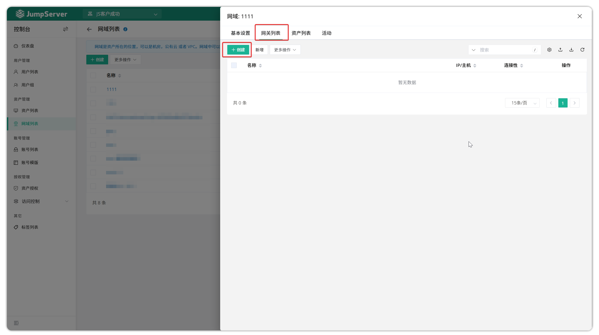
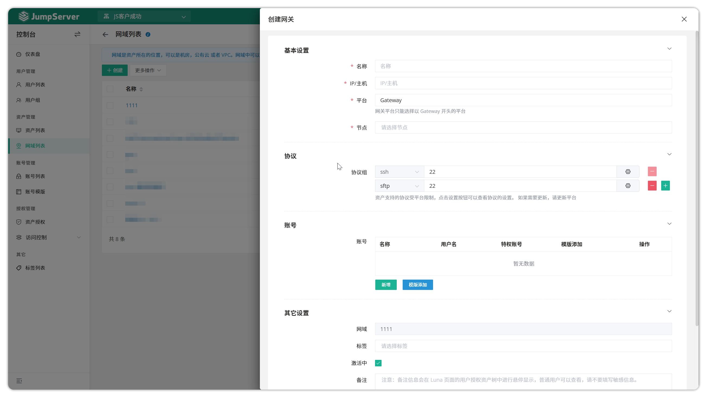
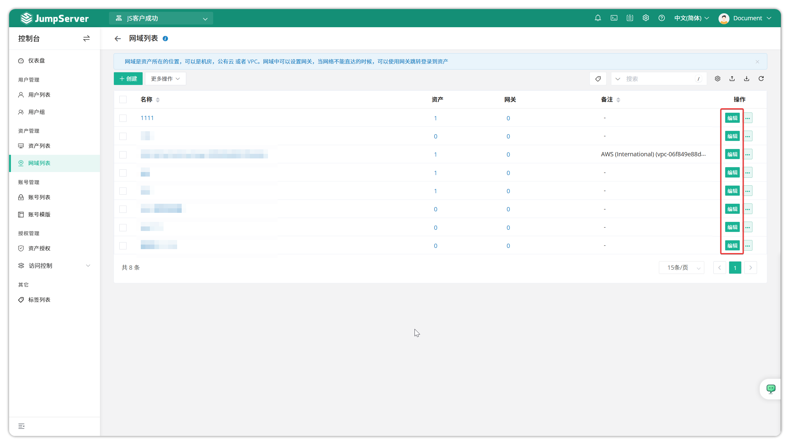
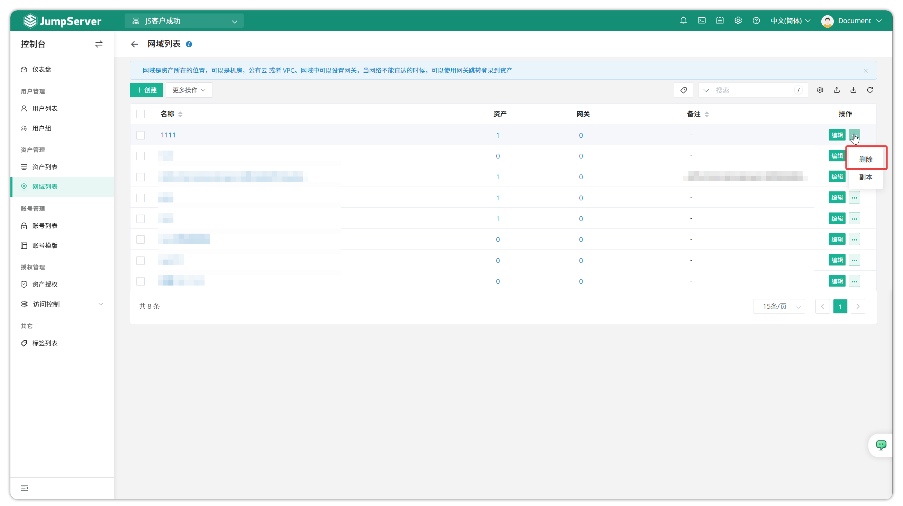
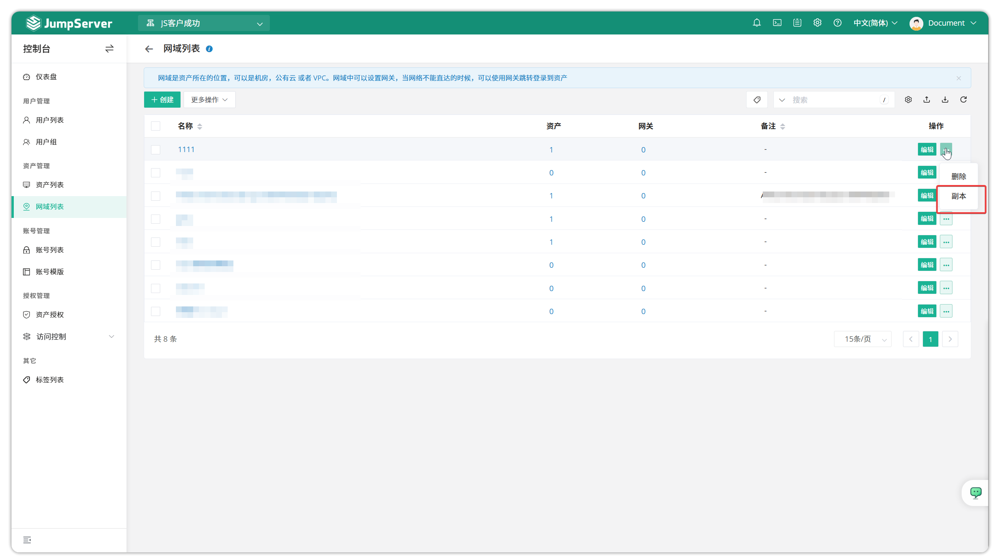
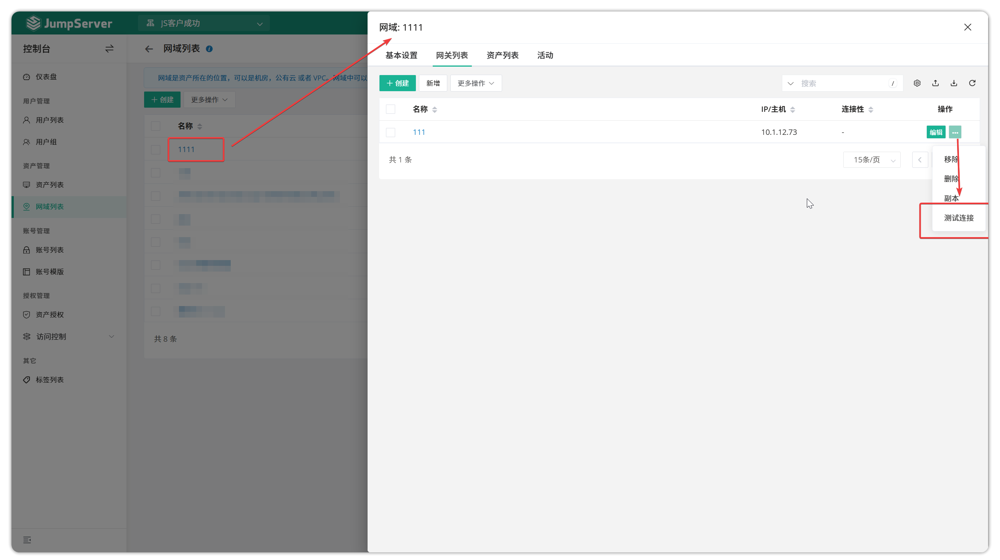
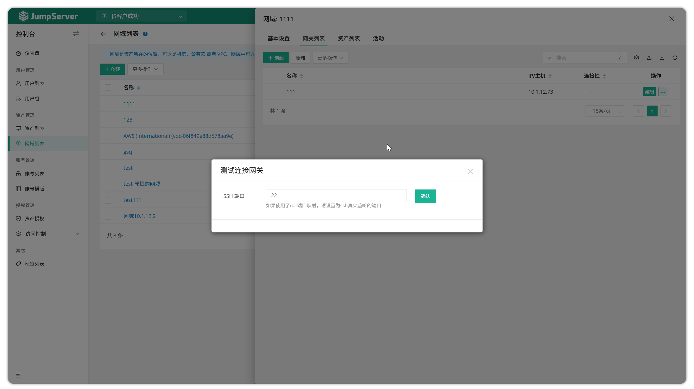

# 网域列表
## 1 功能概述
!!! tip ""
    - 进入 **控制台** 页面，点击 **资产管理 > 网域列表** ，进入网域列表页面。
    - JumpServer 支持网域功能，该功能旨在解决 JumpServer 和某些资产之间的网络连接问题。其原理是使用网关服务器建立 SSH 隧道以转发流量。

## 2 创建网域
!!! tip ""
    - 点击 `网域列表` 页面的 `创建` 按钮，进入网域列表信息设置页面，填写网域的相关信息。

!!! tip ""
    详细参数说明:

    | 参数   | 说明                                      |
    |--------|-------------------------------------------|
    | 名称   | 网域识别名称。                            |
    | 资产   | 资产选项为需要使用网域与 JumpServer 通信的资产。 |

## 3 网域详情
!!! tip ""
    - 在网域列表页面点击 `网域名称` 按钮，进入网域详情页面，该页面主要包含网域详情页面、网关列表页面、活动记录页面。

!!! tip ""
    - 基本设置:此模块主要包含有关区域的详细信息，例如其名称、创建日期等。
    - 网关列表:此模块用于添加、删除、更新和查询网关。
    - 资产列表:显示区域中的资产列表。
    - 活动:该模块主要记录网域的相关日志。

## 4 创建网关
!!! tip ""
    - 网域详情页面，点击 `网关列表` 创建该网域所使用的网关地址信息，Jumpserver 将从网关服务器跳转连接资产。创建后可进行网关的更新、副本、测试网关连接性。

## 5 更新网域
!!! tip ""
    - 当需求对某一个网域的信息进行更新时，可点击资产后方的 `编辑` 按钮，进入资产信息更新页面，更新资产相关信息。当需求更改该网域对应的网关的信息时，点击 `网域名称` 按钮进入网域详情页面，在网关模块对网关信息更新。

## 6 删除网域
!!! tip ""
    - 当需求删除某个网域时，可以点击相应的网域后方的`编辑`按钮，选择 `删除` 按钮，点击删除即可。

## 7 克隆网域
!!! tip ""
    - 要复制特定区域，请单击相应域旁边的 `···` 按钮，然后选择 `副本` 选项。

## 8 测试连接
!!! tip ""
    - 要测试网关的连接，请单击相应区域旁边的 `更多` 按钮，然后选择 `测试连接` 选项。

!!! tip ""
    - 然后选择要测试连接性的端口。
