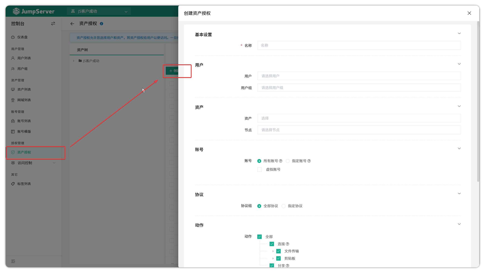
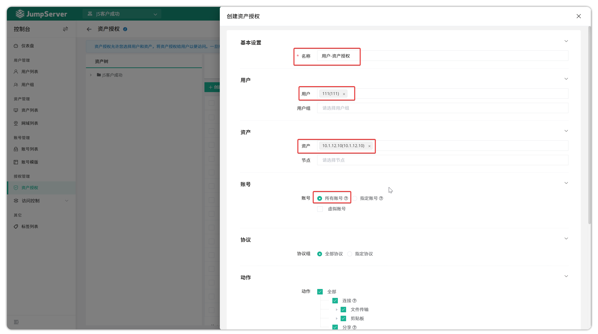
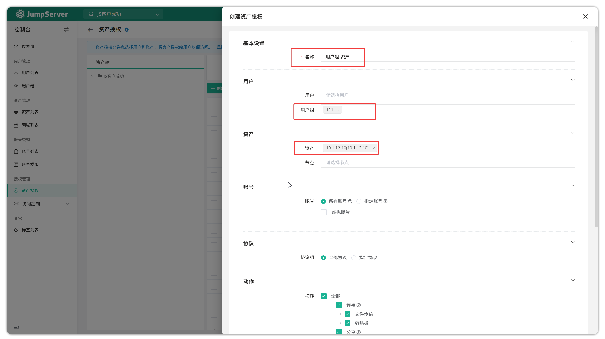
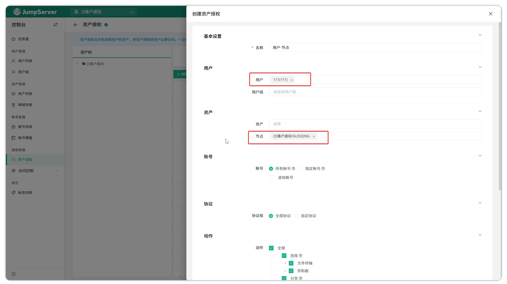
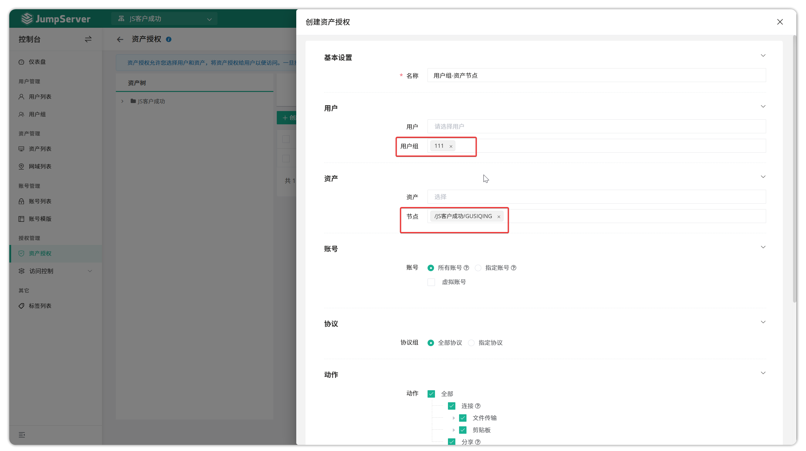

# Asset Authorization

## 1 Overview
!!! tip ""
    - Click the **Console** button on the navigation bar to open the **Console** page.
    - Click **Asset Management > Asset Authorization** to open the **Asset Authorization** page.
    - Asset authorization rules restrict user access to assets, ensuring users can only access authorized assets through specific rules.

## 2 Create asset authorization

!!! tip ""
    - Click the `Create` button on the asset authorization page and fill in the authorization rule information and submit.

!!! tip ""
    Detailed parameter descriptions:

| Parameter | Description |
|-----------|-------------|
| Name | The name of the authorization rule |
| Users | JumpServer login users, i.e., users authorized to connect to assets |
| User Groups | JumpServer login user groups, i.e., user groups authorized to connect to assets |
| Assets | Authorized assets, i.e., assets that users can connect to |
| Nodes | Authorized nodes, i.e., asset groups that users can connect to |
| Account | Accounts for logging in to authorized assets, supports: • **All accounts**: All accounts on the asset • **Specified accounts**: Manually enter account names • **Virtual accounts**: &nbsp;&nbsp;◦ **Manual accounts**: Manually enter username/password during connection &nbsp;&nbsp;◦ **Same-name accounts**: Use accounts with the same name as JumpServer login user &nbsp;&nbsp;◦ **Anonymous accounts**: Do not prefill authentication information, only launch the application itself (suitable for Web/custom assets) |
| Protocols | Protocols available to authorized users, supports: • **All**: Any protocol can be used • **Specified protocols**: Only specified protocols can be used |
| Actions | Operations that users can perform on assets, including connection, upload, download, clipboard (RDP/VNC), SSH session sharing, etc. |
| Start Date | The effective date of the authorization rule, defaults to creation time |
| Expiration Date | The expiration date of the authorization rule |

## 3 Authorization logic explanation
!!! info ""
    - **Combined authorization**: When both users and user groups are selected, all users are effective; when both assets and nodes are selected, all assets are effective, using an "AND" relationship
    - **Empty options are invalid**: When any required field (users/user groups, assets/nodes, accounts, etc.) is empty, the authorization rule does not take effect
    - **Wildcards not supported**: Authorization rules do not support `*` wildcard matching

## 4 Authorization examples

### 4.1 Single user single asset authorization
!!! tip ""
    - Authorize only a specific user to access a specific asset:
        - Users module: Select the user to authorize, leave user group empty
        - Assets module: Select the asset to log in to, leave node empty, select account to authorize (e.g., all accounts)
    - Example authorization rule:
    

### 4.2 User group single asset authorization
!!! tip ""
    - Allow a user group to log in to one asset:
        - Users module: Select the user group to authorize, leave user empty
        - Assets module: Select the asset to log in to, leave node empty, select account to authorize (e.g., all accounts)
    - Example authorization rule:
    

### 4.3 Single user node authorization
!!! tip ""
    - Allow a specific user to log in to a group of assets:
        - Users module: Select the user to authorize, leave user group empty
        - Assets module: Select the asset group to log in to, leave asset empty, select account to authorize (e.g., all accounts)
    - Example authorization rule:
    

### 4.4 User group node authorization
!!! tip ""
    - Allow a user group to log in to a group of assets:
        - Users module: Select the user group to authorize, leave user empty
        - Assets module: Select the asset group to log in to, leave asset empty, select account to authorize (e.g., all accounts)
    - Example authorization rule:
    
